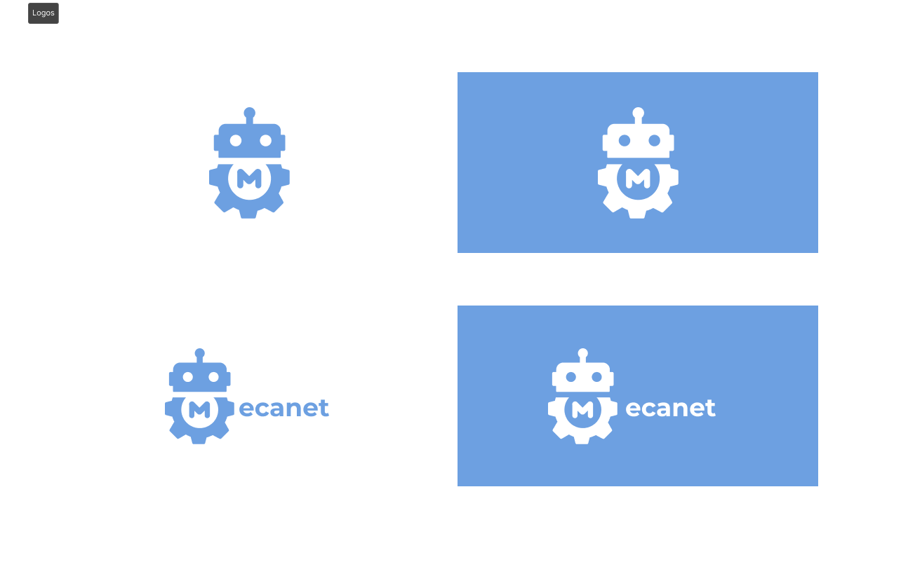

# 
Project Report

    <strong>Universidad Peruana de Ciencias Aplicadas</strong> 
    </img> 
    <strong>Ingeniería de Software - 2025-1</strong> 
    <strong>Aplicaciones Web - 4363</strong> 
    <strong>Profesor: Alex Humberto Sánchez Ponce</strong> 
     <strong>Informe del Trabajo Final</strong>

    <strong>Startup: awawaTech</strong> 
    <strong>Producto: Mecanaut</strong>

    <h3>Team Members:</h3>
    <table align="center">
        <tr>
            <th style="text-align:center;">Member</th>
            <th style="text-align:center;">Code</th>
        </tr>
        <tr>
            <td>Ariana Cecilia Agreda Sobrino</td>
            <td>u202315044</td>
        </tr>
        <tr>
            <td>Claudia Valeria Belledonne Espinoza</td>
            <td>u202210259</td>
        </tr>
        <tr>
            <td>Victor Andres Cruz Ibarra</td>
            <td>u202311053</td>
        </tr>
        <tr>
            <td>Mauricio Daniel Elera Rodríguez</td>
            <td>u202313702</td>
        </tr>
        <tr>
            <td>Rafael Andres Vivanco Salazar</td>
            <td>u202311064</td>
        </tr>
    </table>

    <strong>Abril, 2025</strong>

 

<h1 align="center">Registro de versiones del Informe</h1>
 
<table>
        <thead>
            <tr>
                <th>Versión</th>
                <th>Fecha</th>
                <th>Autor</th>
                <th>Descripción de modificaciones</th>
            </tr>
        </thead>
        <tbody>
            <tr>
                <th>TB1</th>
                <th></th>
                <td>
                    <ul>
          <li>..</li>
          <li>..</li>
          <li>..</li>
          <li>..</li>
                    <ul>
           </td>
      <td>            
             <ul>
          <li>Capítulo I: Introducción</li>
          <li>Capítulo II: Requirements Elicitation & Analysis</li>
          <li>Capítulo III: Requirements Specification</li>
          <li>Capítulo IV: Product Design</li>
          <li>Avance del Capítulo V: Product Implementation, Validation & Deployment hasta el punto 5.2.1.8</li>
          <li>Avance de Conclusiones, Bibliografía y Anexos</li>
        </ul>
      </td>
  </tr>
</tbody>
</table>

# Project Report Collaboration Insights
[Link de repositorio del reporte:](https://github.com/awawaTech/Project-Report): https://github.com/awawaTech/Project-Report

# Contenido
[Student Outcome](#student-outcome)

[Capítulo I: Introducción](#capítulo-i-introducción)
- [1.1. Startup Profile](#11-startup-profile)
  - [1.1.1. Descripción de la Startup](#111-descripción-de-la-startup)
  - [1.1.2. Perfiles de integrantes del equipo](#112-perfiles-de-integrantes-del-equipo)
- [1.2. Solution Profile](#12-solution-profile)
  - [1.2.1 Antecedentes y problemática](#121-antecedentes-y-problemática)
  - [1.2.2 Lean UX Process](#122-lean-ux-process)
    - [1.2.2.1. Lean UX Problem Statements](#1221-lean-ux-problem-statements)
    - [1.2.2.2. Lean UX Assumptions](#1222-lean-ux-assumptions)
    - [1.2.2.3. Lean UX Hypothesis Statements](#1223-lean-ux-hypothesis-statements)
    - [1.2.2.4. Lean UX Canvas](#1224-lean-ux-canvas)
- [1.3. Segmentos objetivo](#13-segmentos-objetivo)

[Capítulo II: Requirements Elicitation & Analysis](#capítulo-ii-requirements-elicitation--analysis)
- [COURSE PROJECT](#course-project)
- [Project Report Collaboration Insights](#project-report-collaboration-insights)
- [Contenido](#contenido)
- [Student Outcome](#student-outcome)
- [Capítulo I: Introducción](#capítulo-i-introducción)
  - [1.1. Startup Profile](#11-startup-profile)
    - [1.1.1. Descripción de la Startup](#111-descripción-de-la-startup)
    - [1.1.2. Perfiles de integrantes del equipo](#112-perfiles-de-integrantes-del-equipo)
  - [1.2. Solution Profile](#12-solution-profile)
    - [1.2.1 Antecedentes y problemática](#121-antecedentes-y-problemática)
    - [1.2.2 Lean UX Process](#122-lean-ux-process)
      - [1.2.2.1. Lean UX Problem Statements](#1221-lean-ux-problem-statements)
      - [1.2.2.2. Lean UX Assumptions](#1222-lean-ux-assumptions)
      - [1.2.2.3. Lean UX Hypothesis Statements](#1223-lean-ux-hypothesis-statements)
      - [1.2.2.4. Lean UX Canvas](#1224-lean-ux-canvas)
  - [1.3. Segmentos objetivo](#13-segmentos-objetivo)
- [Capítulo II: Requirements Elicitation \& Analysis](#capítulo-ii-requirements-elicitation--analysis)
  - [2.1. Competidores](#21-competidores)
    - [2.1.1. Análisis competitivo](#211-análisis-competitivo)
    - [2.1.2. Estrategias y tácticas frente a competidores](#212-estrategias-y-tácticas-frente-a-competidores)
  - [2.2. Entrevistas](#22-entrevistas)
    - [2.2.1. Diseño de entrevistas](#221-diseño-de-entrevistas)
    - [2.2.2. Registro de entrevistas](#222-registro-de-entrevistas)
    - [2.2.3. Análisis de entrevistas](#223-análisis-de-entrevistas)
  - [2.3. Needfinding](#23-needfinding)
    - [2.3.1. User Personas](#231-user-personas)
    - [2.3.2. User Task Matrix](#232-user-task-matrix)
    - [2.3.3. User Journey Mapping](#233-user-journey-mapping)
    - [2.3.4. Empathy Mapping](#234-empathy-mapping)
    - [2.3.5. As-is Scenario Mapping](#235-as-is-scenario-mapping)
  - [2.4. Ubiquitous Language](#24-ubiquitous-language)
- [Capítulo III: Requirements Specification](#capítulo-iii-requirements-specification)
  - [3.1. To-Be Scenario Mapping](#31-to-be-scenario-mapping)
  - [3.2. User Stories](#32-user-stories)
  - [3.3. Impact Mapping](#33-impact-mapping)
  - [3.4. Product Backlog](#34-product-backlog)
- [Capítulo IV: Product Design](#capítulo-iv-product-design)
  - [4.1. Style Guidelines](#41-style-guidelines)
    - [4.1.1. General Style Guidelines](#411-general-style-guidelines)
    - [4.1.2. Web Style Guidelines](#412-web-style-guidelines)
  - [4.2. Information Architecture](#42-information-architecture)
    - [4.2.1. Organization Systems.](#421-organization-systems)
    - [4.2.2. Labeling Systems.](#422-labeling-systems)
    - [4.2.3. SEO Tags and Meta Tags](#423-seo-tags-and-meta-tags)
    - [4.2.4. Searching Systems.](#424-searching-systems)
    - [4.2.5. Navigation Systems.](#425-navigation-systems)
  - [4.3. Landing Page UI Design.](#43-landing-page-ui-design)
    - [4.3.1. Landing Page Wireframe.](#431-landing-page-wireframe)
    - [4.3.2. Landing Page Mock-up.](#432-landing-page-mock-up)
  - [4.4. Web Applications UX/UI Design.](#44-web-applications-uxui-design)
    - [4.4.1. Web Applications Wireframes.](#441-web-applications-wireframes)
    - [4.4.2. Web Applications Wireflow Diagrams.](#442-web-applications-wireflow-diagrams)
    - [4.4.2. Web Applications Mock-ups.](#442-web-applications-mock-ups)
    - [4.4.3. Web Applications User Flow Diagrams.](#443-web-applications-user-flow-diagrams)
  - [4.5. Web Applications Prototyping.](#45-web-applications-prototyping)
  - [4.6. Domain-Driven Software Architecture.](#46-domain-driven-software-architecture)
    - [4.6.1. Software Architecture Context Diagram.](#461-software-architecture-context-diagram)
    - [4.6.2. Software Architecture Container Diagrams.](#462-software-architecture-container-diagrams)
    - [4.6.3. Software Architecture Components Diagrams.](#463-software-architecture-components-diagrams)
  - [4.7. Software Object-Oriented Design.](#47-software-object-oriented-design)
    - [4.7.1. Class Diagrams.](#471-class-diagrams)
    - [4.7.2. Class Dictionary.](#472-class-dictionary)
  - [4.8. Database Design.](#48-database-design)
    - [4.8.1. Database Diagram.](#481-database-diagram)
- [Capítulo V: Product Implementation, Validation \& Deployment](#capítulo-v-product-implementation-validation--deployment)
  - [5.1. Software Configuration Management.](#51-software-configuration-management)
    - [5.1.1. Software Development Environment Configuration.](#511-software-development-environment-configuration)
    - [5.1.2. Source Code Management.](#512-source-code-management)
    - [5.1.3. Source Code Style Guide \& Conventions.](#513-source-code-style-guide--conventions)
    - [5.1.4. Software Deployment Configuration.](#514-software-deployment-configuration)
  - [5.2. Landing Page, Services \& Applications Implementation](#52-landing-page-services--applications-implementation)
    - [5.2.1. Sprint 1](#521-sprint-1)
      - [5.2.1.1. Sprint Planning 1](#5211-sprint-planning-1)
      - [5.2.1.2. Aspect Leaders and Collaborators.](#5212-aspect-leaders-and-collaborators)
      - [5.2.1.3. Sprint Backlog n.](#5213-sprint-backlog-n)
      - [5.2.1.4. Development Evidence for Sprint Review.](#5214-development-evidence-for-sprint-review)
      - [5.2.1.5. Execution Evidence for Sprint Review.](#5215-execution-evidence-for-sprint-review)
      - [5.2.1.6. Services Documentation Evidence for Sprint Review.](#5216-services-documentation-evidence-for-sprint-review)
      - [5.2.1.7. Software Deployment Evidence for Sprint Review.](#5217-software-deployment-evidence-for-sprint-review)
      - [5.2.1.8. Team Collaboration Insights during Sprint.](#5218-team-collaboration-insights-during-sprint)
  - [5.3. Validation Interviews.](#53-validation-interviews)
    - [5.3.1. Diseño de Entrevistas.](#531-diseño-de-entrevistas)
    - [5.3.2. Registro de Entrevistas.](#532-registro-de-entrevistas)
    - [5.3.3. Evaluaciones según heurísticas.](#533-evaluaciones-según-heurísticas)
  - [5.4. Video About-the-Product.](#54-video-about-the-product)
- [Conclusiones](#conclusiones)
  - [Conclusiones y recomendaciones.](#conclusiones-y-recomendaciones)
- [Video About-the-Team.](#video-about-the-team)
- [Bibliografía](#bibliografía)
- [Anexos](#anexos)

[Capítulo III: Requirements Specification](#capítulo-iii-requirements-specification)
- [3.1. To-Be Scenario Mapping](#31-to-be-scenario-mapping)
- [3.2. User Stories](#32-user-stories)
- [3.3. Impact Mapping](#33-impact-mapping)
- [3.4. Product Backlog](#34-product-backlog)

[Capítulo IV: Product Design](#capítulo-iv-product-design)
- [COURSE PROJECT](#course-project)
- [Project Report Collaboration Insights](#project-report-collaboration-insights)
- [Contenido](#contenido)
- [Student Outcome](#student-outcome)
- [Capítulo I: Introducción](#capítulo-i-introducción)
  - [1.1. Startup Profile](#11-startup-profile)
    - [1.1.1. Descripción de la Startup](#111-descripción-de-la-startup)
    - [1.1.2. Perfiles de integrantes del equipo](#112-perfiles-de-integrantes-del-equipo)
  - [1.2. Solution Profile](#12-solution-profile)
    - [1.2.1 Antecedentes y problemática](#121-antecedentes-y-problemática)
    - [1.2.2 Lean UX Process](#122-lean-ux-process)
      - [1.2.2.1. Lean UX Problem Statements](#1221-lean-ux-problem-statements)
      - [1.2.2.2. Lean UX Assumptions](#1222-lean-ux-assumptions)
      - [1.2.2.3. Lean UX Hypothesis Statements](#1223-lean-ux-hypothesis-statements)
      - [1.2.2.4. Lean UX Canvas](#1224-lean-ux-canvas)
  - [1.3. Segmentos objetivo](#13-segmentos-objetivo)
- [Capítulo II: Requirements Elicitation \& Analysis](#capítulo-ii-requirements-elicitation--analysis)
  - [2.1. Competidores](#21-competidores)
    - [2.1.1. Análisis competitivo](#211-análisis-competitivo)
    - [2.1.2. Estrategias y tácticas frente a competidores](#212-estrategias-y-tácticas-frente-a-competidores)
  - [2.2. Entrevistas](#22-entrevistas)
    - [2.2.1. Diseño de entrevistas](#221-diseño-de-entrevistas)
    - [2.2.2. Registro de entrevistas](#222-registro-de-entrevistas)
    - [2.2.3. Análisis de entrevistas](#223-análisis-de-entrevistas)
  - [2.3. Needfinding](#23-needfinding)
    - [2.3.1. User Personas](#231-user-personas)
    - [2.3.2. User Task Matrix](#232-user-task-matrix)
    - [2.3.3. User Journey Mapping](#233-user-journey-mapping)
    - [2.3.4. Empathy Mapping](#234-empathy-mapping)
    - [2.3.5. As-is Scenario Mapping](#235-as-is-scenario-mapping)
  - [2.4. Ubiquitous Language](#24-ubiquitous-language)
- [Capítulo III: Requirements Specification](#capítulo-iii-requirements-specification)
  - [3.1. To-Be Scenario Mapping](#31-to-be-scenario-mapping)
  - [3.2. User Stories](#32-user-stories)
  - [3.3. Impact Mapping](#33-impact-mapping)
  - [3.4. Product Backlog](#34-product-backlog)
- [Capítulo IV: Product Design](#capítulo-iv-product-design)
  - [4.1. Style Guidelines](#41-style-guidelines)
    - [4.1.1. General Style Guidelines](#411-general-style-guidelines)
    - [4.1.2. Web Style Guidelines](#412-web-style-guidelines)
  - [4.2. Information Architecture](#42-information-architecture)
    - [4.2.1. Organization Systems.](#421-organization-systems)
    - [4.2.2. Labeling Systems.](#422-labeling-systems)
    - [4.2.3. SEO Tags and Meta Tags](#423-seo-tags-and-meta-tags)
    - [4.2.4. Searching Systems.](#424-searching-systems)
    - [4.2.5. Navigation Systems.](#425-navigation-systems)
  - [4.3. Landing Page UI Design.](#43-landing-page-ui-design)
    - [4.3.1. Landing Page Wireframe.](#431-landing-page-wireframe)
    - [4.3.2. Landing Page Mock-up.](#432-landing-page-mock-up)
  - [4.4. Web Applications UX/UI Design.](#44-web-applications-uxui-design)
    - [4.4.1. Web Applications Wireframes.](#441-web-applications-wireframes)
    - [4.4.2. Web Applications Wireflow Diagrams.](#442-web-applications-wireflow-diagrams)
    - [4.4.2. Web Applications Mock-ups.](#442-web-applications-mock-ups)
    - [4.4.3. Web Applications User Flow Diagrams.](#443-web-applications-user-flow-diagrams)
  - [4.5. Web Applications Prototyping.](#45-web-applications-prototyping)
  - [4.6. Domain-Driven Software Architecture.](#46-domain-driven-software-architecture)
    - [4.6.1. Software Architecture Context Diagram.](#461-software-architecture-context-diagram)
    - [4.6.2. Software Architecture Container Diagrams.](#462-software-architecture-container-diagrams)
    - [4.6.3. Software Architecture Components Diagrams.](#463-software-architecture-components-diagrams)
  - [4.7. Software Object-Oriented Design.](#47-software-object-oriented-design)
    - [4.7.1. Class Diagrams.](#471-class-diagrams)
    - [4.7.2. Class Dictionary.](#472-class-dictionary)
  - [4.8. Database Design.](#48-database-design)
    - [4.8.1. Database Diagram.](#481-database-diagram)
- [Capítulo V: Product Implementation, Validation \& Deployment](#capítulo-v-product-implementation-validation--deployment)
  - [5.1. Software Configuration Management.](#51-software-configuration-management)
    - [5.1.1. Software Development Environment Configuration.](#511-software-development-environment-configuration)
    - [5.1.2. Source Code Management.](#512-source-code-management)
    - [5.1.3. Source Code Style Guide \& Conventions.](#513-source-code-style-guide--conventions)
    - [5.1.4. Software Deployment Configuration.](#514-software-deployment-configuration)
  - [5.2. Landing Page, Services \& Applications Implementation](#52-landing-page-services--applications-implementation)
    - [5.2.1. Sprint 1](#521-sprint-1)
      - [5.2.1.1. Sprint Planning 1](#5211-sprint-planning-1)
      - [5.2.1.2. Aspect Leaders and Collaborators.](#5212-aspect-leaders-and-collaborators)
      - [5.2.1.3. Sprint Backlog n.](#5213-sprint-backlog-n)
      - [5.2.1.4. Development Evidence for Sprint Review.](#5214-development-evidence-for-sprint-review)
      - [5.2.1.5. Execution Evidence for Sprint Review.](#5215-execution-evidence-for-sprint-review)
      - [5.2.1.6. Services Documentation Evidence for Sprint Review.](#5216-services-documentation-evidence-for-sprint-review)
      - [5.2.1.7. Software Deployment Evidence for Sprint Review.](#5217-software-deployment-evidence-for-sprint-review)
      - [5.2.1.8. Team Collaboration Insights during Sprint.](#5218-team-collaboration-insights-during-sprint)
  - [5.3. Validation Interviews.](#53-validation-interviews)
    - [5.3.1. Diseño de Entrevistas.](#531-diseño-de-entrevistas)
    - [5.3.2. Registro de Entrevistas.](#532-registro-de-entrevistas)
    - [5.3.3. Evaluaciones según heurísticas.](#533-evaluaciones-según-heurísticas)
  - [5.4. Video About-the-Product.](#54-video-about-the-product)
- [Conclusiones](#conclusiones)
  - [Conclusiones y recomendaciones.](#conclusiones-y-recomendaciones)
- [Video About-the-Team.](#video-about-the-team)
- [Bibliografía](#bibliografía)
- [Anexos](#anexos)

[Capítulo V: Product Implementation, Validation & Deployment](#capítulo-v-product-implementation-validation--deployment)
- [COURSE PROJECT](#course-project)
- [Project Report Collaboration Insights](#project-report-collaboration-insights)
- [Contenido](#contenido)
- [Student Outcome](#student-outcome)
- [Capítulo I: Introducción](#capítulo-i-introducción)
  - [1.1. Startup Profile](#11-startup-profile)
    - [1.1.1. Descripción de la Startup](#111-descripción-de-la-startup)
    - [1.1.2. Perfiles de integrantes del equipo](#112-perfiles-de-integrantes-del-equipo)
  - [1.2. Solution Profile](#12-solution-profile)
    - [1.2.1 Antecedentes y problemática](#121-antecedentes-y-problemática)
    - [1.2.2 Lean UX Process](#122-lean-ux-process)
      - [1.2.2.1. Lean UX Problem Statements](#1221-lean-ux-problem-statements)
      - [1.2.2.2. Lean UX Assumptions](#1222-lean-ux-assumptions)
      - [1.2.2.3. Lean UX Hypothesis Statements](#1223-lean-ux-hypothesis-statements)
      - [1.2.2.4. Lean UX Canvas](#1224-lean-ux-canvas)
  - [1.3. Segmentos objetivo](#13-segmentos-objetivo)
- [Capítulo II: Requirements Elicitation \& Analysis](#capítulo-ii-requirements-elicitation--analysis)
  - [2.1. Competidores](#21-competidores)
    - [2.1.1. Análisis competitivo](#211-análisis-competitivo)
    - [2.1.2. Estrategias y tácticas frente a competidores](#212-estrategias-y-tácticas-frente-a-competidores)
  - [2.2. Entrevistas](#22-entrevistas)
    - [2.2.1. Diseño de entrevistas](#221-diseño-de-entrevistas)
    - [2.2.2. Registro de entrevistas](#222-registro-de-entrevistas)
    - [2.2.3. Análisis de entrevistas](#223-análisis-de-entrevistas)
  - [2.3. Needfinding](#23-needfinding)
    - [2.3.1. User Personas](#231-user-personas)
    - [2.3.2. User Task Matrix](#232-user-task-matrix)
    - [2.3.3. User Journey Mapping](#233-user-journey-mapping)
    - [2.3.4. Empathy Mapping](#234-empathy-mapping)
    - [2.3.5. As-is Scenario Mapping](#235-as-is-scenario-mapping)
  - [2.4. Ubiquitous Language](#24-ubiquitous-language)
- [Capítulo III: Requirements Specification](#capítulo-iii-requirements-specification)
  - [3.1. To-Be Scenario Mapping](#31-to-be-scenario-mapping)
  - [3.2. User Stories](#32-user-stories)
  - [3.3. Impact Mapping](#33-impact-mapping)
  - [3.4. Product Backlog](#34-product-backlog)
- [Capítulo IV: Product Design](#capítulo-iv-product-design)
  - [4.1. Style Guidelines](#41-style-guidelines)
    - [4.1.1. General Style Guidelines](#411-general-style-guidelines)
    - [4.1.2. Web Style Guidelines](#412-web-style-guidelines)
  - [4.2. Information Architecture](#42-information-architecture)
    - [4.2.1. Organization Systems.](#421-organization-systems)
    - [4.2.2. Labeling Systems.](#422-labeling-systems)
    - [4.2.3. SEO Tags and Meta Tags](#423-seo-tags-and-meta-tags)
    - [4.2.4. Searching Systems.](#424-searching-systems)
    - [4.2.5. Navigation Systems.](#425-navigation-systems)
  - [4.3. Landing Page UI Design.](#43-landing-page-ui-design)
    - [4.3.1. Landing Page Wireframe.](#431-landing-page-wireframe)
    - [4.3.2. Landing Page Mock-up.](#432-landing-page-mock-up)
  - [4.4. Web Applications UX/UI Design.](#44-web-applications-uxui-design)
    - [4.4.1. Web Applications Wireframes.](#441-web-applications-wireframes)
    - [4.4.2. Web Applications Wireflow Diagrams.](#442-web-applications-wireflow-diagrams)
    - [4.4.2. Web Applications Mock-ups.](#442-web-applications-mock-ups)
    - [4.4.3. Web Applications User Flow Diagrams.](#443-web-applications-user-flow-diagrams)
  - [4.5. Web Applications Prototyping.](#45-web-applications-prototyping)
  - [4.6. Domain-Driven Software Architecture.](#46-domain-driven-software-architecture)
    - [4.6.1. Software Architecture Context Diagram.](#461-software-architecture-context-diagram)
    - [4.6.2. Software Architecture Container Diagrams.](#462-software-architecture-container-diagrams)
    - [4.6.3. Software Architecture Components Diagrams.](#463-software-architecture-components-diagrams)
  - [4.7. Software Object-Oriented Design.](#47-software-object-oriented-design)
    - [4.7.1. Class Diagrams.](#471-class-diagrams)
    - [4.7.2. Class Dictionary.](#472-class-dictionary)
  - [4.8. Database Design.](#48-database-design)
    - [4.8.1. Database Diagram.](#481-database-diagram)
- [Capítulo V: Product Implementation, Validation \& Deployment](#capítulo-v-product-implementation-validation--deployment)
  - [5.1. Software Configuration Management.](#51-software-configuration-management)
    - [5.1.1. Software Development Environment Configuration.](#511-software-development-environment-configuration)
    - [5.1.2. Source Code Management.](#512-source-code-management)
    - [5.1.3. Source Code Style Guide \& Conventions.](#513-source-code-style-guide--conventions)
    - [5.1.4. Software Deployment Configuration.](#514-software-deployment-configuration)
  - [5.2. Landing Page, Services \& Applications Implementation](#52-landing-page-services--applications-implementation)
    - [5.2.1. Sprint 1](#521-sprint-1)
      - [5.2.1.1. Sprint Planning 1](#5211-sprint-planning-1)
      - [5.2.1.2. Aspect Leaders and Collaborators.](#5212-aspect-leaders-and-collaborators)
      - [5.2.1.3. Sprint Backlog n.](#5213-sprint-backlog-n)
      - [5.2.1.4. Development Evidence for Sprint Review.](#5214-development-evidence-for-sprint-review)
      - [5.2.1.5. Execution Evidence for Sprint Review.](#5215-execution-evidence-for-sprint-review)
      - [5.2.1.6. Services Documentation Evidence for Sprint Review.](#5216-services-documentation-evidence-for-sprint-review)
      - [5.2.1.7. Software Deployment Evidence for Sprint Review.](#5217-software-deployment-evidence-for-sprint-review)
      - [5.2.1.8. Team Collaboration Insights during Sprint.](#5218-team-collaboration-insights-during-sprint)
  - [5.3. Validation Interviews.](#53-validation-interviews)
    - [5.3.1. Diseño de Entrevistas.](#531-diseño-de-entrevistas)
    - [5.3.2. Registro de Entrevistas.](#532-registro-de-entrevistas)
    - [5.3.3. Evaluaciones según heurísticas.](#533-evaluaciones-según-heurísticas)
  - [5.4. Video About-the-Product.](#54-video-about-the-product)
- [Conclusiones](#conclusiones)
  - [Conclusiones y recomendaciones.](#conclusiones-y-recomendaciones)
- [Video About-the-Team.](#video-about-the-team)
- [Bibliografía](#bibliografía)
- [Anexos](#anexos)

[Conclusiones](#conclusiones)
- [Conclusiones y recomendaciones](#conclusiones-y-recomendaciones)
- [Video About-the-Team](#video-about-the-team)

[Bibliografía](#bibliografía)

[Anexos](#anexos)

# Student Outcome

ABET – EAC - Student Outcome 5

Criterio: La capacidad de funcionar efectivamente en un equipo cuyos miembros juntos proporcionan liderazgo, crean un entorno de colaboración e inclusivo, establecen objetivos, planifican tareas y cumplen objetivos.

<table>
  <tr>
    <td><b>Criterio específico</b></td>
    <td><b>Acciones realizadas</b></td>
    <td><b>Conclusiones</b></td>
  </tr>
    </thead>
  <tbody>
    <tr>
      <td><b>Comunica oralmente con
efectividad a diferentes rangos
de audiencia.</b></td>
      <td>
        
<b>name  </b>

        
<b>TB1:</b>

        
..

        
<b>TP1:</b>

        
,..

        
<b>TB2:</b>

        
.

        
<b>TF:</b>

        
.

        
<b>name</b>

       
<b>TB1:</b>

        

        
<b>TP1:</b>

        

        
<b>TB2:</b>

        

        
<b>TF:</b>

        
.

        
<b>name</b>

        
<b>TB1:</b>

        
     
        

        
<b>TP1:</b>

        
.

        
<b>TB2:</b>

        

        
<b>TF:</b>

        
.

        
<b></b>

       
<b>TB1:</b>

        

        
<b>TP1:</b>

        

        
<b>TB2:</b>

        

        
<b>TF:</b>

        

      </td>
      <td>
        
<strong>TB1:</strong>

        

        
<strong>TP1:</strong>

        
.

        
<strong>TB2:</strong>

        

        
<strong>TF:</strong>

        

      </td>
    </tr>
    <tr>
      <td>Comunica por escrito con
efectividad a diferentes rangos
de audiencia.</td>
      <td>
        
<b>name  </b>

        
<b>TB1:</b>

        
..

        
<b>TP1:</b>

        
..

        
<b>TB2:</b>

        
..

        
<b>TF:</b>

        
..

        
<b>name</b>

       
<b>TB1:</b>

        
..

        
<b>TP1:</b>

        
..

        
<b>TB2:</b>

        
...

        
<b>TF:</b>

        
.

        
<b>name</b>

        
<b>TB1:</b>

        
..
        

        
<b>TP1:</b>

        
..

        
<b>TB2:</b>

        
...

        
<b>TF:</b>

        
.

        
<b>name</b>

       
<b>TB1:</b>

        
...

        
<b>TP1:</b>

        
...

        
<b>TB2:</b>

        
...

        
<b>TF:</b>

        
...

      </td>
       <td>
        
<strong>TB1:</strong>

        
..

        
<strong>TP1:</strong>

        
...

        
<strong>TB2:</strong>

        
..

        
<strong>TF:</strong>

        
...

      </td>
    </tr>
  </tbody>
</table>

# Capítulo I: Introducción
## 1.1. Startup Profile
### 1.1.1. Descripción de la Startup
### 1.1.2. Perfiles de integrantes del equipo

## 1.2. Solution Profile
### 1.2.1 Antecedentes y problemática
### 1.2.2 Lean UX Process
#### 1.2.2.1. Lean UX Problem Statements
#### 1.2.2.2. Lean UX Assumptions
#### 1.2.2.3. Lean UX Hypothesis Statements
#### 1.2.2.4. Lean UX Canvas
## 1.3. Segmentos objetivo

# Capítulo II: Requirements Elicitation & Analysis

## 2.1. Competidores
### 2.1.1. Análisis competitivo
### 2.1.2. Estrategias y tácticas frente a competidores
## 2.2. Entrevistas
### 2.2.1. Diseño de entrevistas
### 2.2.2. Registro de entrevistas 
### 2.2.3. Análisis de entrevistas
## 2.3. Needfinding
### 2.3.1. User Personas
### 2.3.2. User Task Matrix
### 2.3.3. User Journey Mapping
### 2.3.4. Empathy Mapping
### 2.3.5. As-is Scenario Mapping
## 2.4. Ubiquitous Language

# Capítulo III: Requirements Specification

## 3.1. To-Be Scenario Mapping
## 3.2. User Stories
## 3.3. Impact Mapping
## 3.4. Product Backlog

# Capítulo IV: Product Design

## 4.1. Style Guidelines

Mecanaut revoluciona la administración y planificación de mantenimientos al reemplazar los procesos manuales con una plataforma web automatizada. Lo que antes era tedioso y complejo, ahora se convierte en una experiencia accesible, eficiente y al alcance de cualquier empresa.

Nuestra identidad visual transmite tecnología, modernidad e innovación, sin perder una apariencia amigable que conecta con los usuarios y los hace sentir cómodos al interactuar con la plataforma. El diseño está pensado para ofrecer una interfaz intuitiva y flujos de trabajo optimizados, permitiendo a técnicos y administradores mantener sus equipos operativos, reducir tiempos de inactividad y tomar decisiones basadas en indicadores clave como MTTR, MTBF y costos operativos.

A través de una experiencia visual inspiradora y funcional, Mecanaut no solo cumple con las expectativas creativas de sus usuarios, sino que también los motiva a volver, generando una conexión duradera en cada uso.

### 4.1.1. General Style Guidelines

<ul>
    <li>
        Logo
         
        Se han desarrollado múltiples versiones del isotipo y logotipo para su correcta aplicación sobre diferentes fondos y en distintos formatos (claro, oscuro, con y sin nombre), garantizando la legibilidad y la consistencia visual de la marca en todos los entornos.
        <ul>
            <li>
                Isotipo:
        El isotipo representa un robot estilizado integrado con un engranaje, simbolizando los conceptos de automatización, tecnología y mantenimiento industrial. En el centro del engranaje se encuentra la letra "M", inicial del nombre del proyecto,                 reforzando su identidad visual. El diseño se caracteriza por su simetría, simplicidad y un estilo amigable que transmite eficiencia y facilidad de uso. 
            </li>
            <li> Logotipo:
        El logotipo presenta el nombre completo del proyecto utilizando una tipografía moderna y fácilmente legible. En algunas versiones, el isotipo se incorpora al principio del logotipo reemplazando la letra "M", creando así una identidad visual                 unificada, versátil y fácil de recordar.</li>
        </ul>    
        
         
    </li>
    <li>
        Tipografía
          
        <ul><li>Montserrat: Esta fuente, reconocida por su modernidad y legibilidad, continúa siendo la elección en la interfaz de la aplicación. Aunque inicialmente se orientaba a un público joven, su diseño limpio y profesional se adapta perfectamente a las exigencias de un público de mayor edad. La tipografía proyecta una imagen contemporánea, sin perder la elegancia y claridad que un usuario maduro valora, garantizando así una experiencia visual agradable y accesible para todos.
</li></ul>
         
        
         
    </li>
    <li>
        Colores
         
        <ul>
            <li>
                Gamas de Morado y Azul:
 Los tonos predominantes en la identidad visual distintos tonos de azul y morado sin llegar a una gran intensidad, proyectando una imagen tecnológica, confiable y moderna. El morado comunica sofisticación e innovación, mientras que los matices de azul aportan estabilidad y profesionalismo. Esta combinación establece un vínculo visual fuerte con sectores industriales que valoran tanto la precisión como el diseño.
</li>
<li>
Neutros y Contrastes:
 La paleta incluye grises suaves y oscuros, blanco puro y negro cálido, que refuerzan la estructura visual de la interfaz. Estos colores actúan como base para generar jerarquía visual, aportan balance y mejoran la legibilidad en todos los entornos, tanto en pantallas claras como en modos oscuros.
</li>
<li>
Toques de Rojo y Rosa:
 El rojo vibrante y su versión más clara aportan un acento en la interfaz, utilizado estratégicamente para elementos de alerta, interacción crítica o llamados de atención. Este contraste no solo añade vitalidad, sino que también asegura que las acciones importantes sean percibidas con claridad inmediata por el usuario.
            </li>
        </ul>
        
         
    </li>
    <li>
        Botones
         
        La interfaz de Mecanaut utiliza un sistema de botones diseñado para ser visualmente claro, accesible y jerárquico, facilitando la interacción del usuario en contextos industriales y administrativos. Cada tipo de botón cumple una función específica y se ha diseñado utilizando los colores de la paleta institucional y formas consistentes, lo que garantiza una experiencia fluida y coherente. Con ello se busca garantizan una experiencia intuitiva, clara  y adaptable a distintos perfiles de usuario, manteniendo siempre la armonía visual y la funcionalidad del sistema.
        <ul>
            <li>
                Botones Primarios: 
Botones como “+ Nuevo Repuesto” representan acciones principales. Su diseño con bordes redondeados, íconos de acción y texto blanco resalta visualmente, transmitiendo urgencia y facilitando su identificación.
            </li>
            <li>
               Botones Secundarios: 
Acciones complementarias como “Guardar” o “Agregar Técnico” se presentan con estilos delineados o colores secundarios, como el morado. Estos botones apoyan el flujo de trabajo sin desviar la atención de las acciones prioritarias.
            </li>
            <li>
                Botones de Advertencia o Críticos: 
Botones como “Eliminar” se muestran en rojo intenso para señalar acciones de alto riesgo o impacto. Su color llamativo asegura que el usuario reflexione antes de ejecutar una acción irreversible.
            </li>
            <li>
                Botones Neutros o de Estado: 
Acciones intermedias, como “Marcar como Finalizada”, se representan con un contorno negro y fondo blanco, comunicando neutralidad y evitando confusión con funciones más urgentes o críticas.
            </li>
            <li>
                Botones de Filtro y Herramientas: 
Botones como “Filtro” emplean íconos sutiles y contornos en tonos morados. Están destinados a funciones de navegación o soporte y no compiten visualmente con los botones principales.
            </li>
        </ul>
        
         
    </li>
</ul>

### 4.1.2. Web Style Guidelines

<ul>
    <li>Patrones de Lectura
         
        En la sección de “Producto”, se emplea el patrón de lectura en F para dirigir la atención del usuario hacia los elementos clave, como la descripción de Mecanaut y los tipos de mantenimiento. Este enfoque asegura que títulos e imágenes importantes estén dentro del campo visual inicial, alineándose con la heurística de “reconocimiento antes que recuerdo”, al facilitar el acceso inmediato a la información esencial.
        

 
En secciones como “Beneficios”, se aplica el patrón de lectura en Z, llevando la vista del usuario desde la parte superior derecha hacia la inferior izquierda en un flujo diagonal. Esto permite visualizar cada beneficio de manera ordenada, mejorando la visibilidad del estado del sistema al mostrar claramente el avance de la interacción y las opciones disponibles.
        
         
    </li>
    <li>Navegación
         
        La barra de navegación permanece visible y fija en la parte superior del sitio, ofreciendo al usuario un acceso constante a otras secciones. Esto fortalece la heurística de control y libertad, permitiendo una navegación flexible y evitando que el usuario se pierda durante su recorrido por la plataforma.
                
        
         
    </li>
    <li>Layout y Grid System
         
        Diseño responsivo: El sitio utiliza un sistema de cuadrícula adaptable que mantiene una experiencia uniforme en distintos dispositivos. Esto refuerza la heurística de consistencia y estándares, ya que garantiza una navegación fluida sin importar el tamaño de pantalla.
         
Organización del contenido: La información se presenta en bloques espaciados y bien estructurados, lo que reduce la carga cognitiva y favorece la eficiencia de uso. Así, los usuarios pueden identificar rápidamente los datos relevantes y navegar con mayor agilidad.
         
    </li>
</ul>

## 4.2. Information Architecture
### 4.2.1. Organization Systems.
### 4.2.2. Labeling Systems.
### 4.2.3. SEO Tags and Meta Tags
### 4.2.4. Searching Systems.
### 4.2.5. Navigation Systems.
## 4.3. Landing Page UI Design.
### 4.3.1. Landing Page Wireframe.
### 4.3.2. Landing Page Mock-up.
## 4.4. Web Applications UX/UI Design.
### 4.4.1. Web Applications Wireframes.
### 4.4.2. Web Applications Wireflow Diagrams.
### 4.4.2. Web Applications Mock-ups.
### 4.4.3. Web Applications User Flow Diagrams.
## 4.5. Web Applications Prototyping.
## 4.6. Domain-Driven Software Architecture.
### 4.6.1. Software Architecture Context Diagram.
### 4.6.2. Software Architecture Container Diagrams.
### 4.6.3. Software Architecture Components Diagrams.
## 4.7. Software Object-Oriented Design.
### 4.7.1. Class Diagrams.
### 4.7.2. Class Dictionary.
## 4.8. Database Design.
### 4.8.1. Database Diagram.

</img>

 

# Capítulo V: Product Implementation, Validation & Deployment

## 5.1. Software Configuration Management.
### 5.1.1. Software Development Environment Configuration.
### 5.1.2. Source Code Management.
### 5.1.3. Source Code Style Guide & Conventions.
### 5.1.4. Software Deployment Configuration.
## 5.2. Landing Page, Services & Applications Implementation
### 5.2.1. Sprint 1
#### 5.2.1.1. Sprint Planning 1
#### 5.2.1.2. Aspect Leaders and Collaborators.
#### 5.2.1.3. Sprint Backlog n.
#### 5.2.1.4. Development Evidence for Sprint Review.
#### 5.2.1.5. Execution Evidence for Sprint Review.
#### 5.2.1.6. Services Documentation Evidence for Sprint Review.
#### 5.2.1.7. Software Deployment Evidence for Sprint Review.
#### 5.2.1.8. Team Collaboration Insights during Sprint.
## 5.3. Validation Interviews.
### 5.3.1. Diseño de Entrevistas.
### 5.3.2. Registro de Entrevistas.
### 5.3.3. Evaluaciones según heurísticas.

## 5.4. Video About-the-Product.

# Conclusiones
## Conclusiones y recomendaciones.
# Video About-the-Team.
# Bibliografía
# Anexos
