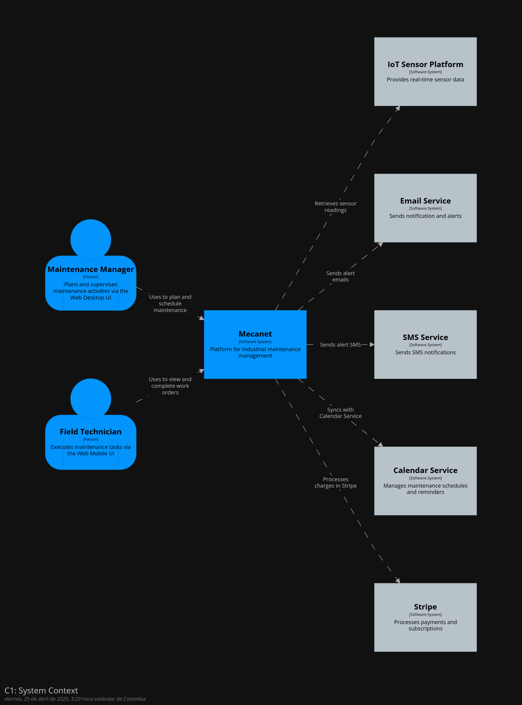
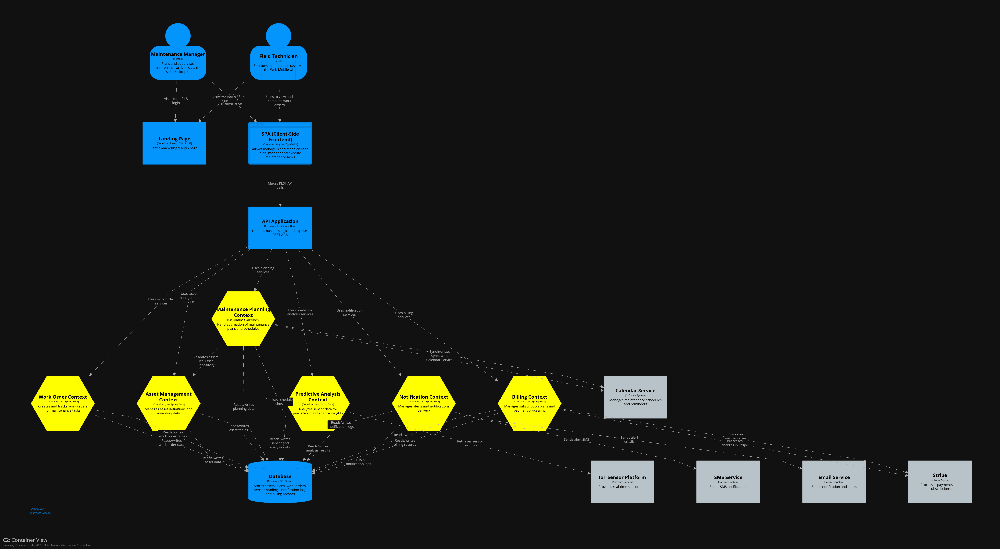
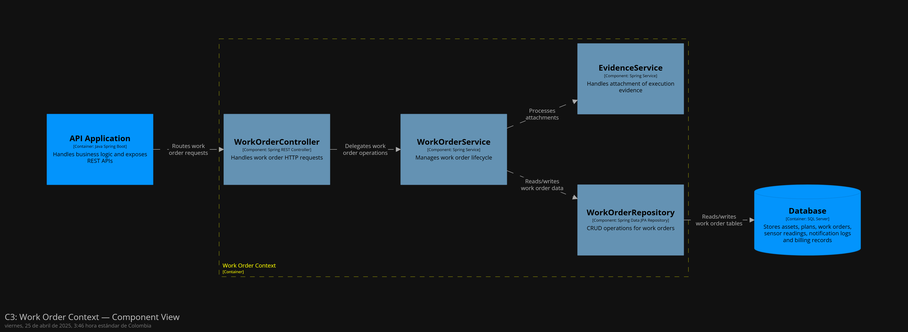
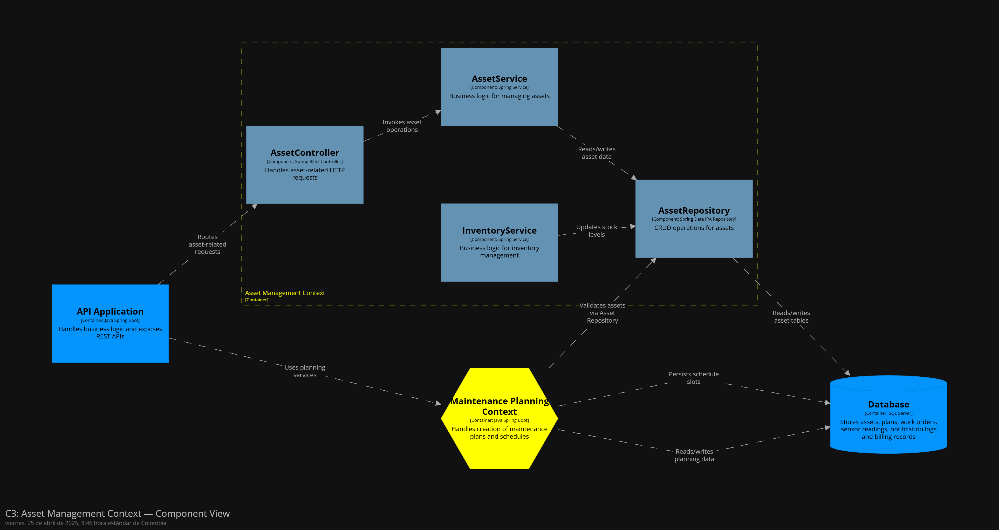
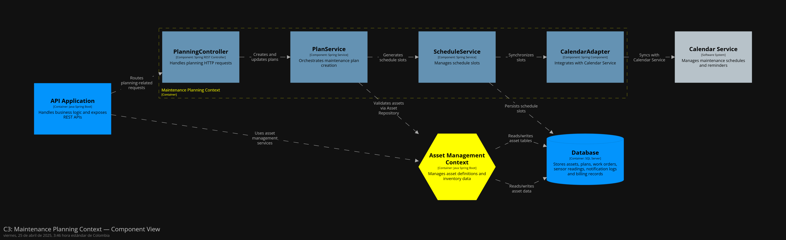
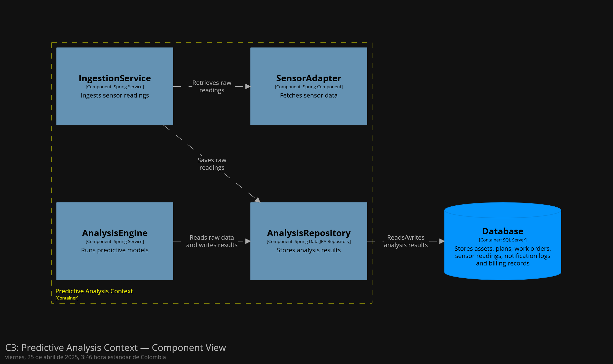
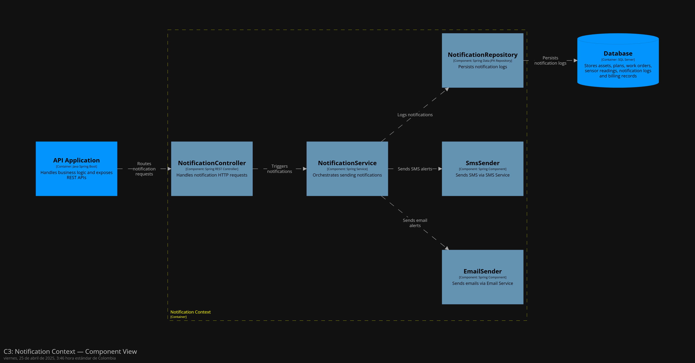
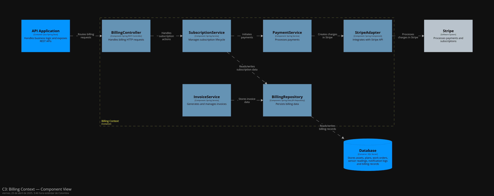
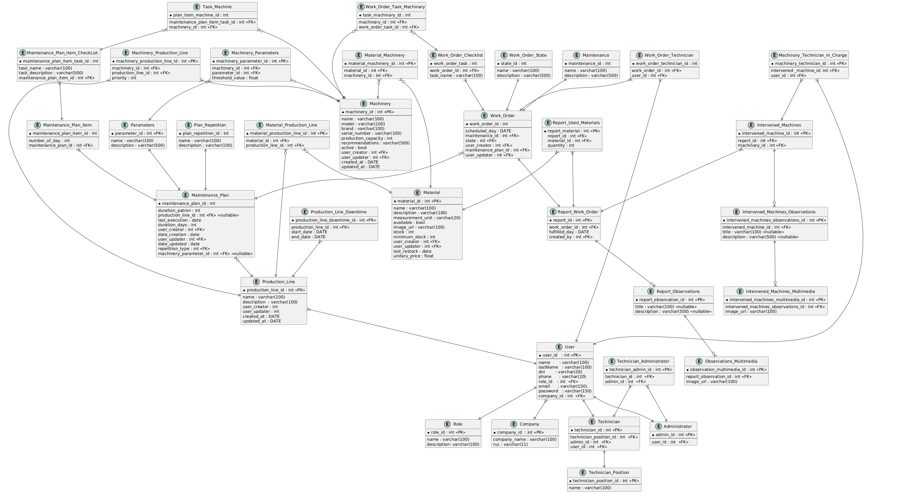

# 
Project Report

    <strong>Universidad Peruana de Ciencias Aplicadas</strong> 
    </img> 
    <strong>Ingeniería de Software - 2025-1</strong> 
    <strong>Aplicaciones Web - 4363</strong> 
    <strong>Profesor: Alex Humberto Sánchez Ponce</strong> 
     <strong>Informe del Trabajo Final</strong>

    <strong>Startup: awawaTech</strong> 
    <strong>Producto: Mecanaut</strong>

    <h3>Team Members:</h3>
    <table align="center">
        <tr>
            <th style="text-align:center;">Member</th>
            <th style="text-align:center;">Code</th>
        </tr>
        <tr>
            <td>Ariana Cecilia Agreda Sobrino</td>
            <td>u202315044</td>
        </tr>
        <tr>
            <td>Claudia Valeria Belledonne Espinoza</td>
            <td>u202210259</td>
        </tr>
        <tr>
            <td>Victor Andres Cruz Ibarra</td>
            <td>u202311053</td>
        </tr>
        <tr>
            <td>Mauricio Daniel Elera Rodríguez</td>
            <td>u202313702</td>
        </tr>
        <tr>
            <td>Rafael Andres Vivanco Salazar</td>
            <td>u202311064</td>
        </tr>
    </table>

    <strong>Abril, 2025</strong>

 

<h1 align="center">Registro de versiones del Informe</h1>
 
<table>
        <thead>
            <tr>
                <th>Versión</th>
                <th>Fecha</th>
                <th>Autor</th>
                <th>Descripción de modificaciones</th>
            </tr>
        </thead>
        <tbody>
            <tr>
                <th>TB1</th>
                <th></th>
                <td>
                    <ul>
          <li>..</li>
          <li>..</li>
          <li>..</li>
          <li>..</li>
                    <ul>
           </td>
      <td>            
             <ul>
          <li>Capítulo I: Introducción</li>
          <li>Capítulo II: Requirements Elicitation & Analysis</li>
          <li>Capítulo III: Requirements Specification</li>
          <li>Capítulo IV: Product Design</li>
          <li>Avance del Capítulo V: Product Implementation, Validation & Deployment hasta el punto 5.2.1.8</li>
          <li>Avance de Conclusiones, Bibliografía y Anexos</li>
        </ul>
      </td>
  </tr>
</tbody>
</table>

# Project Report Collaboration Insights
[Link de repositorio del reporte:](https://github.com/awawaTech/Project-Report): https://github.com/awawaTech/Project-Report

# Contenido
[Student Outcome](#student-outcome)

[Capítulo I: Introducción](#capítulo-i-introducción)
- [1.1. Startup Profile](#11-startup-profile)
  - [1.1.1. Descripción de la Startup](#111-descripción-de-la-startup)
  - [1.1.2. Perfiles de integrantes del equipo](#112-perfiles-de-integrantes-del-equipo)
- [1.2. Solution Profile](#12-solution-profile)
  - [1.2.1 Antecedentes y problemática](#121-antecedentes-y-problemática)
  - [1.2.2 Lean UX Process](#122-lean-ux-process)
    - [1.2.2.1. Lean UX Problem Statements](#1221-lean-ux-problem-statements)
    - [1.2.2.2. Lean UX Assumptions](#1222-lean-ux-assumptions)
    - [1.2.2.3. Lean UX Hypothesis Statements](#1223-lean-ux-hypothesis-statements)
    - [1.2.2.4. Lean UX Canvas](#1224-lean-ux-canvas)
- [1.3. Segmentos objetivo](#13-segmentos-objetivo)

[Capítulo II: Requirements Elicitation & Analysis](#capítulo-ii-requirements-elicitation--analysis)
- [COURSE PROJECT](#course-project)
- [Project Report Collaboration Insights](#project-report-collaboration-insights)
- [Contenido](#contenido)
- [Student Outcome](#student-outcome)
- [Capítulo I: Introducción](#capítulo-i-introducción)
  - [1.1. Startup Profile](#11-startup-profile)
    - [1.1.1. Descripción de la Startup](#111-descripción-de-la-startup)
    - [1.1.2. Perfiles de integrantes del equipo](#112-perfiles-de-integrantes-del-equipo)
  - [1.2. Solution Profile](#12-solution-profile)
    - [1.2.1 Antecedentes y problemática](#121-antecedentes-y-problemática)
    - [1.2.2 Lean UX Process](#122-lean-ux-process)
      - [1.2.2.1. Lean UX Problem Statements](#1221-lean-ux-problem-statements)
      - [1.2.2.2. Lean UX Assumptions](#1222-lean-ux-assumptions)
      - [1.2.2.3. Lean UX Hypothesis Statements](#1223-lean-ux-hypothesis-statements)
      - [1.2.2.4. Lean UX Canvas](#1224-lean-ux-canvas)
  - [1.3. Segmentos objetivo](#13-segmentos-objetivo)
- [Capítulo II: Requirements Elicitation \& Analysis](#capítulo-ii-requirements-elicitation--analysis)
  - [2.1. Competidores](#21-competidores)
    - [2.1.1. Análisis competitivo](#211-análisis-competitivo)
    - [2.1.2. Estrategias y tácticas frente a competidores](#212-estrategias-y-tácticas-frente-a-competidores)
  - [2.2. Entrevistas](#22-entrevistas)
    - [2.2.1. Diseño de entrevistas](#221-diseño-de-entrevistas)
    - [2.2.2. Registro de entrevistas](#222-registro-de-entrevistas)
    - [2.2.3. Análisis de entrevistas](#223-análisis-de-entrevistas)
  - [2.3. Needfinding](#23-needfinding)
    - [2.3.1. User Personas](#231-user-personas)
    - [2.3.2. User Task Matrix](#232-user-task-matrix)
    - [2.3.3. User Journey Mapping](#233-user-journey-mapping)
    - [2.3.4. Empathy Mapping](#234-empathy-mapping)
    - [2.3.5. As-is Scenario Mapping](#235-as-is-scenario-mapping)
  - [2.4. Ubiquitous Language](#24-ubiquitous-language)
- [Capítulo III: Requirements Specification](#capítulo-iii-requirements-specification)
  - [3.1. To-Be Scenario Mapping](#31-to-be-scenario-mapping)
  - [3.2. User Stories](#32-user-stories)
  - [3.3. Impact Mapping](#33-impact-mapping)
  - [3.4. Product Backlog](#34-product-backlog)
- [Capítulo IV: Product Design](#capítulo-iv-product-design)
  - [4.1. Style Guidelines](#41-style-guidelines)
    - [4.1.1. General Style Guidelines](#411-general-style-guidelines)
    - [4.1.2. Web Style Guidelines](#412-web-style-guidelines)
  - [4.2. Information Architecture](#42-information-architecture)
    - [4.2.1. Organization Systems.](#421-organization-systems)
    - [4.2.2. Labeling Systems.](#422-labeling-systems)
    - [4.2.3. SEO Tags and Meta Tags](#423-seo-tags-and-meta-tags)
    - [4.2.4. Searching Systems.](#424-searching-systems)
    - [4.2.5. Navigation Systems.](#425-navigation-systems)
  - [4.3. Landing Page UI Design.](#43-landing-page-ui-design)
    - [4.3.1. Landing Page Wireframe.](#431-landing-page-wireframe)
    - [4.3.2. Landing Page Mock-up.](#432-landing-page-mock-up)
  - [4.4. Web Applications UX/UI Design.](#44-web-applications-uxui-design)
    - [4.4.1. Web Applications Wireframes.](#441-web-applications-wireframes)
    - [4.4.2. Web Applications Wireflow Diagrams.](#442-web-applications-wireflow-diagrams)
    - [4.4.2. Web Applications Mock-ups.](#442-web-applications-mock-ups)
    - [4.4.3. Web Applications User Flow Diagrams.](#443-web-applications-user-flow-diagrams)
  - [4.5. Web Applications Prototyping.](#45-web-applications-prototyping)
  - [4.6. Domain-Driven Software Architecture.](#46-domain-driven-software-architecture)
    - [4.6.1. Software Architecture Context Diagram.](#461-software-architecture-context-diagram)
    - [4.6.2. Software Architecture Container Diagrams.](#462-software-architecture-container-diagrams)
    - [4.6.3. Software Architecture Components Diagrams.](#463-software-architecture-components-diagrams)
  - [4.7. Software Object-Oriented Design.](#47-software-object-oriented-design)
    - [4.7.1. Class Diagrams.](#471-class-diagrams)
    - [4.7.2. Class Dictionary.](#472-class-dictionary)
  - [4.8. Database Design.](#48-database-design)
    - [4.8.1. Database Diagram.](#481-database-diagram)
- [Capítulo V: Product Implementation, Validation \& Deployment](#capítulo-v-product-implementation-validation--deployment)
  - [5.1. Software Configuration Management.](#51-software-configuration-management)
    - [5.1.1. Software Development Environment Configuration.](#511-software-development-environment-configuration)
    - [5.1.2. Source Code Management.](#512-source-code-management)
    - [5.1.3. Source Code Style Guide \& Conventions.](#513-source-code-style-guide--conventions)
    - [5.1.4. Software Deployment Configuration.](#514-software-deployment-configuration)
  - [5.2. Landing Page, Services \& Applications Implementation](#52-landing-page-services--applications-implementation)
    - [5.2.1. Sprint 1](#521-sprint-1)
      - [5.2.1.1. Sprint Planning 1](#5211-sprint-planning-1)
      - [5.2.1.2. Aspect Leaders and Collaborators.](#5212-aspect-leaders-and-collaborators)
      - [5.2.1.3. Sprint Backlog n.](#5213-sprint-backlog-n)
      - [5.2.1.4. Development Evidence for Sprint Review.](#5214-development-evidence-for-sprint-review)
      - [5.2.1.5. Execution Evidence for Sprint Review.](#5215-execution-evidence-for-sprint-review)
      - [5.2.1.6. Services Documentation Evidence for Sprint Review.](#5216-services-documentation-evidence-for-sprint-review)
      - [5.2.1.7. Software Deployment Evidence for Sprint Review.](#5217-software-deployment-evidence-for-sprint-review)
      - [5.2.1.8. Team Collaboration Insights during Sprint.](#5218-team-collaboration-insights-during-sprint)
  - [5.3. Validation Interviews.](#53-validation-interviews)
    - [5.3.1. Diseño de Entrevistas.](#531-diseño-de-entrevistas)
    - [5.3.2. Registro de Entrevistas.](#532-registro-de-entrevistas)
    - [5.3.3. Evaluaciones según heurísticas.](#533-evaluaciones-según-heurísticas)
  - [5.4. Video About-the-Product.](#54-video-about-the-product)
- [Conclusiones](#conclusiones)
  - [Conclusiones y recomendaciones.](#conclusiones-y-recomendaciones)
- [Video About-the-Team.](#video-about-the-team)
- [Bibliografía](#bibliografía)
- [Anexos](#anexos)

[Capítulo III: Requirements Specification](#capítulo-iii-requirements-specification)
- [3.1. To-Be Scenario Mapping](#31-to-be-scenario-mapping)
- [3.2. User Stories](#32-user-stories)
- [3.3. Impact Mapping](#33-impact-mapping)
- [3.4. Product Backlog](#34-product-backlog)

[Capítulo IV: Product Design](#capítulo-iv-product-design)
- [COURSE PROJECT](#course-project)
- [Project Report Collaboration Insights](#project-report-collaboration-insights)
- [Contenido](#contenido)
- [Student Outcome](#student-outcome)
- [Capítulo I: Introducción](#capítulo-i-introducción)
  - [1.1. Startup Profile](#11-startup-profile)
    - [1.1.1. Descripción de la Startup](#111-descripción-de-la-startup)
    - [1.1.2. Perfiles de integrantes del equipo](#112-perfiles-de-integrantes-del-equipo)
  - [1.2. Solution Profile](#12-solution-profile)
    - [1.2.1 Antecedentes y problemática](#121-antecedentes-y-problemática)
    - [1.2.2 Lean UX Process](#122-lean-ux-process)
      - [1.2.2.1. Lean UX Problem Statements](#1221-lean-ux-problem-statements)
      - [1.2.2.2. Lean UX Assumptions](#1222-lean-ux-assumptions)
      - [1.2.2.3. Lean UX Hypothesis Statements](#1223-lean-ux-hypothesis-statements)
      - [1.2.2.4. Lean UX Canvas](#1224-lean-ux-canvas)
  - [1.3. Segmentos objetivo](#13-segmentos-objetivo)
- [Capítulo II: Requirements Elicitation \& Analysis](#capítulo-ii-requirements-elicitation--analysis)
  - [2.1. Competidores](#21-competidores)
    - [2.1.1. Análisis competitivo](#211-análisis-competitivo)
    - [2.1.2. Estrategias y tácticas frente a competidores](#212-estrategias-y-tácticas-frente-a-competidores)
  - [2.2. Entrevistas](#22-entrevistas)
    - [2.2.1. Diseño de entrevistas](#221-diseño-de-entrevistas)
    - [2.2.2. Registro de entrevistas](#222-registro-de-entrevistas)
    - [2.2.3. Análisis de entrevistas](#223-análisis-de-entrevistas)
  - [2.3. Needfinding](#23-needfinding)
    - [2.3.1. User Personas](#231-user-personas)
    - [2.3.2. User Task Matrix](#232-user-task-matrix)
    - [2.3.3. User Journey Mapping](#233-user-journey-mapping)
    - [2.3.4. Empathy Mapping](#234-empathy-mapping)
    - [2.3.5. As-is Scenario Mapping](#235-as-is-scenario-mapping)
  - [2.4. Ubiquitous Language](#24-ubiquitous-language)
- [Capítulo III: Requirements Specification](#capítulo-iii-requirements-specification)
  - [3.1. To-Be Scenario Mapping](#31-to-be-scenario-mapping)
  - [3.2. User Stories](#32-user-stories)
  - [3.3. Impact Mapping](#33-impact-mapping)
  - [3.4. Product Backlog](#34-product-backlog)
- [Capítulo IV: Product Design](#capítulo-iv-product-design)
  - [4.1. Style Guidelines](#41-style-guidelines)
    - [4.1.1. General Style Guidelines](#411-general-style-guidelines)
    - [4.1.2. Web Style Guidelines](#412-web-style-guidelines)
  - [4.2. Information Architecture](#42-information-architecture)
    - [4.2.1. Organization Systems.](#421-organization-systems)
    - [4.2.2. Labeling Systems.](#422-labeling-systems)
    - [4.2.3. SEO Tags and Meta Tags](#423-seo-tags-and-meta-tags)
    - [4.2.4. Searching Systems.](#424-searching-systems)
    - [4.2.5. Navigation Systems.](#425-navigation-systems)
  - [4.3. Landing Page UI Design.](#43-landing-page-ui-design)
    - [4.3.1. Landing Page Wireframe.](#431-landing-page-wireframe)
    - [4.3.2. Landing Page Mock-up.](#432-landing-page-mock-up)
  - [4.4. Web Applications UX/UI Design.](#44-web-applications-uxui-design)
    - [4.4.1. Web Applications Wireframes.](#441-web-applications-wireframes)
    - [4.4.2. Web Applications Wireflow Diagrams.](#442-web-applications-wireflow-diagrams)
    - [4.4.2. Web Applications Mock-ups.](#442-web-applications-mock-ups)
    - [4.4.3. Web Applications User Flow Diagrams.](#443-web-applications-user-flow-diagrams)
  - [4.5. Web Applications Prototyping.](#45-web-applications-prototyping)
  - [4.6. Domain-Driven Software Architecture.](#46-domain-driven-software-architecture)
    - [4.6.1. Software Architecture Context Diagram.](#461-software-architecture-context-diagram)
    - [4.6.2. Software Architecture Container Diagrams.](#462-software-architecture-container-diagrams)
    - [4.6.3. Software Architecture Components Diagrams.](#463-software-architecture-components-diagrams)
  - [4.7. Software Object-Oriented Design.](#47-software-object-oriented-design)
    - [4.7.1. Class Diagrams.](#471-class-diagrams)
    - [4.7.2. Class Dictionary.](#472-class-dictionary)
  - [4.8. Database Design.](#48-database-design)
    - [4.8.1. Database Diagram.](#481-database-diagram)
- [Capítulo V: Product Implementation, Validation \& Deployment](#capítulo-v-product-implementation-validation--deployment)
  - [5.1. Software Configuration Management.](#51-software-configuration-management)
    - [5.1.1. Software Development Environment Configuration.](#511-software-development-environment-configuration)
    - [5.1.2. Source Code Management.](#512-source-code-management)
    - [5.1.3. Source Code Style Guide \& Conventions.](#513-source-code-style-guide--conventions)
    - [5.1.4. Software Deployment Configuration.](#514-software-deployment-configuration)
  - [5.2. Landing Page, Services \& Applications Implementation](#52-landing-page-services--applications-implementation)
    - [5.2.1. Sprint 1](#521-sprint-1)
      - [5.2.1.1. Sprint Planning 1](#5211-sprint-planning-1)
      - [5.2.1.2. Aspect Leaders and Collaborators.](#5212-aspect-leaders-and-collaborators)
      - [5.2.1.3. Sprint Backlog n.](#5213-sprint-backlog-n)
      - [5.2.1.4. Development Evidence for Sprint Review.](#5214-development-evidence-for-sprint-review)
      - [5.2.1.5. Execution Evidence for Sprint Review.](#5215-execution-evidence-for-sprint-review)
      - [5.2.1.6. Services Documentation Evidence for Sprint Review.](#5216-services-documentation-evidence-for-sprint-review)
      - [5.2.1.7. Software Deployment Evidence for Sprint Review.](#5217-software-deployment-evidence-for-sprint-review)
      - [5.2.1.8. Team Collaboration Insights during Sprint.](#5218-team-collaboration-insights-during-sprint)
  - [5.3. Validation Interviews.](#53-validation-interviews)
    - [5.3.1. Diseño de Entrevistas.](#531-diseño-de-entrevistas)
    - [5.3.2. Registro de Entrevistas.](#532-registro-de-entrevistas)
    - [5.3.3. Evaluaciones según heurísticas.](#533-evaluaciones-según-heurísticas)
  - [5.4. Video About-the-Product.](#54-video-about-the-product)
- [Conclusiones](#conclusiones)
  - [Conclusiones y recomendaciones.](#conclusiones-y-recomendaciones)
- [Video About-the-Team.](#video-about-the-team)
- [Bibliografía](#bibliografía)
- [Anexos](#anexos)

[Capítulo V: Product Implementation, Validation & Deployment](#capítulo-v-product-implementation-validation--deployment)
- [COURSE PROJECT](#course-project)
- [Project Report Collaboration Insights](#project-report-collaboration-insights)
- [Contenido](#contenido)
- [Student Outcome](#student-outcome)
- [Capítulo I: Introducción](#capítulo-i-introducción)
  - [1.1. Startup Profile](#11-startup-profile)
    - [1.1.1. Descripción de la Startup](#111-descripción-de-la-startup)
    - [1.1.2. Perfiles de integrantes del equipo](#112-perfiles-de-integrantes-del-equipo)
  - [1.2. Solution Profile](#12-solution-profile)
    - [1.2.1 Antecedentes y problemática](#121-antecedentes-y-problemática)
    - [1.2.2 Lean UX Process](#122-lean-ux-process)
      - [1.2.2.1. Lean UX Problem Statements](#1221-lean-ux-problem-statements)
      - [1.2.2.2. Lean UX Assumptions](#1222-lean-ux-assumptions)
      - [1.2.2.3. Lean UX Hypothesis Statements](#1223-lean-ux-hypothesis-statements)
      - [1.2.2.4. Lean UX Canvas](#1224-lean-ux-canvas)
  - [1.3. Segmentos objetivo](#13-segmentos-objetivo)
- [Capítulo II: Requirements Elicitation \& Analysis](#capítulo-ii-requirements-elicitation--analysis)
  - [2.1. Competidores](#21-competidores)
    - [2.1.1. Análisis competitivo](#211-análisis-competitivo)
    - [2.1.2. Estrategias y tácticas frente a competidores](#212-estrategias-y-tácticas-frente-a-competidores)
  - [2.2. Entrevistas](#22-entrevistas)
    - [2.2.1. Diseño de entrevistas](#221-diseño-de-entrevistas)
    - [2.2.2. Registro de entrevistas](#222-registro-de-entrevistas)
    - [2.2.3. Análisis de entrevistas](#223-análisis-de-entrevistas)
  - [2.3. Needfinding](#23-needfinding)
    - [2.3.1. User Personas](#231-user-personas)
    - [2.3.2. User Task Matrix](#232-user-task-matrix)
    - [2.3.3. User Journey Mapping](#233-user-journey-mapping)
    - [2.3.4. Empathy Mapping](#234-empathy-mapping)
    - [2.3.5. As-is Scenario Mapping](#235-as-is-scenario-mapping)
  - [2.4. Ubiquitous Language](#24-ubiquitous-language)
- [Capítulo III: Requirements Specification](#capítulo-iii-requirements-specification)
  - [3.1. To-Be Scenario Mapping](#31-to-be-scenario-mapping)
  - [3.2. User Stories](#32-user-stories)
  - [3.3. Impact Mapping](#33-impact-mapping)
  - [3.4. Product Backlog](#34-product-backlog)
- [Capítulo IV: Product Design](#capítulo-iv-product-design)
  - [4.1. Style Guidelines](#41-style-guidelines)
    - [4.1.1. General Style Guidelines](#411-general-style-guidelines)
    - [4.1.2. Web Style Guidelines](#412-web-style-guidelines)
  - [4.2. Information Architecture](#42-information-architecture)
    - [4.2.1. Organization Systems.](#421-organization-systems)
    - [4.2.2. Labeling Systems.](#422-labeling-systems)
    - [4.2.3. SEO Tags and Meta Tags](#423-seo-tags-and-meta-tags)
    - [4.2.4. Searching Systems.](#424-searching-systems)
    - [4.2.5. Navigation Systems.](#425-navigation-systems)
  - [4.3. Landing Page UI Design.](#43-landing-page-ui-design)
    - [4.3.1. Landing Page Wireframe.](#431-landing-page-wireframe)
    - [4.3.2. Landing Page Mock-up.](#432-landing-page-mock-up)
  - [4.4. Web Applications UX/UI Design.](#44-web-applications-uxui-design)
    - [4.4.1. Web Applications Wireframes.](#441-web-applications-wireframes)
    - [4.4.2. Web Applications Wireflow Diagrams.](#442-web-applications-wireflow-diagrams)
    - [4.4.2. Web Applications Mock-ups.](#442-web-applications-mock-ups)
    - [4.4.3. Web Applications User Flow Diagrams.](#443-web-applications-user-flow-diagrams)
  - [4.5. Web Applications Prototyping.](#45-web-applications-prototyping)
  - [4.6. Domain-Driven Software Architecture.](#46-domain-driven-software-architecture)
    - [4.6.1. Software Architecture Context Diagram.](#461-software-architecture-context-diagram)
    - [4.6.2. Software Architecture Container Diagrams.](#462-software-architecture-container-diagrams)
    - [4.6.3. Software Architecture Components Diagrams.](#463-software-architecture-components-diagrams)
  - [4.7. Software Object-Oriented Design.](#47-software-object-oriented-design)
    - [4.7.1. Class Diagrams.](#471-class-diagrams)
    - [4.7.2. Class Dictionary.](#472-class-dictionary)
  - [4.8. Database Design.](#48-database-design)
    - [4.8.1. Database Diagram.](#481-database-diagram)
- [Capítulo V: Product Implementation, Validation \& Deployment](#capítulo-v-product-implementation-validation--deployment)
  - [5.1. Software Configuration Management.](#51-software-configuration-management)
    - [5.1.1. Software Development Environment Configuration.](#511-software-development-environment-configuration)
    - [5.1.2. Source Code Management.](#512-source-code-management)
    - [5.1.3. Source Code Style Guide \& Conventions.](#513-source-code-style-guide--conventions)
    - [5.1.4. Software Deployment Configuration.](#514-software-deployment-configuration)
  - [5.2. Landing Page, Services \& Applications Implementation](#52-landing-page-services--applications-implementation)
    - [5.2.1. Sprint 1](#521-sprint-1)
      - [5.2.1.1. Sprint Planning 1](#5211-sprint-planning-1)
      - [5.2.1.2. Aspect Leaders and Collaborators.](#5212-aspect-leaders-and-collaborators)
      - [5.2.1.3. Sprint Backlog n.](#5213-sprint-backlog-n)
      - [5.2.1.4. Development Evidence for Sprint Review.](#5214-development-evidence-for-sprint-review)
      - [5.2.1.5. Execution Evidence for Sprint Review.](#5215-execution-evidence-for-sprint-review)
      - [5.2.1.6. Services Documentation Evidence for Sprint Review.](#5216-services-documentation-evidence-for-sprint-review)
      - [5.2.1.7. Software Deployment Evidence for Sprint Review.](#5217-software-deployment-evidence-for-sprint-review)
      - [5.2.1.8. Team Collaboration Insights during Sprint.](#5218-team-collaboration-insights-during-sprint)
  - [5.3. Validation Interviews.](#53-validation-interviews)
    - [5.3.1. Diseño de Entrevistas.](#531-diseño-de-entrevistas)
    - [5.3.2. Registro de Entrevistas.](#532-registro-de-entrevistas)
    - [5.3.3. Evaluaciones según heurísticas.](#533-evaluaciones-según-heurísticas)
  - [5.4. Video About-the-Product.](#54-video-about-the-product)
- [Conclusiones](#conclusiones)
  - [Conclusiones y recomendaciones.](#conclusiones-y-recomendaciones)
- [Video About-the-Team.](#video-about-the-team)
- [Bibliografía](#bibliografía)
- [Anexos](#anexos)

[Conclusiones](#conclusiones)
- [Conclusiones y recomendaciones](#conclusiones-y-recomendaciones)
- [Video About-the-Team](#video-about-the-team)

[Bibliografía](#bibliografía)

[Anexos](#anexos)

# Student Outcome

ABET – EAC - Student Outcome 5

Criterio: La capacidad de funcionar efectivamente en un equipo cuyos miembros juntos proporcionan liderazgo, crean un entorno de colaboración e inclusivo, establecen objetivos, planifican tareas y cumplen objetivos.

<table>
  <tr>
    <td><b>Criterio específico</b></td>
    <td><b>Acciones realizadas</b></td>
    <td><b>Conclusiones</b></td>
  </tr>
    </thead>
  <tbody>
    <tr>
      <td><b>Comunica oralmente con
efectividad a diferentes rangos
de audiencia.</b></td>
      <td>
        
<b>name  </b>

        
<b>TB1:</b>

        
..

        
<b>TP1:</b>

        
,..

        
<b>TB2:</b>

        
.

        
<b>TF:</b>

        
.

        
<b>name</b>

       
<b>TB1:</b>

        

        
<b>TP1:</b>

        

        
<b>TB2:</b>

        

        
<b>TF:</b>

        
.

        
<b>name</b>

        
<b>TB1:</b>

        
     
        

        
<b>TP1:</b>

        
.

        
<b>TB2:</b>

        

        
<b>TF:</b>

        
.

        
<b></b>

       
<b>TB1:</b>

        

        
<b>TP1:</b>

        

        
<b>TB2:</b>

        

        
<b>TF:</b>

        

      </td>
      <td>
        
<strong>TB1:</strong>

        

        
<strong>TP1:</strong>

        
.

        
<strong>TB2:</strong>

        

        
<strong>TF:</strong>

        

      </td>
    </tr>
    <tr>
      <td>Comunica por escrito con
efectividad a diferentes rangos
de audiencia.</td>
      <td>
        
<b>name  </b>

        
<b>TB1:</b>

        
..

        
<b>TP1:</b>

        
..

        
<b>TB2:</b>

        
..

        
<b>TF:</b>

        
..

        
<b>name</b>

       
<b>TB1:</b>

        
..

        
<b>TP1:</b>

        
..

        
<b>TB2:</b>

        
...

        
<b>TF:</b>

        
.

        
<b>name</b>

        
<b>TB1:</b>

        
..
        

        
<b>TP1:</b>

        
..

        
<b>TB2:</b>

        
...

        
<b>TF:</b>

        
.

        
<b>name</b>

       
<b>TB1:</b>

        
...

        
<b>TP1:</b>

        
...

        
<b>TB2:</b>

        
...

        
<b>TF:</b>

        
...

      </td>
       <td>
        
<strong>TB1:</strong>

        
..

        
<strong>TP1:</strong>

        
...

        
<strong>TB2:</strong>

        
..

        
<strong>TF:</strong>

        
...

      </td>
    </tr>
  </tbody>
</table>

# Capítulo I: Introducción
## 1.1. Startup Profile
### 1.1.1. Descripción de la Startup
### 1.1.2. Perfiles de integrantes del equipo

## 1.2. Solution Profile
### 1.2.1 Antecedentes y problemática
### 1.2.2 Lean UX Process
#### 1.2.2.1. Lean UX Problem Statements
#### 1.2.2.2. Lean UX Assumptions
#### 1.2.2.3. Lean UX Hypothesis Statements
#### 1.2.2.4. Lean UX Canvas
## 1.3. Segmentos objetivo

# Capítulo II: Requirements Elicitation & Analysis

## 2.1. Competidores
### 2.1.1. Análisis competitivo

<table align="center" border="1" cellspacing="0" cellpadding="8">
  <tr>
    <th colspan="6" align="left">Competitive Analysis Landscape</th>
  </tr>
  <tr>
    <td colspan="6" align="center">
      ¿Qué ventajas competitivas puede desarrollar <strong>Mecanaut</strong> para diferenciarse en el mercado de software de mantenimiento frente a soluciones ya consolidadas?
    </td>
  </tr>
  <tr>
    <th colspan="2"></th>
    <td align="center">
       <strong>Mecanaut</strong>
    </td>
    <td align="center">
       <strong>SafetyCulture</strong>
    </td>
    <td align="center">
       <strong>Tofino</strong>
    </td>
    <td align="center">
       <strong>ManagerPlus</strong>
    </td>
  </tr>
    
 <tr>
  <td rowspan="2"><strong>Perfil</strong></td>
  <td><strong>Overview</strong></td>
  <td align="justify">Mecanaut es una solución integral de software enfocada en la gestión del mantenimiento de maquinaria, abarcando mantenimiento preventivo y correctivo.</td>
  <td align="justify">SafetyCulture es una plataforma colaborativa que permite realizar inspecciones digitales, gestionar activos, asignar tareas correctivas y generar informes personalizados.</td>
  <td align="justify">Tofino es una solución CMMS en la nube que integra mantenimiento, gestión de activos, inventario MRO y adquisiciones inteligentes, dirigida a empresas medianas y grandes en sectores como manufactura y distribución.</td>
  <td align="justify">ManagerPlus, ahora parte de Eptura Asset, es una solución CMMS en la nube que ayuda a gestionar activos, órdenes de trabajo, mantenimiento preventivo y seguimiento de inventario.</td>
</tr>

<tr>
  <td><strong>Ventaja competitiva</strong></td>
    <td align="justify">

- Se enfoca en las necesidades del mantenimiento de maquinaria, con funciones adaptadas a este campo.

- Registrar líneas de producción y tiempos muertos permite planificar el mantenimiento de manera más eficiente, reduciendo el impacto en la producción.

- El control de inventario integrado ayuda a evitar desabastecimientos y optimiza la gestión de recursos.
</td>
    
<td align="justify">

- Transforma listas de verificación en papel en formularios digitales personalizables
- Ofrece paneles de control con estadísticas y tendencias para monitorear el rendimiento y cumplimiento.
- Permite asignar tareas, capturar evidencias y comunicar acciones correctivas directamente desde la aplicación.</td>
    
<td align="justify">

- Combina mantenimiento, inventario y adquisiciones en una sola plataforma, eliminando la necesidad de múltiples sistemas.
- Su app para iOS y Android funciona sin conexión a internet, permitiendo operaciones en entornos con conectividad limitada.
- Gestión de Inventario en Tiempo Real.

</td>

<td align="justify">
    
- Combina gestión de activos, mantenimiento preventivo, órdenes de trabajo, inventario y compras en una única plataforma.
- Altamente configurable para adaptarse a las necesidades específicas de diferentes industrias y tamaños de empresa.
- Permite supervisar niveles de stock y realizar pedidos de reabastecimiento.
</td>

</tr>

<tr>
  <td rowspan="2"><strong>Perfil de Marketing</strong></td>
  <td><strong>Mercado objetivo </strong></td>
  <td align="justify">Está dirigido a empresas que requieren una solución especializada para la gestión del mantenimiento de maquinaria, incluyendo sectores como manufactura y transporte</td>
<td align="justify">Está dirigido a empresas de diversos sectores que buscan mejorar sus procesos de inspección y cumplimiento
</td>
<td align="justify">Está dirigido a empresas medianas y grandes en sectores como:​ Manufactura, distribución​, salud​, gestión de instalaciones, etc.</td>
<td align="justify">Está dirigido a empresas de todos los tamaños en sectores como:​ Manufactura, construcción, hostelería, etc.</td>
</tr>

<tr>
  <td><strong>Estrategias de Marketing</strong></td>
    <td align="justify">

- Mecanaut se posiciona como una solución especializada para industrias operativas, diferenciándose de competidores generalistas.
- La plataforma se destacará por su flexibilidad e intuitividad, eliminando fricciones y permitiendo que los clientes la usen desde el primer día.
</td>
    <td align="justify">

- Permite a los usuarios experimentar las funcionalidades premium sin compromiso.
- Ofrece una biblioteca de plantillas, guías y seminarios web para capacitar a los usuarios.
- Mantiene una fuerte presencia en redes sociales y plataformas de reseñas para aumentar su visibilidad.

</td>
    <td align="justify">

- Ofrecen demos adaptadas a las necesidades del cliente.
- Promueven Tofino como una herramienta que fortalece la relación entre distribuidores y sus clientes.
- Presencia constante en Plataformas de Software.
</td>
    <td align="justify">

- Ofrecen demos adaptadas a las necesidades del cliente para mostrar la funcionalidad del software.
- Proporcionan acceso a capacitación, videos, seminarios en línea y tutoriales para facilitar la adopción del software.
- Listados en sitios como Capterra y GetApp para aumentar visibilidad y credibilidad.

</td>
</tr>

<tr>
  <td rowspan="3"><strong>Perfil de Producto</strong></td>
  <td><strong>Productos & Servicios</strong></td>
    <td align="justify">

- Permite una visión completa de la maquinaria y su relación con la producción.
- Facilita el seguimiento y análisis de cada intervención de mantenimiento.
- Análisis de KPIs para el seguimiento de indicadores clave para la mejora continua del mantenimiento.

</td>
    <td align="justify">

- Creación y gestión de listas de verificación personalizadas.​
- Registro y seguimiento del estado de equipos y maquinaria.
- Generación de informes en múltiples formatos, incluyendo PDF, Word y Excel.

</td>
    <td align="justify">

- Programación automática de tareas, seguimiento de órdenes de trabajo y alertas.
- Seguimiento en tiempo real, documentación centralizada y alertas de calibración.
- Compras directas desde catálogos de proveedores.

</td>
    <td align="justify">

- Mantenimiento Preventivo y Correctivo
- Seguimiento en tiempo real, documentación centralizada y alertas de mantenimiento.
- Supervisión de niveles de stock y pedidos de reabastecimiento.
</td>
</tr>

<tr>
  <td><strong>Precios & Costos</strong></td>
    <td align="justify">
        
- <strong>Plan Gratuito:</strong> Incluye hasta 10 activos con mantenimiento básico y 1 perfil de administrador.

- <strong>Plan Profesional:</strong> Incluye hasta 50 activos con mantenimiento preventivo y correctivo, y hasta 5 administradores.

- <strong>Plan Enterprise:</strong> Activos y administradores ilimitados, con opciones de personalización adicionales.</td>

<td align="justify">

- <strong>Plan Gratuito:</strong> Hasta 10 usuarios.
  
- <strong>Plan Premium:</strong> $24 USD por usuario/mes.
  
- <strong>Plan Enterprise:</strong> Precios personalizados.
  
- <strong>Licencias Lite:</strong> $5 por usuario/mes.

</td>
    <td align="justify">

- <strong>Suscripción Mensual:</strong> $400 USD.
</td>
    <td align="justify">
        
- <strong>Modelo de Suscripción:</strong>Precio personalizable.

- <strong>Prueba Gratuita:</strong> Pequeñas demostraciones para testear el aplicativo.
</td>
</tr>

<tr>
  <td><strong>Canales de distribución (Web y/o Móvil)</strong></td>
    <td align="justify">

- Acceso desde navegadores para gestión completa.

- Conexión con otras herramientas empresariales y sistemas mediante APIs.
</td>
    <td align="justify">

- Aplicaciones móviles,  compatibles con iOS y Android.

- Versión web.

- Conexión con otras herramientas empresariales y sistemas mediante APIs y sensores IoT.

</td>
    <td align="justify">

- Aplicaciones móviles,  compatibles con iOS y Android.

- Versión web.

- Compatibilidad con sistemas ERP y otros softwares empresariales.

</td>
    <td align="justify">

- Aplicaciones móviles,  compatibles con iOS y Android.

- Versión web.

- Compatibilidad con sistemas ERP y otros softwares empresariales.
</td>
</tr>

<tr>
  <td rowspan="4"><strong>Análisis SWOT</strong></td>
  <td><strong>Fortalezas</strong></td>
    <td align="justify">

- Cobertura completa de mantenimiento preventivo y correctivo.

- El seguimiento detallado de KPIs facilita la toma de decisiones basada en datos.

- La gestión de inventario integrada optimiza la disponibilidad de repuestos y materiales.
</td>
    <td align="justify">

- Plataforma madura y consolidada.
  
- Presente en múltiples industrias y países.
  
- Interfaz fácil de usar y centrada en móviles.
  
- Versión gratuita funcional para pequeños equipos.
  
- Amplio catálogo de plantillas personalizables.
  
- Gestión de tareas y seguimiento en tiempo real.
  
- Capacidades de análisis (Analytics Dashboard).
  
- Integraciones y compatibilidad con sensores IoT.
</td>
    <td align="justify">

- Combina CMMS, gestión de inventario y adquisiciones en una sola plataforma.

- Aplicación móvil que opera sin conexión, ideal para entornos industriales.

- Modelo de precios que permite acceso ilimitado, favoreciendo la colaboración

</td>
    <td align="justify">

- Combina CMMS, gestión de inventario y adquisiciones en una sola plataforma.

- Aplicación móvil que opera sin conexión, ideal para entornos industriales.

- Modelo de precios que permite acceso ilimitado, favoreciendo la colaboración

</td>
</tr>

<tr>
  <td><strong>Debilidades</strong></td>
    <td align="justify">

- Al ser una startup, Mecanaut aún no cuenta con una presencia consolidada en el mercado.

- La ausencia de aplicaciones móviles puede limitar el acceso en campo y la eficiencia operativa.

</td>
    <td align="justify">

- No especializado 100% en mantenimiento industrial.

- Menor profundidad técnica en KPIs de mantenimiento.

</td>
    <td align="justify">
        
- Sin Prueba Gratuita.

- Altos precios de suscripción mensual.

- Algunos usuarios reportan restricciones en la personalización de la plataforma.

- La amplia gama de funcionalidades puede resultar abrumadora.

</td>
    <td align="justify">

- Sin Prueba Gratuita.

- Interfaz desactualizada y no intuitiva.
</td>
</tr>

<tr>
  <td><strong>Oportunidades</strong></td>
    <td align="justify">

- Crear aplicaciones para iOS y Android para mejorar el acceso y la eficiencia en campo.

- Adaptar la plataforma para pequeñas y medianas empresas en crecimiento que requieren soluciones especializadas.

- Países con industrias en desarrollo necesitan herramientas para optimizar el mantenimiento.
</td>
    <td align="justify">

- Expansión en el sector industrial y manufactura pesada.

- Expansión en mercados emergentes (LatAm, Sudeste Asiático).

- Integración con ERPs o CMMS especializados.
</td>
    <td align="justify">

        
- Adaptar la plataforma para pequeñas y medianas empresas en crecimiento.

- Integración con IoT.

- Colaborar con proveedores de ERP y otros software empresariales para ampliar su ecosistema.

</td>
    <td align="justify">

- Adaptar la plataforma para pequeñas y medianas empresas en crecimiento.​

- Incorporar sensores y dispositivos inteligentes para mantenimiento predictivo.

- Colaborar con proveedores de ERP y otros software empresariales para ampliar su ecosistema.
</td>
</tr>

<tr>
  <td><strong>Amenazas</strong></td>
    <td align="justify">

- Empresas con soluciones más establecidas y mayor cantidad de recursos pueden representar una amenaza para la adopción de Mecanaut.

- Un ataque o fuga de información podría dañar la reputación del software.

- Nuevas normativas en seguridad industrial podrían requerir ajustes costosos en el software.
</td>
    <td align="justify">

- Competidores más especializados en mantenimiento industrial.

- Presión de precios en mercados con software open-source o más accesible

- Ciberseguridad y manejo de datos sensibles

</td>
    <td align="justify">

- Sistemas CMMS enfocados exclusivamente en mantenimiento pueden ofrecer soluciones más profundas en ese ámbito.

- Empresas más pequeñas pueden optar por soluciones más económicas o con modelos freemium.

</td>
    <td align="justify">

- Competencia de soluciones especializadas y emergentes

- La necesidad de mantenerse actualizado con las últimas tecnologías y tendencias del mercado.

- En regiones con presupuestos más ajustados, las soluciones más económicas o freemium pueden ser una amenaza.
</td>
</tr>
</table>

### 2.1.2. Estrategias y tácticas frente a competidores

#### Estrategia 1: Posicionamiento como solución especializada para la industria manufacturera
- 
A diferencia de competidores generalistas o diseñados para múltiples sectores, Mecanaut apuesta por un enfoque claro: ser el sistema de mantenimiento pensado exclusivamente para empresas con operaciones industriales o logísticas intensivas, como el sector textil, agroindustrial o de transporte interprovincial. Esta especialización le permite ofrecer flujos más adaptados al uso real en planta, términos técnicos familiares para los encargados de mantenimiento y configuraciones específicas para distintos tipos de maquinaria. Esta ventaja le otorga cercanía funcional y técnica con los procesos reales de producción.

#### Estrategia 2: Diferenciación por simplicidad de uso y adopción inmediata
- 
Uno de los principales obstáculos para la digitalización del mantenimiento en empresas medianas es la complejidad y curva de aprendizaje de muchas soluciones. Mecanaut convierte esto en una ventaja competitiva al diseñar una interfaz intuitiva, con lenguaje claro y flujos guiados que permiten a los usuarios empezar a usar la plataforma desde el primer día. El objetivo es reducir el tiempo necesario para capacitar al equipo, evitar barreras técnicas, y facilitar la incorporación del software al día a día sin fricciones.

#### Estrategia 3: Aprovechamiento del vacío entre soluciones simples y complejas
- 
El análisis competitivo demuestra que existe un “espacio intermedio” poco atendido entre herramientas demasiado simples (que no cubren inventario ni KPIs) y herramientas demasiado complejas (difíciles de adoptar y costosas). Mecanaut se posiciona justamente en ese espacio, con una propuesta que combina profundidad funcional (MTBF, control de stock, órdenes planificadas) con facilidad de uso. Esto le permite responder a necesidades reales de mantenimiento sin exigir una infraestructura TI avanzada ni grandes inversiones.

## 2.2. Entrevistas
### 2.2.1. Diseño de entrevistas
### 2.2.2. Registro de entrevistas 
### 2.2.3. Análisis de entrevistas
## 2.3. Needfinding
### 2.3.1. User Personas
### 2.3.2. User Task Matrix
### 2.3.3. User Journey Mapping
### 2.3.4. Empathy Mapping
### 2.3.5. As-is Scenario Mapping
## 2.4. Ubiquitous Language

# Capítulo III: Requirements Specification

## 3.1. To-Be Scenario Mapping
## 3.2. User Stories
## 3.3. Impact Mapping
## 3.4. Product Backlog

# Capítulo IV: Product Design

## 4.1. Style Guidelines
### 4.1.1. General Style Guidelines
### 4.1.2. Web Style Guidelines
## 4.2. Information Architecture
### 4.2.1. Organization Systems.
### 4.2.2. Labeling Systems.
### 4.2.3. SEO Tags and Meta Tags
### 4.2.4. Searching Systems.
### 4.2.5. Navigation Systems.
## 4.3. Landing Page UI Design.
### 4.3.1. Landing Page Wireframe.
### 4.3.2. Landing Page Mock-up.
## 4.4. Web Applications UX/UI Design.
### 4.4.1. Web Applications Wireframes.
### 4.4.2. Web Applications Wireflow Diagrams.
### 4.4.2. Web Applications Mock-ups.
### 4.4.3. Web Applications User Flow Diagrams.
## 4.5. Web Applications Prototyping.
## 4.6. Domain-Driven Software Architecture.

El **Domain-Driven Design (DDD)** pretende que el software represente con exactitud el mundo de negocio, favoreciendo la cooperación fluida entre desarrolladores y especialistas del dominio. Para lograrlo, DDD introduce:

- **Lenguaje ubicuo**: un vocabulario compartido tanto en el código como en las conversaciones, que elimina interpretaciones ambiguas.  
- **Bounded Contexts**: división del dominio en zonas independientes, cada una con su propio modelo y límites claros.  
- **Patrones estratégicos** (Context Map, Anticorruption Layer) y **tácticos** (Entidades, Value Objects, Repositories, Domain Services) que orientan la estructura del código y la arquitectura general.

En SwiftPort, esta filosofía permite separar responsabilidades (autenticación, facturación, recursos, planificación, ejecución y notificaciones) y evolucionar cada área por separado sin sacrificar la coherencia global.

 

### 4.6.1. Software Architecture Context Diagram.

El siguiente diagrama presenta en una sola vista el sistema SwiftPort, sus actores principales y los sistemas externos con los que se comunica:

  

 

### 4.6.2. Software Architecture Container Diagrams.

El C2 hace “zoom” dentro del sistema y destaca los contenedores lógicos. Para mostrar cómo se aplica DDD, se representan seis contenedores en forma de hexágono —los bounded contexts— dentro del monolito API Application.

  

 

### 4.6.3. Software Architecture Components Diagrams.
En el nivel C3 profundizamos en cada contenedor. A continuación se muestran los C3 de los bounded contexts identificados:

* Work Order Context:  
  

    

  

* Asset Management Context:  
  

    

  

* Maintance Planning Context:  
  

    

  

* Predictive Analysis Context:  
  

    

  

* Notificaction Context:  
  

    

  

* Billing Context:  
  

    

  

 

## 4.7. Software Object-Oriented Design.
### 4.7.1. Class Diagrams.
### 4.7.2. Class Dictionary.
## 4.8. Database Design.
### 4.8.1. Database Diagram.

</img>

 

# Capítulo V: Product Implementation, Validation & Deployment

## 5.1. Software Configuration Management.
### 5.1.1. Software Development Environment Configuration.
### 5.1.2. Source Code Management.
### 5.1.3. Source Code Style Guide & Conventions.
### 5.1.4. Software Deployment Configuration.
## 5.2. Landing Page, Services & Applications Implementation
### 5.2.1. Sprint 1
#### 5.2.1.1. Sprint Planning 1
#### 5.2.1.2. Aspect Leaders and Collaborators.
#### 5.2.1.3. Sprint Backlog n.
#### 5.2.1.4. Development Evidence for Sprint Review.
#### 5.2.1.5. Execution Evidence for Sprint Review.
#### 5.2.1.6. Services Documentation Evidence for Sprint Review.
#### 5.2.1.7. Software Deployment Evidence for Sprint Review.
#### 5.2.1.8. Team Collaboration Insights during Sprint.
## 5.3. Validation Interviews.
### 5.3.1. Diseño de Entrevistas.
### 5.3.2. Registro de Entrevistas.
### 5.3.3. Evaluaciones según heurísticas.

## 5.4. Video About-the-Product.

# Conclusiones
## Conclusiones y recomendaciones.
# Video About-the-Team.
# Bibliografía
# Anexos
