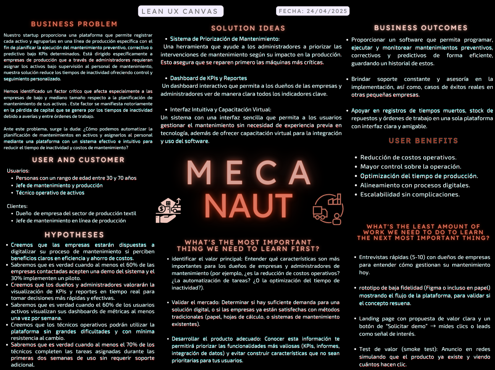
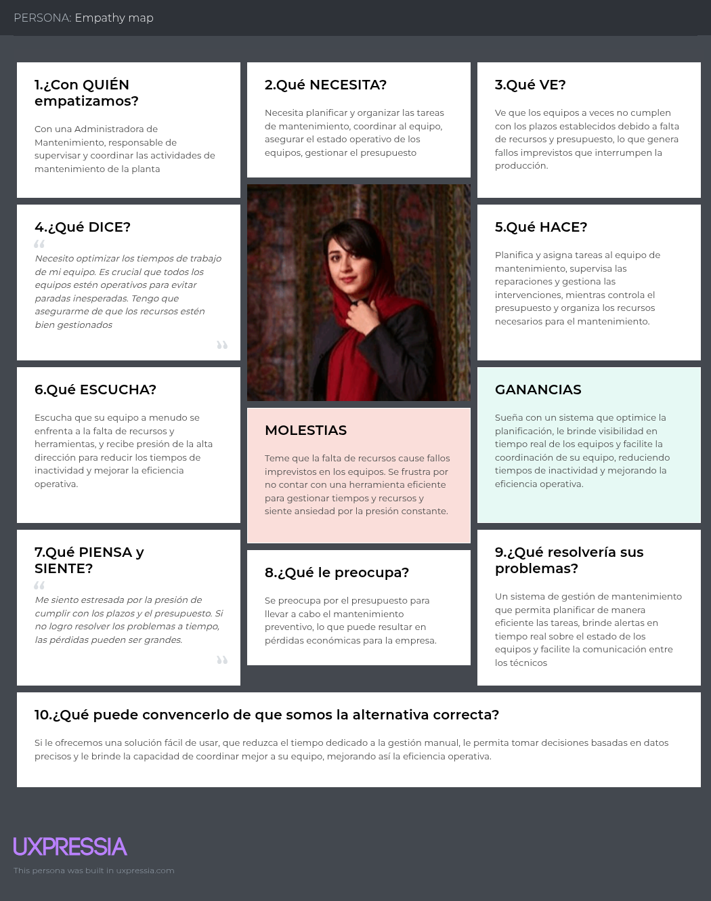
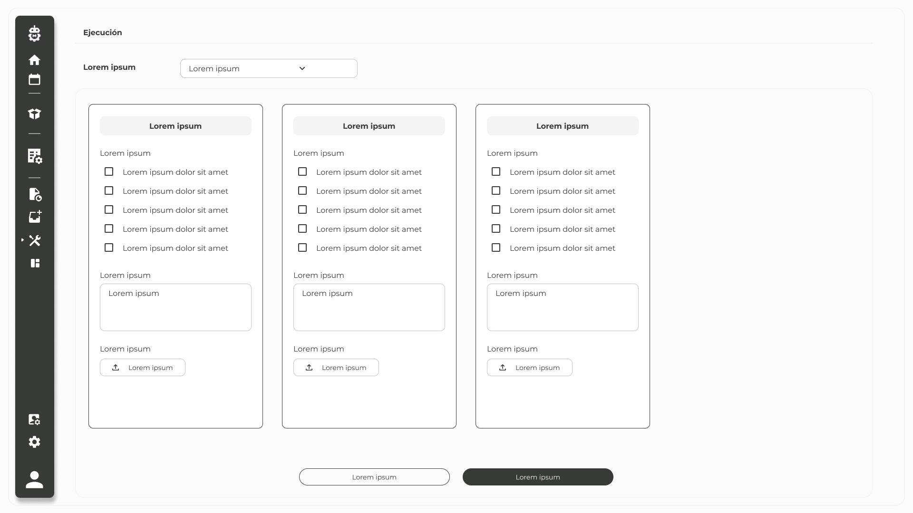
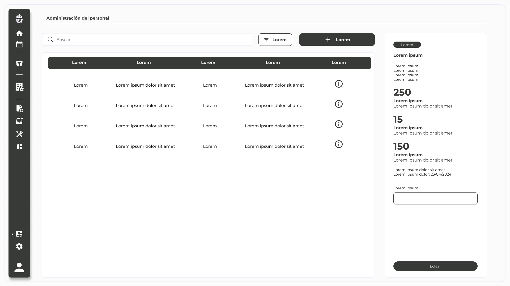

# 
Project Report

    <strong>Universidad Peruana de Ciencias Aplicadas</strong> 
    </img> 
    <strong>Ingeniería de Software - 2025-1</strong>  
    <strong>Aplicaciones Web - 4363</strong> 
    <strong>Profesor: Alex Humberto Sánchez Ponce</strong> 
     <strong>Informe del Trabajo Final</strong>

    <strong>Startup: awawaTech</strong> 
    <strong>Producto: Mecanaut</strong>

    <h3>Team Members:</h3>
    <table align="center">
        <tr>
            <th style="text-align:center;">Member</th>
            <th style="text-align:center;">Code</th>
        </tr>
        <tr>
            <td>Ariana Cecilia Agreda Sobrino</td>
            <td>u202315044</td>
        </tr>
        <tr>
            <td>Claudia Valeria Belledonne Espinoza</td>
            <td>u202210259</td>
        </tr>
        <tr>
            <td>Victor Andres Cruz Ibarra</td>
            <td>u202311053</td>
        </tr>
        <tr>
            <td>Mauricio Daniel Elera Rodríguez</td>
            <td>u202313702</td>
        </tr>
        <tr>
            <td>Rafael Andres Vivanco Salazar</td>
            <td>u202311064</td>
        </tr>
    </table>

    <strong>Abril, 2025</strong>

 

<h1 align="center">Registro de versiones del Informe</h1>
 
<table>
            <tr>
                <th>Versión</th>
                <th>Fecha</th>
                <th>Autor</th>
                <th>Descripción de modificaciones</th>
            </tr>
<tr>
    <td>0</td>
    <td>18/04/2025</td>
    <td>Claudia Belledonne</td>
    <td>Creación del reporte.</td>
</tr>
<tr>
    <td>1.0</td>
    <td>26/04/2025</td>
    <td>Rafael Andres Vivanco Salazar</td>
    <td>Creación y redacción del Startup Profile</td>
</tr>
<tr>
    <td>1.1</td>
    <td>26/04/2025</td>
    <td>Rafael Andres Vivanco Salazar</td>
    <td>Creación y redacción de los segmentos objetivos</td>
</tr>
<tr>
    <td>1.2</td>
    <td>26/04/2025</td>
    <td>Claudia Belledonne</td>
    <td>Creación y redacción de los análisis competitivo asi como las propuesta de estrategias para enfrentarlo.</td>
</tr>
<tr>
    <td>1.3</td>
    <td>26/04/2025</td>
    <td>Victor Andres Cruz Ibarra</td>
    <td>Documentación y análisis de las entrevistas a nuestros segmentos objetivos.</td>
</tr>
<tr>
    <td>1.4</td>
    <td>26/04/2025</td>
    <td>Victor Andres Cruz Ibarra</td>
    <td>Creación y maquetación de la sección 'Needfinding' y sus diagramas. De la misma forma, se completo la redaccion de las historias de usuario y el to-be scenario mapping.</td>
</tr>
<tr>
    <td>1.5</td>
    <td>26/04/2025</td>
    <td>Rafael Andres Vivanco Salazar</td>
    <td>Creación del impact mapping asi como la asignacion de user story points en el product backlog.</td>
</tr>
<tr>
    <td>1.6</td>
    <td>26/04/2025</td>
    <td>Ariana Cecilia Agreda Sobrino, Claudia Belldonne</td>
    <td>Documentación de los style guidelines. Documentación de la seccion de la arquitectura de la información.</td>
</tr>
<tr>
    <td>1.7</td>
    <td>26/04/2025</td>
    <td>Ariana Cecilia Agreda Sobrino</td>
    <td>Creación y documentación del Landing Page UI Design, Web Applications UX/UI Design y Web Applications Prototyping.</td>
</tr>
<tr>
    <td>1.8</td>
    <td>26/04/2025</td>
    <td>Mauricio Elera, Claudia Belledonne</td>
    <td>Creación y documentación del la sección de Domain-Driven Software Architecture, Software Object-Oriented Design y Database Design.</td>
</tr>
<tr>
    <td>1.9</td>
    <td>26/04/2025</td>
    <td>Mauricio Elera</td>
    <td>Creación e implementación de la sección Software Configuration Management.</td>
</tr>
<tr>
    <td>1.10</td>
    <td>26/04/2025</td>
    <td>Claudia Belledonne</td>
    <td>Planeación y documentación del Sprint 1</td>
</tr>
</table>

 

# Project Report Collaboration Insights
[Link de repositorio del reporte:](https://github.com/awawaTech/Project-Report): https://github.com/awawaTech/Project-Report

# Contenido
[Student Outcome](#student-outcome)

[Capítulo I: Introducción](#capítulo-i-introducción)
- [1.1. Startup Profile](#11-startup-profile)
  - [1.1.1. Descripción de la Startup](#111-descripción-de-la-startup)
  - [1.1.2. Perfiles de integrantes del equipo](#112-perfiles-de-integrantes-del-equipo)
- [1.2. Solution Profile](#12-solution-profile)
  - [1.2.1 Antecedentes y problemática](#121-antecedentes-y-problemática)
  - [1.2.2 Lean UX Process](#122-lean-ux-process)
    - [1.2.2.1. Lean UX Problem Statements](#1221-lean-ux-problem-statements)
    - [1.2.2.2. Lean UX Assumptions](#1222-lean-ux-assumptions)
    - [1.2.2.3. Lean UX Hypothesis Statements](#1223-lean-ux-hypothesis-statements)
    - [1.2.2.4. Lean UX Canvas](#1224-lean-ux-canvas)
- [1.3. Segmentos objetivo](#13-segmentos-objetivo)

[Capítulo II: Requirements Elicitation & Analysis](#capítulo-ii-requirements-elicitation--analysis)
- [COURSE PROJECT](#course-project)
- [Project Report Collaboration Insights](#project-report-collaboration-insights)
- [Contenido](#contenido)
- [Student Outcome](#student-outcome)
- [Capítulo I: Introducción](#capítulo-i-introducción)
  - [1.1. Startup Profile](#11-startup-profile)
    - [1.1.1. Descripción de la Startup](#111-descripción-de-la-startup)
    - [1.1.2. Perfiles de integrantes del equipo](#112-perfiles-de-integrantes-del-equipo)
  - [1.2. Solution Profile](#12-solution-profile)
    - [1.2.1 Antecedentes y problemática](#121-antecedentes-y-problemática)
    - [1.2.2 Lean UX Process](#122-lean-ux-process)
      - [1.2.2.1. Lean UX Problem Statements](#1221-lean-ux-problem-statements)
      - [1.2.2.2. Lean UX Assumptions](#1222-lean-ux-assumptions)
      - [1.2.2.3. Lean UX Hypothesis Statements](#1223-lean-ux-hypothesis-statements)
      - [1.2.2.4. Lean UX Canvas](#1224-lean-ux-canvas)
  - [1.3. Segmentos objetivo](#13-segmentos-objetivo)
- [Capítulo II: Requirements Elicitation \& Analysis](#capítulo-ii-requirements-elicitation--analysis)
  - [2.1. Competidores](#21-competidores)
    - [2.1.1. Análisis competitivo](#211-análisis-competitivo)
    - [2.1.2. Estrategias y tácticas frente a competidores](#212-estrategias-y-tácticas-frente-a-competidores)
  - [2.2. Entrevistas](#22-entrevistas)
    - [2.2.1. Diseño de entrevistas](#221-diseño-de-entrevistas)
    - [2.2.2. Registro de entrevistas](#222-registro-de-entrevistas)
    - [2.2.3. Análisis de entrevistas](#223-análisis-de-entrevistas)
  - [2.3. Needfinding](#23-needfinding)
    - [2.3.1. User Personas](#231-user-personas)
    - [2.3.2. User Task Matrix](#232-user-task-matrix)
    - [2.3.3. User Journey Mapping](#233-user-journey-mapping)
    - [2.3.4. Empathy Mapping](#234-empathy-mapping)
    - [2.3.5. As-is Scenario Mapping](#235-as-is-scenario-mapping)
  - [2.4. Ubiquitous Language](#24-ubiquitous-language)
- [Capítulo III: Requirements Specification](#capítulo-iii-requirements-specification)
  - [3.1. To-Be Scenario Mapping](#31-to-be-scenario-mapping)
  - [3.2. User Stories](#32-user-stories)
  - [3.3. Impact Mapping](#33-impact-mapping)
  - [3.4. Product Backlog](#34-product-backlog)
- [Capítulo IV: Product Design](#capítulo-iv-product-design)
  - [4.1. Style Guidelines](#41-style-guidelines)
    - [4.1.1. General Style Guidelines](#411-general-style-guidelines)
    - [4.1.2. Web Style Guidelines](#412-web-style-guidelines)
  - [4.2. Information Architecture](#42-information-architecture)
    - [4.2.1. Organization Systems.](#421-organization-systems)
    - [4.2.2. Labeling Systems.](#422-labeling-systems)
    - [4.2.3. SEO Tags and Meta Tags](#423-seo-tags-and-meta-tags)
    - [4.2.4. Searching Systems.](#424-searching-systems)
    - [4.2.5. Navigation Systems.](#425-navigation-systems)
  - [4.3. Landing Page UI Design.](#43-landing-page-ui-design)
    - [4.3.1. Landing Page Wireframe.](#431-landing-page-wireframe)
    - [4.3.2. Landing Page Mock-up.](#432-landing-page-mock-up)
  - [4.4. Web Applications UX/UI Design.](#44-web-applications-uxui-design)
    - [4.4.1. Web Applications Wireframes.](#441-web-applications-wireframes)
    - [4.4.2. Web Applications Wireflow Diagrams.](#442-web-applications-wireflow-diagrams)
    - [4.4.2. Web Applications Mock-ups.](#442-web-applications-mock-ups)
    - [4.4.3. Web Applications User Flow Diagrams.](#443-web-applications-user-flow-diagrams)
  - [4.5. Web Applications Prototyping.](#45-web-applications-prototyping)
  - [4.6. Domain-Driven Software Architecture.](#46-domain-driven-software-architecture)
    - [4.6.1. Software Architecture Context Diagram.](#461-software-architecture-context-diagram)
    - [4.6.2. Software Architecture Container Diagrams.](#462-software-architecture-container-diagrams)
    - [4.6.3. Software Architecture Components Diagrams.](#463-software-architecture-components-diagrams)
  - [4.7. Software Object-Oriented Design.](#47-software-object-oriented-design)
    - [4.7.1. Class Diagrams.](#471-class-diagrams)
    - [4.7.2. Class Dictionary.](#472-class-dictionary)
  - [4.8. Database Design.](#48-database-design)
    - [4.8.1. Database Diagram.](#481-database-diagram)
- [Capítulo V: Product Implementation, Validation \& Deployment](#capítulo-v-product-implementation-validation--deployment)
  - [5.1. Software Configuration Management.](#51-software-configuration-management)
    - [5.1.1. Software Development Environment Configuration.](#511-software-development-environment-configuration)
    - [5.1.2. Source Code Management.](#512-source-code-management)
    - [5.1.3. Source Code Style Guide \& Conventions.](#513-source-code-style-guide--conventions)
    - [5.1.4. Software Deployment Configuration.](#514-software-deployment-configuration)
  - [5.2. Landing Page, Services \& Applications Implementation](#52-landing-page-services--applications-implementation)
    - [5.2.1. Sprint 1](#521-sprint-1)
      - [5.2.1.1. Sprint Planning 1](#5211-sprint-planning-1)
      - [5.2.1.2. Aspect Leaders and Collaborators.](#5212-aspect-leaders-and-collaborators)
      - [5.2.1.3. Sprint Backlog n.](#5213-sprint-backlog-n)
      - [5.2.1.4. Development Evidence for Sprint Review.](#5214-development-evidence-for-sprint-review)
      - [5.2.1.5. Execution Evidence for Sprint Review.](#5215-execution-evidence-for-sprint-review)
      - [5.2.1.6. Services Documentation Evidence for Sprint Review.](#5216-services-documentation-evidence-for-sprint-review)
      - [5.2.1.7. Software Deployment Evidence for Sprint Review.](#5217-software-deployment-evidence-for-sprint-review)
      - [5.2.1.8. Team Collaboration Insights during Sprint.](#5218-team-collaboration-insights-during-sprint)
  - [5.3. Validation Interviews.](#53-validation-interviews)
    - [5.3.1. Diseño de Entrevistas.](#531-diseño-de-entrevistas)
    - [5.3.2. Registro de Entrevistas.](#532-registro-de-entrevistas)
    - [5.3.3. Evaluaciones según heurísticas.](#533-evaluaciones-según-heurísticas)
  - [5.4. Video About-the-Product.](#54-video-about-the-product)
- [Conclusiones](#conclusiones)
  - [Conclusiones y recomendaciones.](#conclusiones-y-recomendaciones)
- [Video About-the-Team.](#video-about-the-team)
- [Bibliografía](#bibliografía)
- [Anexos](#anexos)

[Capítulo III: Requirements Specification](#capítulo-iii-requirements-specification)
- [3.1. To-Be Scenario Mapping](#31-to-be-scenario-mapping)
- [3.2. User Stories](#32-user-stories)
- [3.3. Impact Mapping](#33-impact-mapping)
- [3.4. Product Backlog](#34-product-backlog)

[Capítulo IV: Product Design](#capítulo-iv-product-design)
- [COURSE PROJECT](#course-project)
- [Project Report Collaboration Insights](#project-report-collaboration-insights)
- [Contenido](#contenido)
- [Student Outcome](#student-outcome)
- [Capítulo I: Introducción](#capítulo-i-introducción)
  - [1.1. Startup Profile](#11-startup-profile)
    - [1.1.1. Descripción de la Startup](#111-descripción-de-la-startup)
    - [1.1.2. Perfiles de integrantes del equipo](#112-perfiles-de-integrantes-del-equipo)
  - [1.2. Solution Profile](#12-solution-profile)
    - [1.2.1 Antecedentes y problemática](#121-antecedentes-y-problemática)
    - [1.2.2 Lean UX Process](#122-lean-ux-process)
      - [1.2.2.1. Lean UX Problem Statements](#1221-lean-ux-problem-statements)
      - [1.2.2.2. Lean UX Assumptions](#1222-lean-ux-assumptions)
      - [1.2.2.3. Lean UX Hypothesis Statements](#1223-lean-ux-hypothesis-statements)
      - [1.2.2.4. Lean UX Canvas](#1224-lean-ux-canvas)
  - [1.3. Segmentos objetivo](#13-segmentos-objetivo)
- [Capítulo II: Requirements Elicitation \& Analysis](#capítulo-ii-requirements-elicitation--analysis)
  - [2.1. Competidores](#21-competidores)
    - [2.1.1. Análisis competitivo](#211-análisis-competitivo)
    - [2.1.2. Estrategias y tácticas frente a competidores](#212-estrategias-y-tácticas-frente-a-competidores)
  - [2.2. Entrevistas](#22-entrevistas)
    - [2.2.1. Diseño de entrevistas](#221-diseño-de-entrevistas)
    - [2.2.2. Registro de entrevistas](#222-registro-de-entrevistas)
    - [2.2.3. Análisis de entrevistas](#223-análisis-de-entrevistas)
  - [2.3. Needfinding](#23-needfinding)
    - [2.3.1. User Personas](#231-user-personas)
    - [2.3.2. User Task Matrix](#232-user-task-matrix)
    - [2.3.3. User Journey Mapping](#233-user-journey-mapping)
    - [2.3.4. Empathy Mapping](#234-empathy-mapping)
    - [2.3.5. As-is Scenario Mapping](#235-as-is-scenario-mapping)
  - [2.4. Ubiquitous Language](#24-ubiquitous-language)
- [Capítulo III: Requirements Specification](#capítulo-iii-requirements-specification)
  - [3.1. To-Be Scenario Mapping](#31-to-be-scenario-mapping)
  - [3.2. User Stories](#32-user-stories)
  - [3.3. Impact Mapping](#33-impact-mapping)
  - [3.4. Product Backlog](#34-product-backlog)
- [Capítulo IV: Product Design](#capítulo-iv-product-design)
  - [4.1. Style Guidelines](#41-style-guidelines)
    - [4.1.1. General Style Guidelines](#411-general-style-guidelines)
    - [4.1.2. Web Style Guidelines](#412-web-style-guidelines)
  - [4.2. Information Architecture](#42-information-architecture)
    - [4.2.1. Organization Systems.](#421-organization-systems)
    - [4.2.2. Labeling Systems.](#422-labeling-systems)
    - [4.2.3. SEO Tags and Meta Tags](#423-seo-tags-and-meta-tags)
    - [4.2.4. Searching Systems.](#424-searching-systems)
    - [4.2.5. Navigation Systems.](#425-navigation-systems)
  - [4.3. Landing Page UI Design.](#43-landing-page-ui-design)
    - [4.3.1. Landing Page Wireframe.](#431-landing-page-wireframe)
    - [4.3.2. Landing Page Mock-up.](#432-landing-page-mock-up)
  - [4.4. Web Applications UX/UI Design.](#44-web-applications-uxui-design)
    - [4.4.1. Web Applications Wireframes.](#441-web-applications-wireframes)
    - [4.4.2. Web Applications Wireflow Diagrams.](#442-web-applications-wireflow-diagrams)
    - [4.4.2. Web Applications Mock-ups.](#442-web-applications-mock-ups)
    - [4.4.3. Web Applications User Flow Diagrams.](#443-web-applications-user-flow-diagrams)
  - [4.5. Web Applications Prototyping.](#45-web-applications-prototyping)
  - [4.6. Domain-Driven Software Architecture.](#46-domain-driven-software-architecture)
    - [4.6.1. Software Architecture Context Diagram.](#461-software-architecture-context-diagram)
    - [4.6.2. Software Architecture Container Diagrams.](#462-software-architecture-container-diagrams)
    - [4.6.3. Software Architecture Components Diagrams.](#463-software-architecture-components-diagrams)
  - [4.7. Software Object-Oriented Design.](#47-software-object-oriented-design)
    - [4.7.1. Class Diagrams.](#471-class-diagrams)
    - [4.7.2. Class Dictionary.](#472-class-dictionary)
  - [4.8. Database Design.](#48-database-design)
    - [4.8.1. Database Diagram.](#481-database-diagram)
- [Capítulo V: Product Implementation, Validation \& Deployment](#capítulo-v-product-implementation-validation--deployment)
  - [5.1. Software Configuration Management.](#51-software-configuration-management)
    - [5.1.1. Software Development Environment Configuration.](#511-software-development-environment-configuration)
    - [5.1.2. Source Code Management.](#512-source-code-management)
    - [5.1.3. Source Code Style Guide \& Conventions.](#513-source-code-style-guide--conventions)
    - [5.1.4. Software Deployment Configuration.](#514-software-deployment-configuration)
  - [5.2. Landing Page, Services \& Applications Implementation](#52-landing-page-services--applications-implementation)
    - [5.2.1. Sprint 1](#521-sprint-1)
      - [5.2.1.1. Sprint Planning 1](#5211-sprint-planning-1)
      - [5.2.1.2. Aspect Leaders and Collaborators.](#5212-aspect-leaders-and-collaborators)
      - [5.2.1.3. Sprint Backlog n.](#5213-sprint-backlog-n)
      - [5.2.1.4. Development Evidence for Sprint Review.](#5214-development-evidence-for-sprint-review)
      - [5.2.1.5. Execution Evidence for Sprint Review.](#5215-execution-evidence-for-sprint-review)
      - [5.2.1.6. Services Documentation Evidence for Sprint Review.](#5216-services-documentation-evidence-for-sprint-review)
      - [5.2.1.7. Software Deployment Evidence for Sprint Review.](#5217-software-deployment-evidence-for-sprint-review)
      - [5.2.1.8. Team Collaboration Insights during Sprint.](#5218-team-collaboration-insights-during-sprint)
  - [5.3. Validation Interviews.](#53-validation-interviews)
    - [5.3.1. Diseño de Entrevistas.](#531-diseño-de-entrevistas)
    - [5.3.2. Registro de Entrevistas.](#532-registro-de-entrevistas)
    - [5.3.3. Evaluaciones según heurísticas.](#533-evaluaciones-según-heurísticas)
  - [5.4. Video About-the-Product.](#54-video-about-the-product)
- [Conclusiones](#conclusiones)
  - [Conclusiones y recomendaciones.](#conclusiones-y-recomendaciones)
- [Video About-the-Team.](#video-about-the-team)
- [Bibliografía](#bibliografía)
- [Anexos](#anexos)

[Capítulo V: Product Implementation, Validation & Deployment](#capítulo-v-product-implementation-validation--deployment)
- [COURSE PROJECT](#course-project)
- [Project Report Collaboration Insights](#project-report-collaboration-insights)
- [Contenido](#contenido)
- [Student Outcome](#student-outcome)
- [Capítulo I: Introducción](#capítulo-i-introducción)
  - [1.1. Startup Profile](#11-startup-profile)
    - [1.1.1. Descripción de la Startup](#111-descripción-de-la-startup)
    - [1.1.2. Perfiles de integrantes del equipo](#112-perfiles-de-integrantes-del-equipo)
  - [1.2. Solution Profile](#12-solution-profile)
    - [1.2.1 Antecedentes y problemática](#121-antecedentes-y-problemática)
    - [1.2.2 Lean UX Process](#122-lean-ux-process)
      - [1.2.2.1. Lean UX Problem Statements](#1221-lean-ux-problem-statements)
      - [1.2.2.2. Lean UX Assumptions](#1222-lean-ux-assumptions)
      - [1.2.2.3. Lean UX Hypothesis Statements](#1223-lean-ux-hypothesis-statements)
      - [1.2.2.4. Lean UX Canvas](#1224-lean-ux-canvas)
  - [1.3. Segmentos objetivo](#13-segmentos-objetivo)
- [Capítulo II: Requirements Elicitation \& Analysis](#capítulo-ii-requirements-elicitation--analysis)
  - [2.1. Competidores](#21-competidores)
    - [2.1.1. Análisis competitivo](#211-análisis-competitivo)
    - [2.1.2. Estrategias y tácticas frente a competidores](#212-estrategias-y-tácticas-frente-a-competidores)
  - [2.2. Entrevistas](#22-entrevistas)
    - [2.2.1. Diseño de entrevistas](#221-diseño-de-entrevistas)
    - [2.2.2. Registro de entrevistas](#222-registro-de-entrevistas)
    - [2.2.3. Análisis de entrevistas](#223-análisis-de-entrevistas)
  - [2.3. Needfinding](#23-needfinding)
    - [2.3.1. User Personas](#231-user-personas)
    - [2.3.2. User Task Matrix](#232-user-task-matrix)
    - [2.3.3. User Journey Mapping](#233-user-journey-mapping)
    - [2.3.4. Empathy Mapping](#234-empathy-mapping)
    - [2.3.5. As-is Scenario Mapping](#235-as-is-scenario-mapping)
  - [2.4. Ubiquitous Language](#24-ubiquitous-language)
- [Capítulo III: Requirements Specification](#capítulo-iii-requirements-specification)
  - [3.1. To-Be Scenario Mapping](#31-to-be-scenario-mapping)
  - [3.2. User Stories](#32-user-stories)
  - [3.3. Impact Mapping](#33-impact-mapping)
  - [3.4. Product Backlog](#34-product-backlog)
- [Capítulo IV: Product Design](#capítulo-iv-product-design)
  - [4.1. Style Guidelines](#41-style-guidelines)
    - [4.1.1. General Style Guidelines](#411-general-style-guidelines)
    - [4.1.2. Web Style Guidelines](#412-web-style-guidelines)
  - [4.2. Information Architecture](#42-information-architecture)
    - [4.2.1. Organization Systems.](#421-organization-systems)
    - [4.2.2. Labeling Systems.](#422-labeling-systems)
    - [4.2.3. SEO Tags and Meta Tags](#423-seo-tags-and-meta-tags)
    - [4.2.4. Searching Systems.](#424-searching-systems)
    - [4.2.5. Navigation Systems.](#425-navigation-systems)
  - [4.3. Landing Page UI Design.](#43-landing-page-ui-design)
    - [4.3.1. Landing Page Wireframe.](#431-landing-page-wireframe)
    - [4.3.2. Landing Page Mock-up.](#432-landing-page-mock-up)
  - [4.4. Web Applications UX/UI Design.](#44-web-applications-uxui-design)
    - [4.4.1. Web Applications Wireframes.](#441-web-applications-wireframes)
    - [4.4.2. Web Applications Wireflow Diagrams.](#442-web-applications-wireflow-diagrams)
    - [4.4.2. Web Applications Mock-ups.](#442-web-applications-mock-ups)
    - [4.4.3. Web Applications User Flow Diagrams.](#443-web-applications-user-flow-diagrams)
  - [4.5. Web Applications Prototyping.](#45-web-applications-prototyping)
  - [4.6. Domain-Driven Software Architecture.](#46-domain-driven-software-architecture)
    - [4.6.1. Software Architecture Context Diagram.](#461-software-architecture-context-diagram)
    - [4.6.2. Software Architecture Container Diagrams.](#462-software-architecture-container-diagrams)
    - [4.6.3. Software Architecture Components Diagrams.](#463-software-architecture-components-diagrams)
  - [4.7. Software Object-Oriented Design.](#47-software-object-oriented-design)
    - [4.7.1. Class Diagrams.](#471-class-diagrams)
    - [4.7.2. Class Dictionary.](#472-class-dictionary)
  - [4.8. Database Design.](#48-database-design)
    - [4.8.1. Database Diagram.](#481-database-diagram)
- [Capítulo V: Product Implementation, Validation \& Deployment](#capítulo-v-product-implementation-validation--deployment)
  - [5.1. Software Configuration Management.](#51-software-configuration-management)
    - [5.1.1. Software Development Environment Configuration.](#511-software-development-environment-configuration)
    - [5.1.2. Source Code Management.](#512-source-code-management)
    - [5.1.3. Source Code Style Guide \& Conventions.](#513-source-code-style-guide--conventions)
    - [5.1.4. Software Deployment Configuration.](#514-software-deployment-configuration)
  - [5.2. Landing Page, Services \& Applications Implementation](#52-landing-page-services--applications-implementation)
    - [5.2.1. Sprint 1](#521-sprint-1)
      - [5.2.1.1. Sprint Planning 1](#5211-sprint-planning-1)
      - [5.2.1.2. Aspect Leaders and Collaborators.](#5212-aspect-leaders-and-collaborators)
      - [5.2.1.3. Sprint Backlog n.](#5213-sprint-backlog-n)
      - [5.2.1.4. Development Evidence for Sprint Review.](#5214-development-evidence-for-sprint-review)
      - [5.2.1.5. Execution Evidence for Sprint Review.](#5215-execution-evidence-for-sprint-review)
      - [5.2.1.6. Services Documentation Evidence for Sprint Review.](#5216-services-documentation-evidence-for-sprint-review)
      - [5.2.1.7. Software Deployment Evidence for Sprint Review.](#5217-software-deployment-evidence-for-sprint-review)
      - [5.2.1.8. Team Collaboration Insights during Sprint.](#5218-team-collaboration-insights-during-sprint)
  - [5.3. Validation Interviews.](#53-validation-interviews)
    - [5.3.1. Diseño de Entrevistas.](#531-diseño-de-entrevistas)
    - [5.3.2. Registro de Entrevistas.](#532-registro-de-entrevistas)
    - [5.3.3. Evaluaciones según heurísticas.](#533-evaluaciones-según-heurísticas)
  - [5.4. Video About-the-Product.](#54-video-about-the-product)
- [Conclusiones](#conclusiones)
  - [Conclusiones y recomendaciones.](#conclusiones-y-recomendaciones)
- [Video About-the-Team.](#video-about-the-team)
- [Bibliografía](#bibliografía)
- [Anexos](#anexos)

[Conclusiones](#conclusiones)
- [Conclusiones y recomendaciones](#conclusiones-y-recomendaciones)
- [Video About-the-Team](#video-about-the-team)

[Bibliografía](#bibliografía)

[Anexos](#anexos)

# Student Outcome

ABET – EAC - Student Outcome 5

Criterio: La capacidad de funcionar efectivamente en un equipo cuyos miembros juntos proporcionan liderazgo, crean un entorno de colaboración e inclusivo, establecen objetivos, planifican tareas y cumplen objetivos.

<table>
  <tr>
    <td><b>Criterio específico</b></td>
    <td><b>Acciones realizadas</b></td>
    <td><b>Conclusiones</b></td>
  </tr>
    </thead>
  <tbody>
    <tr>
      <td><b>Comunica oralmente con
efectividad a diferentes rangos
de audiencia.</b></td>
      <td>
        
<b>name  </b>

        
<b>TB1:</b>

        
..

        
<b>TP1:</b>

        
,..

        
<b>TB2:</b>

        
.

        
<b>TF:</b>

        
.

        
<b>name</b>

       
<b>TB1:</b>

        

        
<b>TP1:</b>

        

        
<b>TB2:</b>

        

        
<b>TF:</b>

        
.

        
<b>name</b>

        
<b>TB1:</b>

        
     
        

        
<b>TP1:</b>

        
.

        
<b>TB2:</b>

        

        
<b>TF:</b>

        
.

        
<b></b>

       
<b>TB1:</b>

        

        
<b>TP1:</b>

        

        
<b>TB2:</b>

        

        
<b>TF:</b>

        

      </td>
      <td>
        
<strong>TB1:</strong>

        

        
<strong>TP1:</strong>

        
.

        
<strong>TB2:</strong>

        

        
<strong>TF:</strong>

        

      </td>
    </tr>
    <tr>
      <td>Comunica por escrito con
efectividad a diferentes rangos
de audiencia.</td>
      <td>
        
<b>name  </b>

        
<b>TB1:</b>

        
..

        
<b>TP1:</b>

        
..

        
<b>TB2:</b>

        
..

        
<b>TF:</b>

        
..

        
<b>name</b>

       
<b>TB1:</b>

        
..

        
<b>TP1:</b>

        
..

        
<b>TB2:</b>

        
...

        
<b>TF:</b>

        
.

        
<b>name</b>

        
<b>TB1:</b>

        
..
        

        
<b>TP1:</b>

        
..

        
<b>TB2:</b>

        
...

        
<b>TF:</b>

        
.

        
<b>name</b>

       
<b>TB1:</b>

        
...

        
<b>TP1:</b>

        
...

        
<b>TB2:</b>

        
...

        
<b>TF:</b>

        
...

      </td>
       <td>
        
<strong>TB1:</strong>

        
..

        
<strong>TP1:</strong>

        
...

        
<strong>TB2:</strong>

        
..

        
<strong>TF:</strong>

        
...

      </td>
    </tr>
  </tbody>
</table>

# Capítulo I: Introducción
## 1.1. Startup Profile
### 1.1.1 Descripción de la Startup 

**Mecanaut** es un software especializado para la gestión de mantenimiento industrial, diseñado para empresas que operan con maquinaria crítica. Permite registrar activos, materiales, líneas de producción y organizar tanto órdenes de trabajo correctivas como planes de mantenimiento preventivo.

Con una interfaz intuitiva y flujos de trabajo optimizados, Mecanaut ayuda a técnicos y administradores a mantener sus equipos operativos, reducir tiempos de inactividad y tomar decisiones basadas en indicadores clave como MTTR, MTBF y costos operativos.
 

### 1.1.2. Perfiles de integrantes del equipo
2. ### Perfiles de integrantes del equipo

|  | **Ariana Agreda \- u202315044**   Mi nombre es Ariana Agreda, tengo 18 años y soy estudiante del 5to ciclo de Ingeniería de Software en la UPC. Me considero una persona creativa, responsable y comprometida con cada tarea. Por ello, estoy dispuesta a dedicar un gran esfuerzo y apoyo para que logremos los mejores resultados para el proyecto. |
| :---: | ----- |
|  | **Claudia Belledonne \- u202210259**   Mi nombre es Claudia Belledonne, tengo 20 años y me encuentro en mi segundo año de Ingeniería de Software en la UPC. En general, soy alguien creativa, responsable, dedicada y manejo bien el hacer muchas tareas a la vez. Para este trabajo, me comprometo a brindar mi máximo esfuerzo y dedicación. |
|  | **Mauricio Elera \- u202313702**   Mi nombre es Mauricio Elera, tengo 18 años y soy estudiante del 5to ciclo de Ingeniería de Software en la UPC. Me considero una persona proactiva, organizada y con muchas ganas de aprender. Estoy comprometido con el trabajo en equipo y dispuesto a aportar todo lo necesario para que nuestro proyecto sea exitoso. |
|  | **Victor Cruz \- u202311053**   Mi nombre es Victor Cruz, tengo 19 años y estoy cursando mi 5to ciclo de la carrera de Ingeniería de Software en la UPC. Soy una persona entusiasta, creativa y comprometida con cada actividad que realizo. Estoy decidido a dar lo mejor de mi en este proyecto para lograr resultados de calidad. |
| | **Rafael Vivanco \- u202311064**   Mi nombre es Rafael Vivanco, tengo 19 años y actualmente curso el 5to ciclo de la carrera de Ingeniería de Software en la UPC. Me considero una persona responsable con facilidad para adaptarme a distintos entornos y manejar varias tareas a la vez. Siempre doy lo mejor de mí en cada proyecto, aportando dedicación, esfuerzo y actitud positiva. |
 

## 1.2. Solution Profile
### 1.2.1 Antecedentes y problemática
En empresas alrededor del mundo el mantenimiento de maquinaria es importante para garantizar la continuidad operativa y la eficiencia en la producción. Tradicionalmente, muchas empresas han gestionado el mantenimiento de forma manual (como hojas de cálculo o documentos físicos), lo que genera pérdida de información, y falta de seguimiento. 

Con la creciente necesidad de optimizar recursos, reducir tiempos de inactividad y anticiparse a posibles fallas, han surgido sistemas asistidos por software. Sin embargo, muchos de estos sistemas son costosos y no se ajustan a la realidad de pequeñas y medianas empresas manufactureras.

#### **Who (¿Quién?)**

Empresas con abundantes  maquinarias, especialmente aquellas que operan en líneas de producción constantes con alta demanda de mercado, son las principales afectadas por problemas de mantenimiento. El administrador y sus técnicos encargados de estas tareas suelen carecer de herramientas digitales adecuadas.

#### **What (¿Qué?)**

Se requiere una solución tecnológica que permita gestionar eficientemente los mantenimientos preventivos y correctivos de maquinaria, así como el inventario de repuestos, los costos y personal técnico involucrado.

#### **Where (¿Dónde?)**

El problema ocurre en fábricas o talleres donde se utilizan diversas maquinarias dentro de líneas de producción. Es común en contextos donde no se cuenta con sistemas integrados o actualizados.

#### **When (¿Cuándo?)**

El problema se presenta constantemente durante las operaciones diarias, especialmente cuando ocurren fallas imprevistas, durante mantenimientos mal programados o cuando se necesita rastrear el historial de intervenciones.

#### **Why (¿Por qué?)**

Porque sin un control adecuado del mantenimiento, las empresas sufren pérdidas económicas debido a tiempos de inactividad (downtime), desgaste prematuro de equipos, mala gestión del stock de repuestos, y falta de información para tomar decisiones operativas como la asignación al personal.

#### **How (¿Cómo?)**

A través del desarrollo de un software llamado *Mecanaut*, se permitirá registrar activos, programar mantenimientos, monitorear KPIs determinados y administrar el inventario de repuestos, todo en una plataforma web que permita la ejecución de órdenes de rabajo.

#### **How Much (¿Cuánto?)**

Aunque el costo específico puede variar según la escala de la empresa, se estima que las pérdidas por mal mantenimiento pueden representar hasta un 5-10 % de la producción total anual, lo que justifica la inversión en un sistema automatizado como *Mecanaut*.
 

### 1.2.2 Lean UX Process
#### 1.2.2.1. Lean UX Problem Statements
Nuestro startup proporciona una plataforma que permite registrar cada activo y agruparlas en una línea de producción específica con el fin de planificar la ejecución del mantenimiento preventivo o correctivo y analizar KPIs determinados. Está dirigido específicamente a empresas de producción que a través de administradores requieran asignar los activos bajo supervisión al personal de mantenimiento, nuestra solución reduce los tiempos de inactividad ofreciendo control y seguimiento personalizado.

Hemos identificado un factor crítico que afecta especialmente a las empresas de bajo y mediano tamaño respecto a la planificación de mantenimiento de sus activos . Este factor se manifiesta notoriamente en la pérdida de capital que se genera por los tiempos de inactividad debido a averías y entre órdenes de trabajo. 

Ante este problema, surge la duda: ¿Cómo podemos automatizar la planificación de mantenimientos en activos y asignarlos al personal mediante una plataforma con un sistema efectivo e intuitivo para reducir el tiempo de inactividad y costos de mantenimiento? 

##### **Domain:**

Gestión de mantenimiento y activos para empresas del sector textil, industrial y transporte.

##### **Customer Segments:**

Dueños de empresas y administradores de mantenimiento.

##### **Pain Points:**

* Falta de organización en los mantenimientos.  
* Dificultad para visualizar métricas clave (KPIs).  
* Riesgo de fallas costosas por no tener historial ni seguimiento.  
* Uso de Excel o papel, sin herramientas digitales efectivas y seguras.

##### **Gap:**

Muchas soluciones actuales son costosas, complejas o no se adaptan empresas sin experiencia tecnológica. Mecanaut busca cubrir ese espacio con una solución accesible e intuitiva.

##### **Vision / Strategy:**

Facilitar la transformación digital del mantenimiento de activos a través de una plataforma amigable, que permita registrar, visualizar y optimizar procesos integrando reportes automáticos.

##### **Initial Segment:**

Dueños de empresas y administradores del sector productor textil, que ya reconocen la necesidad de controlar sus activos, pero aún no digitalizan sus procesos.
 

#### 1.2.2.2 **Lean UX Assumptions**

**1.2.2.2.1 Users**

* Personas con un rango de edad entre 30 y 70 años  
* Administrador de mantenimiento y producción  
* Técnico operativo de activos

 

**1.2.2.2.2 User outcomes:**  
**¿Quién es el usuario?** 

Mis usuarios serán administradores de mantenimiento y técnicos operativos de maquinarias de un rango de edad entre 30 a 70 años que busquen gestionar equipos, planificar tareas, y deberán asegurar la continuidad operativa de las líneas de producción.

**¿Dónde encaja nuestro producto en su trabajo o vida?**   
Encaja en su rutina laboral diaria. Lo utilizan para programar mantenimientos, evitar tiempos muertos y tomar decisiones estratégicas basadas en reportes y KPIs.

**¿Qué problemas tiene nuestro producto y cómo se puede resolver?**   
El problema puede estar en la complejidad inicial del sistema para usuarios mayores o menos familiarizados con la tecnología. Esto se resolverá con un sistema simplificado de navegación y capacitaciones a los usuarios.

**¿Cuándo y cómo es usado nuestro producto?**   
Se utiliza desde computadoras o tablets todos los días laborales: al iniciar turnos, para asignar órdenes de trabajo, hacer seguimiento o consultar historial de maquinaria.

**¿Qué características son importantes?**   
Algunas características importantes son:

* Vista calendario de mantenimientos.  
* Seguimiento de tareas en tiempo real.  
* Panel de control KPIs (MTBF, MTTR, costos, etc.).  
* Generación de órdenes de trabajo.  
* Control de stock de repuestos.  
* Registro de tiempos muertos en líneas de producción.

**¿Cómo debe verse nuestro producto y cómo debe comportarse?** 

Debe tener una interfaz profesional, clara y sin sobrecarga visual. El sistema debe ser estable, rápido y confiabl**e**, incluso con muchos activos registrados en líneas de producción.
 

**1.2.2.2.3 Business outcomes:**

1. **Creo que mis clientes necesitan** reducir el **t**iempo de inactividad de sus maquinarias, optimizar sus procesos de mantenimiento y evitar pérdidas económicas debido a fallas imprevistas  
2. **Estas necesidades se pueden resolver** con *Mecanaut* que permite programar, ejecutar y monitorear mantenimientos preventivos, correctivos y predictivos de forma eficiente, guardando un historial de estos.  
3. **Mis clientes iniciales serán** dueños y administradores de empresas. Su principal motivación es reducir costos operativos, prevenir paradas no planificadas y prolongar la vida útil de sus activos.  
4. **El valor \#1 que un cliente quiere de mi servicio es** la **c**onfianza en que el software garantice el correcto seguimiento y ejecución del mantenimiento, evitando pérdidas económicas.  
5. **El cliente también puede obtener estos beneficios adicionales:** Mayor control sobre los recursos utilizados (repuestos, tiempo, personal) y mejora en auditorías y cumplimiento de KPIs.  
6. **Voy a adquirir la mayoría de mis clientes a través de** campañas de marketing digital y contacto directo con empresas.  
7. **Haré dinero a través de la suscripción** anual o  mensual del software.  
8. **Mi competencia principal en el mercado serán** empresas que ofrecen software de mantenimiento tradicional, que no están adaptados específicamente a las necesidades de **e**mpresas con múltiples líneas de producción.  
9. **Los venceremos debido a nuestro apoyo** en registros de tiempos muertos, stock de repuestos y órdenes de trabajo en una sola plataforma con interfaz clara y amigable.  
10. **Mi mayor riesgo es** que las empresas desconfíen de la efectividad del sistema para adaptarse a sus flujos reales de trabajo o que no lo integren completamente en sus operaciones diarias.  
11. **Resolveremos esto a través de** soporte constante y asesoría en la implementación, así como, casos de éxitos reales en otras pequeñas empresas.

    **Suposición N°1:** Se asume que las empresas tienen la disposición y recursos para digitalizar su proceso de mantenimiento.

    **Suposición N°2:** Se asume que los usuarios (dueños y administradores) valorarán la capacidad de visualizar KPIs y reportes en tiempo real.
    
    **Suposición N°3:** Se asume que los equipos técnicos podrán usar la plataforma sin dificultades técnicas o de resistencia al cambio.
    
    **Suposición N°4:** Se asume que el historial de mantenimiento y los activos previos a la implementación del software están documentados y disponibles para ser cargados al sistema.

**¿Eso, si se prueba que es falso, causará que nuestro negocio / proyecto no funcione?**

Si se prueba que nuestras suposiciones clave son falsas, podríamos enfrentar serios desafíos en la sostenibilidad de Mecanaut como negocio. Por ejemplo, si las empresas no cuentan con información previa organizada sobre sus activos y mantenimiento**s**, el proceso de implementación será más lento y costoso, lo cual puede disuadir a nuevos clientes.
 
#### 1.2.2.3 **Lean UX Hypothesis Statements**

* **Creemos que** las empresas estarán dispuestas a digitalizar su proceso de mantenimiento si perciben beneficios claros en eficiencia y ahorro de costos.

* **Sabremos que** es verdad cuando al menos el 60% de las empresas contactadas acepten una demo del sistema y el 30% implementen un piloto.

* **Creemos que** los dueños y administradores valorarán la visualización de KPIs y reportes en tiempo real para tomar decisiones más rápidas y efectivas.

* **Sabremos que** es verdad cuando el 60% de los usuarios activos visualizan sus dashboards de métricas al menos una vez por semana. 

* **Creemos que** los técnicos operativos podrán utilizar la plataforma sin grandes dificultades y con mínima resistencia al cambio.

* **Sabremos que** es verdad cuando al menos el 70% de los técnicos completen las tareas asignadas durante las primeras dos semanas de uso sin requerir soporte adicional.

* **Creemos que** las empresas tendrán documentado su historial de activos y mantenimientos para agilizar la implementación del sistema.

* **Sabremos que es verdad cuando** al menos el 50% de los nuevos clientes carguen su información de activos en la primera semana.
 

#### 1.2.2.4 **Lean UX Canvas**

 

## 1.3 Segmentos objetivo 

### **Administrador de mantenimiento**
**Descripción:**  
Responsables de asegurar que la maquinaria de producción funcione sin interrupciones. Lideran al equipo técnico, gestionan el inventario de repuestos y generan reportes para la dirección. Buscan herramientas digitales para centralizar el control de tareas, monitorear indicadores de mantenimiento y justificar inversiones en mejoras.
**Características Demográficas:**
* **Edad:** 30–60 años
* **Ingreso:** Medio a alto
* **Ubicación:** Ciudades industriales o zonas con plantas de producción activa
* **Educación:** Técnica o universitaria (ingeniería mecánica, mantenimiento industrial, mecatrónica)
* **Intereses:**
  * Gestión eficiente de recursos y repuestos
  * Cumplimiento de KPIs de mantenimiento (disponibilidad, MTBF, MTTR)
  * Generación de planes de mantenimiento y órdenes de trabajo.
  * Reducción de tiempo de inactividad de equipos

### **Técnico operativo**
**Descripción:**  
Profesionales encargados de ejecutar las tareas de mantenimiento preventivo y correctivo en planta. Necesitan una herramienta que les facilite registrar actividades, recibir órdenes de trabajo de forma clara, y reportar incidencias o necesidades de repuestos. Son quienes operan directamente con el sistema de Mecanaut en el campo.
**Características Demográficas:**
* **Edad:** 20–45 años
* **Ingreso:** Medio
* **Ubicación:** Plantas industriales o centros de producción
* **Educación:** Técnica (mecánica, electricidad industrial, mantenimiento)
* **Intereses:**
  * Tener un sistema claro para registrar y seguir tareas
  * Acceso móvil a órdenes de trabajo diarias.
  * Reporte rápido de evidencia de mantenimiento realizado o necesidades de repuestos
  * Herramientas simples y visuales para trabajar en la planta.  
 

# Capítulo II: Requirements Elicitation & Analysis

## 2.1. Competidores
### 2.1.1. Análisis competitivo

<table align="center" border="1" cellspacing="0" cellpadding="8">
  <tr>
    <th colspan="6" align="left">Competitive Analysis Landscape</th>
  </tr>
  <tr>
    <td colspan="6" align="center">
      ¿Qué ventajas competitivas puede desarrollar <strong>Mecanaut</strong> para diferenciarse en el mercado de software de mantenimiento frente a soluciones ya consolidadas?
    </td>
  </tr>
  <tr>
    <th colspan="2"></th>
    <td align="center">
       <strong>Mecanaut</strong>
    </td>
    <td align="center">
       <strong>SafetyCulture</strong>
    </td>
    <td align="center">
       <strong>Tofino</strong>
    </td>
    <td align="center">
       <strong>ManagerPlus</strong>
    </td>
  </tr>
    
 <tr>
  <td rowspan="2"><strong>Perfil</strong></td>
  <td><strong>Overview</strong></td>
  <td align="justify">Mecanaut es una solución integral de software enfocada en la gestión del mantenimiento de maquinaria, abarcando mantenimiento preventivo y correctivo.</td>
  <td align="justify">SafetyCulture es una plataforma colaborativa que permite realizar inspecciones digitales, gestionar activos, asignar tareas correctivas y generar informes personalizados.</td>
  <td align="justify">Tofino es una solución CMMS en la nube que integra mantenimiento, gestión de activos, inventario MRO y adquisiciones inteligentes, dirigida a empresas medianas y grandes en sectores como manufactura y distribución.</td>
  <td align="justify">ManagerPlus, ahora parte de Eptura Asset, es una solución CMMS en la nube que ayuda a gestionar activos, órdenes de trabajo, mantenimiento preventivo y seguimiento de inventario.</td>
</tr>

<tr>
  <td><strong>Ventaja competitiva</strong></td>
    <td align="justify">

- Se enfoca en las necesidades del mantenimiento de maquinaria, con funciones adaptadas a este campo.

- Registrar líneas de producción y tiempos muertos permite planificar el mantenimiento de manera más eficiente, reduciendo el impacto en la producción.

- El control de inventario integrado ayuda a evitar desabastecimientos y optimiza la gestión de recursos.
</td>
    
<td align="justify">

- Transforma listas de verificación en papel en formularios digitales personalizables
- Ofrece paneles de control con estadísticas y tendencias para monitorear el rendimiento y cumplimiento.
- Permite asignar tareas, capturar evidencias y comunicar acciones correctivas directamente desde la aplicación.</td>
    
<td align="justify">

- Combina mantenimiento, inventario y adquisiciones en una sola plataforma, eliminando la necesidad de múltiples sistemas.
- Su app para iOS y Android funciona sin conexión a internet, permitiendo operaciones en entornos con conectividad limitada.
- Gestión de Inventario en Tiempo Real.

</td>

<td align="justify">
    
- Combina gestión de activos, mantenimiento preventivo, órdenes de trabajo, inventario y compras en una única plataforma.
- Altamente configurable para adaptarse a las necesidades específicas de diferentes industrias y tamaños de empresa.
- Permite supervisar niveles de stock y realizar pedidos de reabastecimiento.
</td>

</tr>

<tr>
  <td rowspan="2"><strong>Perfil de Marketing</strong></td>
  <td><strong>Mercado objetivo </strong></td>
  <td align="justify">Está dirigido a empresas que requieren una solución especializada para la gestión del mantenimiento de maquinaria, incluyendo sectores como manufactura y transporte</td>
<td align="justify">Está dirigido a empresas de diversos sectores que buscan mejorar sus procesos de inspección y cumplimiento
</td>
<td align="justify">Está dirigido a empresas medianas y grandes en sectores como:​ Manufactura, distribución​, salud​, gestión de instalaciones, etc.</td>
<td align="justify">Está dirigido a empresas de todos los tamaños en sectores como:​ Manufactura, construcción, hostelería, etc.</td>
</tr>

<tr>
  <td><strong>Estrategias de Marketing</strong></td>
    <td align="justify">

- Mecanaut se posiciona como una solución especializada para industrias operativas, diferenciándose de competidores generalistas.
- La plataforma se destacará por su flexibilidad e intuitividad, eliminando fricciones y permitiendo que los clientes la usen desde el primer día.
</td>
    <td align="justify">

- Permite a los usuarios experimentar las funcionalidades premium sin compromiso.
- Ofrece una biblioteca de plantillas, guías y seminarios web para capacitar a los usuarios.
- Mantiene una fuerte presencia en redes sociales y plataformas de reseñas para aumentar su visibilidad.

</td>
    <td align="justify">

- Ofrecen demos adaptadas a las necesidades del cliente.
- Promueven Tofino como una herramienta que fortalece la relación entre distribuidores y sus clientes.
- Presencia constante en Plataformas de Software.
</td>
    <td align="justify">

- Ofrecen demos adaptadas a las necesidades del cliente para mostrar la funcionalidad del software.
- Proporcionan acceso a capacitación, videos, seminarios en línea y tutoriales para facilitar la adopción del software.
- Listados en sitios como Capterra y GetApp para aumentar visibilidad y credibilidad.

</td>
</tr>

<tr>
  <td rowspan="3"><strong>Perfil de Producto</strong></td>
  <td><strong>Productos & Servicios</strong></td>
    <td align="justify">

- Permite una visión completa de la maquinaria y su relación con la producción.
- Facilita el seguimiento y análisis de cada intervención de mantenimiento.
- Análisis de KPIs para el seguimiento de indicadores clave para la mejora continua del mantenimiento.

</td>
    <td align="justify">

- Creación y gestión de listas de verificación personalizadas.​
- Registro y seguimiento del estado de equipos y maquinaria.
- Generación de informes en múltiples formatos, incluyendo PDF, Word y Excel.

</td>
    <td align="justify">

- Programación automática de tareas, seguimiento de órdenes de trabajo y alertas.
- Seguimiento en tiempo real, documentación centralizada y alertas de calibración.
- Compras directas desde catálogos de proveedores.

</td>
    <td align="justify">

- Mantenimiento Preventivo y Correctivo
- Seguimiento en tiempo real, documentación centralizada y alertas de mantenimiento.
- Supervisión de niveles de stock y pedidos de reabastecimiento.
</td>
</tr>

<tr>
  <td><strong>Precios & Costos</strong></td>
    <td align="justify">
        
- <strong>Plan Gratuito:</strong> Incluye hasta 10 activos con mantenimiento básico y 1 perfil de administrador.

- <strong>Plan Profesional:</strong> Incluye hasta 50 activos con mantenimiento preventivo y correctivo, y hasta 5 administradores.

- <strong>Plan Enterprise:</strong> Activos y administradores ilimitados, con opciones de personalización adicionales.</td>

<td align="justify">

- <strong>Plan Gratuito:</strong> Hasta 10 usuarios.
  
- <strong>Plan Premium:</strong> $24 USD por usuario/mes.
  
- <strong>Plan Enterprise:</strong> Precios personalizados.
  
- <strong>Licencias Lite:</strong> $5 por usuario/mes.

</td>
    <td align="justify">

- <strong>Suscripción Mensual:</strong> $400 USD.
</td>
    <td align="justify">
        
- <strong>Modelo de Suscripción:</strong>Precio personalizable.

- <strong>Prueba Gratuita:</strong> Pequeñas demostraciones para testear el aplicativo.
</td>
</tr>

<tr>
  <td><strong>Canales de distribución (Web y/o Móvil)</strong></td>
    <td align="justify">

- Acceso desde navegadores para gestión completa.

- Conexión con otras herramientas empresariales y sistemas mediante APIs.
</td>
    <td align="justify">

- Aplicaciones móviles,  compatibles con iOS y Android.

- Versión web.

- Conexión con otras herramientas empresariales y sistemas mediante APIs y sensores IoT.

</td>
    <td align="justify">

- Aplicaciones móviles,  compatibles con iOS y Android.

- Versión web.

- Compatibilidad con sistemas ERP y otros softwares empresariales.

</td>
    <td align="justify">

- Aplicaciones móviles,  compatibles con iOS y Android.

- Versión web.

- Compatibilidad con sistemas ERP y otros softwares empresariales.
</td>
</tr>

<tr>
  <td rowspan="4"><strong>Análisis SWOT</strong></td>
  <td><strong>Fortalezas</strong></td>
    <td align="justify">

- Cobertura completa de mantenimiento preventivo y correctivo.

- El seguimiento detallado de KPIs facilita la toma de decisiones basada en datos.

- La gestión de inventario integrada optimiza la disponibilidad de repuestos y materiales.
</td>
    <td align="justify">

- Plataforma madura y consolidada.
  
- Presente en múltiples industrias y países.
  
- Interfaz fácil de usar y centrada en móviles.
  
- Versión gratuita funcional para pequeños equipos.
  
- Amplio catálogo de plantillas personalizables.
  
- Gestión de tareas y seguimiento en tiempo real.
  
- Capacidades de análisis (Analytics Dashboard).
  
- Integraciones y compatibilidad con sensores IoT.
</td>
    <td align="justify">

- Combina CMMS, gestión de inventario y adquisiciones en una sola plataforma.

- Aplicación móvil que opera sin conexión, ideal para entornos industriales.

- Modelo de precios que permite acceso ilimitado, favoreciendo la colaboración

</td>
    <td align="justify">

- Combina CMMS, gestión de inventario y adquisiciones en una sola plataforma.

- Aplicación móvil que opera sin conexión, ideal para entornos industriales.

- Modelo de precios que permite acceso ilimitado, favoreciendo la colaboración

</td>
</tr>

<tr>
  <td><strong>Debilidades</strong></td>
    <td align="justify">

- Al ser una startup, Mecanaut aún no cuenta con una presencia consolidada en el mercado.

- La ausencia de aplicaciones móviles puede limitar el acceso en campo y la eficiencia operativa.

</td>
    <td align="justify">

- No especializado 100% en mantenimiento industrial.

- Menor profundidad técnica en KPIs de mantenimiento.

</td>
    <td align="justify">
        
- Sin Prueba Gratuita.

- Altos precios de suscripción mensual.

- Algunos usuarios reportan restricciones en la personalización de la plataforma.

- La amplia gama de funcionalidades puede resultar abrumadora.

</td>
    <td align="justify">

- Sin Prueba Gratuita.

- Interfaz desactualizada y no intuitiva.
</td>
</tr>

<tr>
  <td><strong>Oportunidades</strong></td>
    <td align="justify">

- Crear aplicaciones para iOS y Android para mejorar el acceso y la eficiencia en campo.

- Adaptar la plataforma para pequeñas y medianas empresas en crecimiento que requieren soluciones especializadas.

- Países con industrias en desarrollo necesitan herramientas para optimizar el mantenimiento.
</td>
    <td align="justify">

- Expansión en el sector industrial y manufactura pesada.

- Expansión en mercados emergentes (LatAm, Sudeste Asiático).

- Integración con ERPs o CMMS especializados.
</td>
    <td align="justify">

        
- Adaptar la plataforma para pequeñas y medianas empresas en crecimiento.

- Integración con IoT.

- Colaborar con proveedores de ERP y otros software empresariales para ampliar su ecosistema.

</td>
    <td align="justify">

- Adaptar la plataforma para pequeñas y medianas empresas en crecimiento.​

- Incorporar sensores y dispositivos inteligentes para mantenimiento predictivo.

- Colaborar con proveedores de ERP y otros software empresariales para ampliar su ecosistema.
</td>
</tr>

<tr>
  <td><strong>Amenazas</strong></td>
    <td align="justify">

- Empresas con soluciones más establecidas y mayor cantidad de recursos pueden representar una amenaza para la adopción de Mecanaut.

- Un ataque o fuga de información podría dañar la reputación del software.

- Nuevas normativas en seguridad industrial podrían requerir ajustes costosos en el software.
</td>
    <td align="justify">

- Competidores más especializados en mantenimiento industrial.

- Presión de precios en mercados con software open-source o más accesible

- Ciberseguridad y manejo de datos sensibles

</td>
    <td align="justify">

- Sistemas CMMS enfocados exclusivamente en mantenimiento pueden ofrecer soluciones más profundas en ese ámbito.

- Empresas más pequeñas pueden optar por soluciones más económicas o con modelos freemium.

</td>
    <td align="justify">

- Competencia de soluciones especializadas y emergentes

- La necesidad de mantenerse actualizado con las últimas tecnologías y tendencias del mercado.

- En regiones con presupuestos más ajustados, las soluciones más económicas o freemium pueden ser una amenaza.
</td>
</tr>
</table>

### 2.1.2. Estrategias y tácticas frente a competidores

#### Estrategia 1: Posicionamiento como solución especializada para la industria manufacturera
- 
A diferencia de competidores generalistas o diseñados para múltiples sectores, Mecanaut apuesta por un enfoque claro: ser el sistema de mantenimiento pensado exclusivamente para empresas con operaciones industriales o logísticas intensivas, como el sector textil, agroindustrial o de transporte interprovincial. Esta especialización le permite ofrecer flujos más adaptados al uso real en planta, términos técnicos familiares para los encargados de mantenimiento y configuraciones específicas para distintos tipos de maquinaria. Esta ventaja le otorga cercanía funcional y técnica con los procesos reales de producción.

#### Estrategia 2: Diferenciación por simplicidad de uso y adopción inmediata
- 
Uno de los principales obstáculos para la digitalización del mantenimiento en empresas medianas es la complejidad y curva de aprendizaje de muchas soluciones. Mecanaut convierte esto en una ventaja competitiva al diseñar una interfaz intuitiva, con lenguaje claro y flujos guiados que permiten a los usuarios empezar a usar la plataforma desde el primer día. El objetivo es reducir el tiempo necesario para capacitar al equipo, evitar barreras técnicas, y facilitar la incorporación del software al día a día sin fricciones.

#### Estrategia 3: Aprovechamiento del vacío entre soluciones simples y complejas
- 
El análisis competitivo demuestra que existe un “espacio intermedio” poco atendido entre herramientas demasiado simples (que no cubren inventario ni KPIs) y herramientas demasiado complejas (difíciles de adoptar y costosas). Mecanaut se posiciona justamente en ese espacio, con una propuesta que combina profundidad funcional (MTBF, control de stock, órdenes planificadas) con facilidad de uso. Esto le permite responder a necesidades reales de mantenimiento sin exigir una infraestructura TI avanzada ni grandes inversiones.

## 2.2. Entrevistas
### 2.2.1. Diseño de entrevistas
### 2.2.2. Registro de entrevistas 
### 2.2.3. Análisis de entrevistas
## 2.3. Needfinding
### 2.3.1. User Personas
### 2.3.2. User Task Matrix

| Task Matrix | Administrador de mantenimiento |  | Técnico Operativo |  |
|--------------|--------------------------------|--|-------------------|--|
|              | **Frecuencia** | **Importancia** | **Frecuencia** | **Importancia** |
| Registrar activos | Media | Alta | Baja | Media |
| Registrar líneas de producción y su prioridad | Media | Alta | Nula | Baja |
| Generar órdenes de trabajo | Alta | Alta | Baja | Alta |
| Asignar personal técnico a órdenes de trabajo | Alta | Alta | Nula | Media |
| Ejecutar tareas de mantenimiento programado | Nula | Media | Alta | Alta |
| Supervisar el calendario de mantenimiento | Alta | Alta | Media | Alta |
| Analizar KPIs de mantenimiento (Downtime, MTBF, MTTR, etc.) | Alta | Alta | Baja | Media |
| Reportar fallas o incidencias en máquinas | Baja | Alta | Alta | Alta |
| Registrar evidencias (fotos, comentarios, checklist) | Nula | Media | Alta | Alta |
| Crear catálogo de repuestos o materiales | Alta | Alta | Baja | Alta |
| Revisar y actualizar inventario de repuestos | Media | Alta | Alta | Media |
| Solicitar repuestos o materiales faltantes | Baja | Media | Alta | Alta |
| Comunicar disponibilidad o inactividad de máquinas | Baja | Media | Media | Alta |
| Coordinar mantenimientos con las líneas de producción | Alta | Alta | Media | Media |

 

### 2.3.3. User Journey Mapping

**Administrador de mantenimiento:** 

</img>

**Técnico Operativo:**

</img>

 

### 2.3.4. Empathy Mapping

Para la elaboración de los Empathy Maps de los User Personas Claudia (Jefa de Producción) y Jonathan (Técnico Operativo), el equipo siguió un proceso estructurado que inició con una etapa de preparación, en la cual se revisaron las entrevistas realizadas y se consolidaron los hallazgos más relevantes sobre sus comportamientos, necesidades y emociones en su entorno laboral. A continuación, se colocó al User Persona en el centro de la herramienta, y se realizó una lluvia de ideas grupal para responder a las preguntas correspondientes. Esta información fue organizada en las secciones correspondientes del mapa, priorizando la comprensión profunda del usuario desde una perspectiva humana. Este proceso permitió desarrollar una representación empática sólida y realista de cada perfil, que orientará mejor las decisiones de diseño.

**Administrador de mantenimiento:**

</img>

**Técnico Operativo:**

</img>

 

### 2.3.5. As-is Scenario Mapping

**Administrador de mantenimiento:**

**1\. Preparación**

Para elaborar el As-Is Scenario Mapping de Claudia, iniciamos revisando los resultados de su entrevista, su mapa de empatía y la Task Matrix. A partir de ello, buscamos comprender cómo experimenta actualmente el proceso de gestión del mantenimiento desde que recibe una incidencia hasta que genera reportes.

**2\. Lluvia de ideas individual**

Durante la lluvia de ideas, nuestro equipo propuso lo que Claudia probablemente realiza o siente en su día a día. Algunas ideas sueltas fueron:

* Recibe muchas llamadas imprevistas.  
* Usa Excel o papel para anotar incidentes.  
* Se siente presionada cuando hay muchos reportes.  
* Coordina mucho por WhatsApp con técnicos.  
* A veces duda si los técnicos están haciendo bien su trabajo.  
* Tiene que redactar reportes manuales, lo cual le quita tiempo.  
* Se siente frustrada al no tener todo centralizado.

**3\. Revisión grupal**

En esta etapa, revisamos las ideas, detectando repeticiones como "coordinar por WhatsApp" o "anotar en Excel", y consolidamos algunas acciones similares. También descartamos elementos muy generales que no estaban directamente vinculados a fases específicas.

**4\. Identificación de fases**

Identificamos las fases principales del proceso que vive Claudia, desde la recepción del incidente hasta el registro de resultados. Las detectamos al observar puntos de transición en sus actividades cotidianas. Así nacieron fases como “Recepción de incidentes”, “Planear mantenimiento”, “Coordinar con técnicos”.

**5\. Nombrar las fases**

Cada fase fue nombrada con verbos claros que representarán las acciones que Claudia ejecuta o lidera. Buscamos mantener un lenguaje simple y profesional para su fácil lectura.

**6\. Llenar filas: Doing, Thinking y Feeling**

Una vez definidas las fases, completamos con el Doing, Thinking y Feeling en cada una. Para esto, retomamos su mapa de empatía y las ideas validadas del grupo. Por ejemplo, en “Planear mantenimiento” ella anota problemas en Excel (Doing), teme olvidar algo (Thinking), y siente frustración (Feeling).

**7\. Identificación de áreas positivas, negativas y blank areas**

Se identificaron áreas negativas donde Claudia siente ansiedad, frustración o incertidumbre, especialmente en la coordinación y verificación de tareas. Como área positiva se detectó el sentimiento de control en la planificación inicial. Las blank areas fueron momentos en los que no teníamos claridad sobre cómo prioriza tareas o cómo mide la efectividad de las órdenes, y lo marcamos para investigar más profundamente. 

Finalmente, luego del anterior proceso conseguimos el siguiente As-Is Scenario Mapping:

</img>

**Técnico Operativo:**

**1\. Preparación**

Para el caso de Jonathan, el equipo revisó su mapa de empatía, entrevista y Task Matrix para identificar cómo es su jornada laboral al realizar tareas de mantenimiento. Nos enfocamos en su experiencia desde que recibe una orden de trabajo hasta que la completa y reporta.

**2\. Lluvia de ideas individual**

Algunas ideas surgidas de manera individual por los miembros del equipo fueron:

* A veces no sabe si tiene todas las herramientas al empezar.  
* Revisa la orden por WhatsApp o la recibe verbalmente.  
* No siempre recibe instrucciones claras.  
* Se frustra si le falta material.  
* Se siente presionado por completar bien y rápido el trabajo.  
* No tiene tiempo para reportar de forma detallada.

**3\. Revisión grupal**

Reunimos las ideas y agrupamos conceptos similares, como los relacionados a la verificación de herramientas y la inseguridad al iniciar una tarea. También se eliminaron algunas ideas vagas o repetitivas, como “le falta comunicación”, que se sustituyó por situaciones más específicas.

**4\. Identificación de fases**

Definimos fases que representan el flujo natural del trabajo de Jonathan, como “Recepción de orden de trabajo”, “Búsqueda y preparación de herramientas”, “Ejecución del mantenimiento”. Estas surgieron al seguir el trayecto real de una tarea.

**5\. Nombrar las fases**

Elegimos nombres que reflejaran lo que hace Jonathan, con un enfoque operativo. Por ejemplo, “Ejecución del mantenimiento” en lugar de simplemente “Trabajo”, para mantener claridad y precisión.

**6\. Llenar filas: Doing, Thinking y Feeling**

Completamos las filas con base en sus actividades diarias. Por ejemplo, en la fase de ejecución, realiza el trabajo solicitado (Doing), piensa que debe hacerlo rápido y bien (Thinking), y se siente concentrado (Feeling). Nos apoyamos tanto en su mapa de empatía como en sus respuestas de entrevista.

**7\. Identificación de áreas positivas, negativas y blank areas**

Detectamos áreas negativas asociadas a la falta de recursos o comunicación, que generan inseguridad, frustración y desmotivación. Como punto positivo, la ejecución misma del trabajo le permite concentrarse. Las blank areas surgieron en fases como la de reportar resultados, donde no sabíamos exactamente qué tan detallado era el informe o cómo se entregaba.

Luego de este proceso, se consiguió el siguiente As-Is Scenario Mapping:

</img>

 

## 2.4. Ubiquitous Language

Maintenance Request(Solicitud de mantenimiento): Petición generada por un usuario para atender un incidente o requerimiento de mantenimiento.

Incident(Incidente): Evento que interrumpe el funcionamiento normal de un equipo o instalación.

Work Order(Orden de trabajo): Documento o registro formal que detalla las tareas a realizar para atender una solicitud de mantenimiento.

Preventive Maintenance(Mantenimiento preventivo): Intervenciones programadas para evitar fallas o deterioro de los activos.

Corrective Maintenance(Mantenimiento correctivo): Intervenciones realizadas tras detectar una falla o avería.

Asset(Activo): Bien físico (máquina, equipo, infraestructura) que requiere mantenimiento o monitoreo.

Technician(Técnico): Persona encargada de ejecutar tareas de mantenimiento, reparación o inspección.

Downtime(Tiempo de inactividad): Tiempo durante el cual un activo no está operativo debido a un problema técnico.

Maintenance Schedule(Cronograma de mantenimiento): Plan que define fechas y frecuencias para realizar tareas de mantenimiento.  
Mean Time Between Failures(MTBF): El tiempo promedio entre fallos de un equipo. Este valor es importante para evaluar la confiabilidad de las máquinas y para planificar el mantenimiento preventivo.

Mean Time To Repair(MTTR): El tiempo promedio necesario para reparar un equipo después de una falla. Este valor es crucial para evaluar la eficiencia del proceso de reparación y la capacidad de recuperación.

Spare Parts(Repuestos): Componentes o piezas necesarias para reparar o reemplazar partes de un activo.

Checklist(Lista de verificación): Documento que contiene tareas o ítems que deben revisarse durante una intervención.

Report(Informe): Documento que resume el trabajo realizado, hallazgos o resultados de una tarea de mantenimiento.

Ticket: Registro en el sistema sobre un problema específico reportado.

Maintenance History(Historial de mantenimiento): Registro acumulado de todas las intervenciones realizadas sobre un activo.

Service Provider(Proveedor de servicios): Empresa o profesional externo encargado de brindar servicios de mantenimiento.

 

# Capítulo III: Requirements Specification

Después de comprender a profundidad a nuestros usuarios y sus contextos, pasamos a una etapa clave del proyecto: definir claramente qué debe hacer nuestra solución. En esta sección presentamos los requisitos que guiarán el desarrollo del producto digital, alineados con los hallazgos obtenidos. A través de herramientas como el *To-Be Scenario Mapping*, *User Stories*, *Impact Map* y *Product Backlog*, comenzamos a construir la base de una experiencia que responda verdaderamente a sus necesidades.

## 3.1. To-Be Scenario Mapping

**1\. Preparación**

Iniciamos esta etapa revisando los As-Is Scenario Mappings, las entrevistas, y los mapas de empatía para entender las frustraciones, necesidades y puntos de mejora tanto de Claudia como de Jonathan. El objetivo fue imaginar un futuro ideal donde sus actividades fueran más fluidas, apoyadas por tecnología, y sin fricciones innecesarias.

**2\. Lluvia de ideas individual**

El equipo propuso de manera individual cómo podría ser una experiencia ideal para Claudia y Jonathan si contaran con un sistema optimizado. Las ideas incluyeron, por ejemplo:

* Alertas automáticas de fallas.  
* Asignación de tareas sin llamadas.  
* Seguimiento en tiempo real.  
* Confirmación previa de herramientas.  
* Comunicación fluida sin confusiones.  
* Registro automático de evidencias.

**3\. Revisión grupal**

Se reunieron todas las ideas propuestas y se agruparon por afinidad, eliminando duplicados y conectando propuestas complementarias. Se validaron las ideas más viables desde el punto de vista tecnológico y de experiencia de usuario, manteniendo un enfoque centrado en las tareas reales de Claudia y Jonathan.

**4\. Identificación de fases (columnas)**

A partir de los flujos mejorados, el equipo identificó las fases clave del nuevo proceso. Estas fases representan los momentos de interacción con el sistema en un escenario deseado, con una lógica fluida desde la identificación del problema hasta el cierre de la tarea. Así se definieron las columnas como:

Para Claudia:

* Identificación  
* Planificar mantenimiento  
* Asignar tareas a técnicos  
* Supervisar en tiempo real  
* Registro y reporte de resultados

Para Jonathan:

* Recepción digital de la orden de trabajo  
* Confirmación de herramientas y materiales  
* Ejecución guiada de tareas  
* Comunicación con administrador en tiempo real  
* Registro y cierre

**5\. Nombrar las fases**

Se eligieron nombres breves, descriptivos y centrados en la acción. Priorizamos el uso de verbos como identificar, planificar, asignar, supervisar, etc., para reflejar claramente el tipo de interacción del usuario con el sistema o proceso. Nos aseguramos que cada nombre pudiera transmitir de forma intuitiva lo que ocurre en esa etapa, facilitando su comprensión.

**Administrador de mantenimiento:**  

</img> 
 
El To-Be Scenario Mapping de Claudia Navarro muestra una experiencia optimizada frente al As-Is. Las fases del proceso se mantienen, pero se transforman gracias a Mecanaut: la recepción de incidentes se automatiza, la planificación y asignación se vuelve más eficiente, y el seguimiento y reporte se digitalizan. Esto reduce tiempos, evita errores y le brinda mayor control sobre el mantenimiento.  

**Técnico Operador:**  

</img> 
 
En comparación con el escenario actual, el To-Be Scenario introduce mejoras clave: digitalización de órdenes, disponibilidad anticipada de herramientas, instrucciones más claras, y comunicación estructurada. Estas mejoras reducen el estrés, aumentan la eficiencia y motivación del técnico, y aseguran una mejor documentación del trabajo realizado.

 

## 3.2. User Stories

| Epic/ Story ID | Título | Descripción  | Criterios de aceptación | Linked ID |
| :---- | :---- | :---- | :---- | :---- |
| US01 | Registro de maquinarias | Como administrador de mantenimiento, quiero registrar maquinarias para llevar un control detallado del equipo en planta. | Escenario 1: Registro exitoso **Given** que el administrador accede al sistema. **When** registra una nueva maquinaria. **Then** se guarda correctamente con su información correspondiente. Escenario 2: Campos incompletos **Given** que el administrador intenta registrar una maquinaria.  **When** no completa los campos obligatorios.  **Then** el sistema muestra un mensaje de error indicando la falta de información. | EP01 |
| US02 | Registro de líneas de producción | Como administrador de mantenimiento, quiero registrar líneas de producción con prioridad, para planificar el mantenimiento. | Escenario 1: Registro exitoso **Given** que el administrador crea una línea.  **When** asigna prioridad. **Then** el sistema la almacena correctamente. Escenario 2: Prioridad no asignada **Given** que el administrador intenta registrar una línea.  **When** no selecciona una prioridad.  **Then** el sistema bloquea el registro y solicita definirla. | EP01 |
| US03 | Generación de órdenes de trabajo correctivas | Como administrador, quiero generar órdenes de trabajo correctivas, para cuando suceda un mantenimiento inesperado. | Escenario 1: Orden generada correctamente  **Given** que un activo necesita un mantenimiento repentino. **When** el administrador genera una orden manualmente.  **Then** esta queda registrada y visible en el calendario para los técnicos. Escenario 2: Error de duplicación  **Given** que el administrador intenta generar una orden ya existente. **When** el sistema detecta duplicidad. **Then** muestra un aviso y no permite guardar. | EP02 |
| US04 | Asignación de personal técnico | Como administrador, quiero asignar técnicos a órdenes de trabajo, para asegurar su ejecución. | Escenario 1: Asignación exitosa **Given** que una orden está activa.  **When** selecciona a uno o más técnicos **Then** el sistema le notifica y actualiza la orden. Escenario 2: Técnicos no disponibles  **Given** que el o los técnicos ya tienen tareas asignadas que interfieren con la actual  **When** el administrador intenta asignarle una nueva.  **Then** el sistema alerta sobre la carga de trabajo. | EP02 |
| US05 | Supervisión del calendario de plan de mantenimiento | Como administrador, quiero ver el calendario de planes de mantenimiento, para monitorear su cumplimiento. | Escenario 1: Visualización correcta  **Given** que accedió al calendario.  **When** se visualiza un plan de mantenimiento.  **Then** se muestra el estado de cada orden de trabajo (pendiente, en progreso o finalizada). Escenario 2: Error de carga  **Given** que hay una falla técnica.  **When** intenta cargar el calendario.  **Then** se muestra un mensaje de mantenimiento del sistema. | EP08 |
| US06 | Filtro de plan de mantenimiento | Como usuario administrador, quiero filtrar los planes de mantenimiento por criterios como tipo de activo, fecha o estado, para visualizar solo los planes relevantes en el calendario. | Escenario 1: Filtrar planes de mantenimiento **Given** que está en la vista del calendario de mantenimiento.  **When** selecciona el tipo de filtro deseado. **And** elige la especificación. **Then** se muestran los planes de mantenimiento asociados al filtro Escenario 2: Filtro no válido **Given** esta en la vista del calendario de mantenimiento.  **When** aplica un filtro con un estado inexistente o sin planes asociados.  **Then** el sistema muestra un mensaje que indica que no se encontraron resultados. | EP08 |
| US07 | Visualización de KPIs | Como administrador, quiero analizar métricas (MTBF, MTTR, etc.), para evaluar el rendimiento. | Escenario 1: Acceso a métricas  **Given** que accede al dashboard.  **When** selecciona una métrica.  **Then** el sistema muestra un gráfico actualizado. Escenario 2: Filtro no válido **Given** que el administrador aplica un filtro erróneo.  **When** solicita la métrica.  **Then** el sistema devuelve un mensaje de error explicando el fallo. | EP03 |
| US08 | Reporte de orden de trabajo | Como técnico, quiero poder hacer un reporte final de una orden de trabajo, para dejar constancia. | Escenario 1: Reporte exitoso  **Given** que termina una orden de trabajo.  **When** sube evidencia al reporte.  **Then** el reporte se subirá con la evidencia correspondiente. Escenario 2: Formato de evidencia incorrecto  **Given** que se intenta subir una imagen con formato no permitido. **When** carga el archivo. **Then** el sistema rechaza el archivo y muestra el tipo aceptado. | EP04 |
| US09 | Implementación de plan de mantenimiento | Como administrador, quiero crear un plan de mantenimiento para una línea de producción y agregarlo al calendario con una duración para organizar a mis técnicos. | Escenario 1: Agregación exitosa  **Given** que ingresó a la opción para crear un plan de trabajo **When** llena los campos en el formulario (línea de producción, maquinaria involucrada, duración, etc.)  **Then** el plan de mantenimiento se agrega al calendario. Escenario 2: Falla en la agregación **Given** que el usuario no llena todos los campos. **When** envía el formulario. **Then** el sistema solicita completar los campos requeridos. | EP02 |
| US10 | Consulta de órdenes de trabajo diarias | Como técnico, quiero ver las órdenes de trabajo que me han sido asignadas en el día, para planificarlo. | Escenario 1: Consulta correcta  **Given** que accede al calendario. **When** presiona el día que desea ver las órdenes. **Then** ve el listado ordenado de órdenes en el día. Escenario 2: Sin tareas asignadas  **Given** que el técnico no tiene ordenes en el día seleccionado.  **When** presiona el día que desea consultar.  **Then** el sistema muestra un mensaje informando que no hay ordenes asignadas. | EP08 |
| US11 | Solicitud de repuestos | Como técnico, quiero solicitar repuestos faltantes, para poder realizar el mantenimiento. | Escenario 1: Solicitud correcta  **Given** que una tarea está activa. **When** faltan materiales. **Then** puede hacer una solicitud que se registra en el inventario. Escenario 2: Solicitud duplicada  **Given** que ya se solicitó ese material.  **When** el técnico intenta solicitarlo de nuevo.  **Then** el sistema le informa que ya existe una solicitud pendiente. | EP06 |
| US12 | Revisión de inventario | Como administrador, quiero ver el inventario actualizado en tiempo real, para asegurar la disponibilidad de herramientas y materiales. | Escenario 1: Revisión de inventario **Given** que accedió al inventario. **When** selecciona las herramienta o materiales que desea revisar. **Then** el sistema refleja el inventario disponible en tiempo real. Escenario 2: Error en la base de datos **Given** que accedió al inventario. **When** hay un error de conexión con la base de datos. **Then** el sistema muestra un mensaje de error indicando que no se puede visualizar el inventario. | EP06 |
| US13 | Sección de beneficios del sistema | Como usuario interesado, quiero conocer los beneficios del sistema, para evaluar su utilidad. | Escenario 1: Acceso a sección **Given** que el visitante entra a la landing page. **When** accede a la sección de beneficios. **Then** visualiza los beneficios con claridad. Escenario 2: Error de carga **Given** que hay un fallo de red. **When** accede a la sección. **Then** se muestra un mensaje de error de conexión. | EP08 |
| US14 | Sección precios del sitio web | Como usuario interesado, quiero conocer los planes de precios (gratuito, corporativo, profesional), para elegir el que más se adapte a mis necesidades. | Escenario 1: Visualización correcta de planes **Given** que el visitante entra a la landing page. **When** accede a la sección de precios. **Then** visualiza claramente los tres planes disponibles. Escenario 2: Error de carga de planes **Given** que hay una interrupción del servicio. **When** accede a la sección de precios. **Then** se muestra un mensaje indicando que no se pudieron cargar los planes. | EP08 |
| US15 |  Sección footer del sitio web | Como usuario interesado, quiero acceder a información útil en el footer, como contacto, políticas y enlaces rápidos. | Escenario 1: Footer accesible **Given** que el visitante llega al final de la página. **When** visualiza el footer. **Then** encuentra enlaces e información relevante organizada. Escenario 2: Footer incompleto **Given** que hay un error de carga. **When** accede al footer. **Then** solo se visualiza parcialmente o sin enlaces funcionales. | EP08 |
| US16 | Navegación del sitio web | Como usuario interesado, quiero contar con una barra de navegación para explorar fácilmente el sitio. | Escenario 1: Navegación funcional **Given** que el visitante accede al sitio web. **When** utiliza la barra de navegación. **Then** puede moverse entre las secciones sin problemas. Escenario 2: Barra no visible **Given** que el sitio no carga correctamente. **When** intenta navegar. **Then** no puede ver la barra y no puede cambiar de sección. | EP08 |
| US17 | Sección dudas del sitio web | Como usuario interesado, quiero consultar una sección de preguntas frecuentes para resolver mis dudas rápidamente. | Escenario 1: Acceso a preguntas frecuentes **Given** que el visitante entra a la landing page. **When** accede a la sección de dudas. **Then** visualiza preguntas y respuestas comunes organizadas. Escenario 2: Error al cargar contenido **Given** que hay un problema de conexión. **When** accede a la sección de dudas. **Then** se muestra un mensaje indicando que el contenido no está disponible. | EP08 |
| US18  | Registro de tareas realizadas | Como técnico, quiero marcar las tareas que ya he realizado, para mantener un seguimiento claro de mi trabajo. | Escenario 1: Registro exitoso de tarea **Given** que el técnico está trabajando en una orden. **When** marca una tarea como realizada. **Then** el sistema actualiza el estado de la tarea en tiempo real. Escenario 2: Fallo al guardar tarea **Given** que hay una pérdida de conexión. **When** intenta registrar una tarea completada. **Then** el sistema muestra un error y permite reintentar luego. | EP04 |
| US19 | Visualización de pantalla en dispositivos | Como usuario, quiero que el sitio se vea correctamente en cualquier dispositivo, para poder navegar cómodamente. | Escenario 1: Visualización correcta en móvil **Given** que el visitante accede desde un teléfono móvil. **When** navega por el sitio. **Then** todo el contenido se adapta correctamente al tamaño de pantalla. Escenario 2: Fallo en el diseño responsive **Given** que accede desde un dispositivo con pantalla pequeña. **When** navega por el sitio. **Then** el contenido se desborda o aparece desordenado. | EP05 |
| US20 | Registro de cuenta | Como administrador, quiero registrar una cuenta con datos de empresa, tipo y contacto, para usar el sistema. | Escenario 1: Registro exitoso **Given** que el administrador accede al formulario de registro. **When** completa todos los campos requeridos. **Then** el sistema crea la cuenta y envía confirmación. Escenario 2: Campos incompletos **Given** que deja campos obligatorios vacíos. **When** intenta registrar la cuenta. **Then** el sistema muestra los errores específicos que debe corregir. | EP09 |
| US21 | Registro de técnicos | Como administrador, quiero registrar técnicos con sus datos, para asignarles tareas. | Escenario 1: Técnico registrado correctamente **Given** que el administrador tiene los datos del técnico. **When** completa el formulario de registro. **Then** el técnico queda disponible en el sistema. Escenario 2: Error en el formulario **Given** que el administrador ingresa datos inválidos. **When** intenta registrar al técnico. **Then** el sistema indica los errores y no permite continuar. | EP09 |
| US22 | Inicio de sesión | Como administrador o técnico, quiero iniciar sesión en el sistema para acceder a mis funcionalidades. | Escenario 1: Inicio de sesión exitoso **Given** que el usuario tiene credenciales válidas. **When** las ingresa correctamente. **Then** accede a su panel de usuario. Escenario 2: Error en las credenciales **Given** que el usuario introduce datos incorrectos. **When** intenta iniciar sesión. **Then** el sistema indica que el usuario o la contraseña son inválidos. | EP09 |
| US23 | Modificar plan de mantenimiento | Como administrador, quiero modificar un plan de mantenimiento ya registrado en el calendario, para ajustar fechas o duración según nuevas necesidades. | Escenario 1: Modificación exitosa **Given** que accede al calendario de mantenimiento. **When** edita un plan existente y guarda los cambios. **Then** el sistema actualiza el calendario y notifica a los técnicos afectados. Escenario 2: Campos inválidos al modificar **Given** que intenta editar un plan. **When** deja campos obligatorios vacíos. **Then** el sistema bloquea la acción y solicita completar los datos. | EP02 |
| US24 | Eliminar plan de mantenimiento | Como administrador, quiero eliminar un plan de mantenimiento del calendario, para retirar tareas que ya no se realizarán. | Escenario 1: Eliminación exitosa **Given** que accede al plan de mantenimiento. **When** selecciona la opción eliminar. **Then** el sistema borra el plan del calendario y actualiza las asignaciones. Escenario 2: Error al eliminar plan inexistente **Given** que el plan ya fue eliminado previamente. **When** intenta eliminarlo nuevamente. **Then** el sistema muestra un mensaje indicando que no se encuentra el plan. | EP02 |
| US25 | Eliminar activo | Como administrador, quiero eliminar activos que ya no están en uso, para mantener actualizada la base de datos. | Escenario 1: Eliminación exitosa **Given** que accede al listado de activos. **When** selecciona un activo y confirma su eliminación. **Then** el sistema lo elimina y actualiza los registros relacionados. Escenario 2: Error por dependencias activas **Given** que el activo está asociado a órdenes de trabajo activas. **When** intenta eliminarlo. **Then** el sistema muestra un error y no permite la acción. | EP01 |
| US26 | Eliminar orden de trabajo repentina | Como administrador, quiero eliminar órdenes de trabajo repentinas que fueron creadas por error, para mantener el calendario limpio. | Escenario 1: Eliminación correcta **Given** que accede a una orden de trabajo. **When** decide eliminarla. **Then** el sistema la elimina del calendario y del historial. Escenario 2: Orden ya finalizada **Given** que la orden ya fue completada. **When** intenta eliminarla. **Then** el sistema muestra un mensaje indicando que no puede eliminar tareas ya cerradas. | EP02 |
| US27 | Visualización de perfil de administrador | Como administrador, quiero visualizar mi perfil, para revisar y actualizar mi información personal o de la cuenta. | Escenario 1: Visualización exitosa del perfil **Given** que el administrador accede a su cuenta. **When** abre la sección de perfil. **Then** el sistema muestra sus datos correctamente. Escenario 2: Error al cargar perfil **Given** que hay un problema de conexión. **When** intenta abrir su perfil. **Then** el sistema muestra un mensaje de error temporal. | EP09 |
| US28 | Visualización de perfil de técnico | Como técnico, quiero visualizar mi perfil, para conocer mis datos y tareas asignadas. | Escenario 1: Acceso exitoso al perfil **Given** que el técnico inicia sesión. **When** abre su perfil desde el panel principal. **Then** visualiza sus datos personales y actividad reciente. Escenario 2: Perfil no encontrado **Given** que hay un error en la base de datos. **When** intenta cargar su perfil. **Then** el sistema muestra un mensaje indicando que no se encuentra el perfil. | EP09 |
| US29 | Eliminar técnico | Como administrador, quiero eliminar técnicos que ya no forman parte del equipo, para mantener la base de datos limpia. | Escenario 1: Eliminación correcta **Given** que accede al listado de técnicos. **When** selecciona uno y confirma su eliminación. **Then** el sistema elimina al técnico y actualiza sus asignaciones. Escenario 2: Técnico con tareas pendientes **Given** que el técnico tiene tareas asignadas. **When** intenta eliminarlo. **Then** el sistema impide la acción e informa sobre las tareas activas. | EP09 |
| US30 | Modificar perfil | Como usuario (técnico o administrador), quiero editar los datos de mi perfil, para mantener mi información actualizada. | Escenario 1: Modificación exitosa **Given** que el usuario accede a su perfil. **When** actualiza su información y guarda los cambios. **Then** el sistema confirma la modificación y actualiza los datos. Escenario 2: Error en formato de datos **Given** que el usuario ingresa datos inválidos (ej. email mal escrito). **When** intenta guardar los cambios. **Then** el sistema muestra errores específicos que debe corregir. | EP09 |
| US31 | Actualización de inventario | Como administrador, quiero actualizar las cantidades de herramientas y materiales en el inventario, para su correcta información. | Escenario 1: Revisión de inventario **Given** que accedió al inventario. **When** actualiza las cantidades de herramientas o materiales. **Then** se muestra un mensaje diciendo que se actualizó el inventario con éxito. Escenario 2: Error en la base de datos **Given** que accedió al inventario. **When** intenta ingresar una cantidad inválida (como un número negativo) **Then** el sistema muestra un mensaje indicando que el valor ingresado no es válido. | EP06 |
| US32 | Sección Hero del sitio web | Como usuario interesado, quiero ver una presentación clara del servicio apenas ingreso, para entender rápidamente qué ofrece Mecanet y por qué me conviene usarlo. | Escenario 1: Visualización inicial del servicio **Given** que el usuario accede a la landing page **When** se carga la página **Then** se muestra el nombre del sistema, un subtítulo explicativo y una breve descripción del servicio en el centro de la pantalla. Escenario 2: Métricas destacadas visibles  **Given** que el usuario hace scroll o visualiza la sección completa **When** observa los indicadores de impacto (ej. menos fallas, menos tiempo perdido, mantenimientos programados) **Then** puede entender rápidamente los beneficios concretos de la plataforma. | EP07 |
| EP01 | Registro y organización inicial | Como administrador, quiero registrar los elementos y categorías del sistema, para organizar la información base de mantenimiento. | No corresponde | US01, US02, US25 |
| EP02 | Gestión y planificación del plan de mantenimiento | Como administrador, quiero gestionar y planificar el plan de mantenimiento, para asegurar que las tareas se ejecuten en tiempo y forma. | No corresponde | US03, US04,US23, US24, US26 |
| EP03 | Métricas de desempeño | Como administrador, quiero visualizar indicadores clave del sistema, para evaluar el rendimiento del equipo técnico y la eficiencia operativa. | No corresponde | US07 |
| EP04 | Ejecución técnica | Como técnico operativo, quiero recibir y completar las tareas de mantenimiento con claridad y respaldo, para asegurar un trabajo eficiente y sin errores. | No corresponde | US08, US18 |
| EP05 | Responsive Design | Como usuario, quiero que la interfaz se adapte a cualquier dispositivo, para navegar cómodamente desde móviles, tablets o PCs. | No corresponde | US19 |
| EP06 | Gestión de inventario | Como administrador o técnico, quiero revisar, actualizar y solicitar el inventario, para asegurar disponibilidad de insumos y control de materiales. | No corresponde | US11, US12, US31 |
| EP07 | Sitio web informativo | Como usuario interesado, quiero acceder a un sitio web con información clara del sistema, para conocer su propuesta de valor. | No corresponde | US13, US14, US15, US16, US17, US32 |
| EP08 | Monitoreo general del plan de mantenimiento | Como administrador o técnico, quiero acceder al estado general del plan de mantenimiento, para supervisar su avance y cumplimiento. | No corresponde | US05, US06, US10 |
| EP09 | Gestión de cuentas e inicio de sesión | Como usuario (administrador o técnico), quiero poder registrarme, iniciar sesión y gestionar mi cuenta, para acceder al sistema de manera segura. | No corresponde | US20, US21, US22, US27, US28, US29, US30 |

| TS01 | Post Usuario | Como desarrollador que trabaja en la aplicación de MecaNaut Quiero registrar a un nuevo usuario mediante una API Para que pueda autenticarse y utilizar las funcionalidades del sistema. |
| :---- | :---- | :---- |
| TS02 | Get Usuario | **Como** desarrollador que trabaja en la aplicación de MecaNaut **Quiero** obtener la información de un usuario mediante una API **Para** mostrar sus datos y permisos dentro del sistema. |
| TS03 | Get Roles por Uuario | **Como** desarrollador que trabaja en la aplicación de MecaNaut **Quiero** obtener los roles asociados a un usuario mediante una API **Para** controlar el acceso y las funcionalidades disponibles. |
| TS04 | Post Orden de Trabajo | **Como** desarrollador que trabaja en la aplicación de MecaNaut **Quiero** registrar una nueva orden de trabajo mediante una API **Para** llevar control de los mantenimientos realizados. |
| TS05 | Get Órdenes de Trabajo | **Como** desarrollador que trabaja en la aplicación de MecaNaut **Quiero** obtener las órdenes de trabajo existentes mediante una API **Para** mostrar el historial de mantenimientos. |
| TS06 | Get Métricas de Mantenimiento | **Como** desarrollador que trabaja en la aplicación de MecaNaut **Quiero** obtener las métricas generales de mantenimiento mediante una API **Para** mostrar indicadores de desempeño en el dashboard. |
| TS07 | Post Inventory Item | **Como** desarrollador que trabaja en la aplicación de MecaNaut **Quiero** registrar un nuevo ítem en el inventario mediante una API **Para** mantener actualizado el stock de herramientas, materiales o equipos. |
| TS08 | Get Inventory Item | **Como** desarrollador que trabaja en la aplicación de MecaNaut**Quiero** obtener los detalles de un ítem del inventario mediante una API**Para** visualizar su disponibilidad, ubicación y cantidad. |
| TS09 | Post Activo | **Como** desarrollador que trabaja en la aplicación de MecaNaut **Quiero** registrar un activo mediante una API **Para** tenerlo disponible para programación de mantenimientos. |
| TS10 | Get Activo | **Como** desarrollador que trabaja en la aplicación de MecaNaut **Quiero** obtener la información de un activo mediante una API **Para** mostrarla en el módulo de activos. |

 

## 3.3. Impact Mapping

## 3.4. Product Backlog

| \#Orden | User Story ID | Título | Descripción | Story Points  |
| ----- | ----- | ----- | ----- | ----- |
| 1 | US01 | Registro de maquinarias | Como administrador de mantenimiento, quiero registrar activos para llevar un control detallado del equipo en planta. | 5 |
| 2 | US02 | Registro de líneas de producción | Como administrador de mantenimiento, quiero registrar líneas de producción con prioridad, para planificar el mantenimiento. | 5 |
| 3 | US03 | Generación de órdenes de trabajo correctivas | Como administrador, quiero generar órdenes de trabajo correctivas, para cuando suceda un mantenimiento inesperado. | 8 |
| 4 | US04 | Asignación de personal técnico | Como administrador, quiero asignar técnicos a órdenes de trabajo, para asegurar su ejecución. | 5 |
| 5 | US05 | Supervisión del calendario de plan de mantenimiento. | Como administrador, quiero ver el calendario de planes de mantenimiento, para monitorear su cumplimiento. | 3 |
| 6 | US06 | Filtro de plan de mantenimiento | Como usuario administrador, quiero filtrar los planes de mantenimiento por criterios como tipo de activo, fecha o estado, para visualizar solo los planes relevantes en el calendario. | 2 |
| 7 | US07 | Visualización de KPIs | Como administrador, quiero analizar métricas (MTBF, MTTR, etc.), para evaluar el rendimiento. | 2 |
| 8 | US08 | Reporte de orden de trabajo | Como técnico, quiero poder hacer un reporte final de una orden de trabajo, para dejar constancia. | 3 |
| 9 | US09 | Implementación de plan de trabajo | Como administrador, quiero agregar un plan de mantenimiento al calendario con una duración para organizar a mis técnicos | 8 |
| 10 | US10 | Consulta de órdenes de trabajo diarias | Como técnico, quiero ver las órdenes de trabajo que me han sido asignadas en el día, para planificarlo. | 3 |
| 11 | US11 | Solicitud de repuestos | Como técnico, quiero solicitar repuestos faltantes, para poder realizar el mantenimiento. | 2 |
| 12 | US12 | Revisión de inventario | Como administrador, quiero ver y actualizar el inventario, para asegurar disponibilidad de insumos | 2 |
| 13 | US13 | Sección de beneficios del sistema | Como usuario interesado, quiero conocer los beneficios del sistema, para evaluar su utilidad. | 2 |
| 14 | US14 | Sección precios del sitio web | Como usuario interesado, quiero conocer los planes de precios (gratuito, corporativo, profesional), para elegir el que más se adapte a mis necesidades. | 5 |
| 15 | US15 | Sección footer del sitio web | Como usuario interesado, quiero acceder a información útil en el footer, como contacto, políticas y enlaces rápidos.. | 1 |
| 16 | US16 | Navegación del sitio web | Como usuario interesado, quiero contar con una barra de navegación para explorar fácilmente el sitio. | 2 |
| 17 | US17 | Sección dudas del sitio web | Como usuario interesado, quiero consultar una sección de preguntas frecuentes para resolver mis dudas rápidamente. | 1 |
| 18 | US18 | Registro de tareas realizadas | Como técnico, quiero marcar las tareas que ya he realizado, para mantener un seguimiento claro de mi trabajo. | 5 |
| 19 | US19 | Visualización de pantalla en dispositivos | Como usuario, quiero que el sitio se vea correctamente en cualquier dispositivo, para poder navegar cómodamente. | 2 |
| 20 | US20 | Registro de cuenta | Como administrador, quiero registrar una cuenta con datos de empresa, tipo y contacto, para usar el sistema. | 3 |
| 21 | US21 | Registro de técnicos | Como administrador, quiero registrar técnicos con sus datos, para asignarles tareas. | 3 |
| 22 | US22 | Inicio de sesión | Como administrador o técnico, quiero iniciar sesión en el sistema para acceder a mis funcionalidades. | 3 |
| 23 | US23 | Modificar plan de mantenimiento | Como administrador, quiero modificar un plan de mantenimiento ya registrado en el calendario, para ajustar fechas o duración según nuevas necesidades. | 5 |
| 24 | US24 | Eliminar plan de mantenimiento | Como administrador, quiero eliminar un plan de mantenimiento del calendario, para retirar tareas que ya no se realizarán. | 5 |
| 25 | US25 | Eliminar activo | Como administrador, quiero eliminar activos que ya no están en uso, para mantener actualizada la base de datos. | 5 |
| 26 | US26 | Eliminar orden de trabajo repentina | Como administrador, quiero eliminar órdenes de trabajo repentinas que fueron creadas por error, para mantener el calendario limpio. | 5 |
| 27 | US27 | Visualización de perfil de administrador | Como administrador, quiero visualizar mi perfil, para revisar y actualizar mi información personal o de la cuenta. | 3 |
| 28 | US28 | Visualización de perfil de técnico | Como técnico, quiero visualizar mi perfil, para conocer mis datos y tareas asignadas. | 3 |
| 29 | US29 | Eliminar técnico | Como administrador, quiero eliminar técnicos que ya no forman parte del equipo, para mantener la base de datos limpia. | 5 |
| 30 | US30 | Modificar perfil | Como usuario (técnico o administrador), quiero editar los datos de mi perfil, para mantener mi información actualizada. | 2 |
| 31 | US31 | Actualización de inventario | Como administrador, quiero actualizar las cantidades de herramientas y materiales en el inventario, para su correcta información. | 3 |
| 32 | US31 | Sección Hero del sitio web | Como usuario interesado, quiero ver una presentación clara del servicio apenas ingreso, para entender rápidamente qué ofrece Mecanaut y por qué me conviene usarlo. | 3 |
| 33 | TS01 | Post Usuario | Como desarrollador que trabaja en la aplicación de MecaNaut Quiero registrar a un nuevo usuario mediante una API Para que pueda autenticarse y utilizar las funcionalidades del sistema. | 3 |
| 34 | TS02 | Get Usuario | Como desarrollador que trabaja en la aplicación de MecaNaut Quiero obtener la información de un usuario mediante una API Para mostrar sus datos y permisos dentro del sistema. | 3 |
| 35 | TS03 | Get Roles por Uuario | Como desarrollador que trabaja en la aplicación de MecaNaut Quiero obtener los roles asociados a un usuario mediante una API Para controlar el acceso y las funcionalidades disponibles | 3 |
| 36 | TS04 | Post Orden de Trabajo | Como desarrollador que trabaja en la aplicación de MecaNaut Quiero registrar una nueva orden de trabajo mediante una API Para llevar control de los mantenimientos realizados. | 3 |
| 37 | TS05 | Get Órdenes de Trabajo | Como desarrollador que trabaja en la aplicación de MecaNaut Quiero obtener las órdenes de trabajo existentes mediante una API Para mostrar el historial de mantenimientos. | 3 |
| 38 | TS06 | Get Métricas de Mantenimiento | Como desarrollador que trabaja en la aplicación de MecaNaut Quiero obtener las métricas generales de mantenimiento mediante una API Para mostrar indicadores de desempeño en el dashboard. | 3 |
| 39 | TS07 | Post Inventory Item | Como desarrollador que trabaja en la aplicación de MecaNaut Quiero registrar un nuevo ítem en el inventario mediante una API Para mantener actualizado el stock de herramientas, materiales o equipos | 3 |
| 40 | T08 | Get Inventory Item | Como desarrollador que trabaja en la aplicación de MecaNautQuiero obtener los detalles de un ítem del inventario mediante una APIPara visualizar su disponibilidad, ubicación y cantidad | 3 |
| 41 | TS09 | Post Activo | Como desarrollador que trabaja en la aplicación de MecaNaut Quiero registrar un activo mediante una API Para tenerlo disponible para programación de mantenimientos | 3 |
| 42 | TS10 | Get Activo | Como desarrollador que trabaja en la aplicación de MecaNaut Quiero obtener la información de un activo mediante una API Para mostrarla en el módulo de activos | 3 |
 
   
# Capítulo IV: Product Design

## 4.1. Style Guidelines

Mecanaut revoluciona la administración y planificación de mantenimientos al reemplazar los procesos manuales con una plataforma web automatizada. Lo que antes era tedioso y complejo, ahora se convierte en una experiencia accesible, eficiente y al alcance de cualquier empresa.

Nuestra identidad visual transmite tecnología, modernidad e innovación, sin perder una apariencia amigable que conecta con los usuarios y los hace sentir cómodos al interactuar con la plataforma. El diseño está pensado para ofrecer una interfaz intuitiva y flujos de trabajo optimizados, permitiendo a técnicos y administradores mantener sus equipos operativos, reducir tiempos de inactividad y tomar decisiones basadas en indicadores clave como MTTR, MTBF y costos operativos.

A través de una experiencia visual inspiradora y funcional, Mecanaut no solo cumple con las expectativas creativas de sus usuarios, sino que también los motiva a volver, generando una conexión duradera en cada uso.

### 4.1.1. General Style Guidelines

<ul>
    <li>
        Logo
         
        Se han desarrollado múltiples versiones del isotipo y logotipo para su correcta aplicación sobre diferentes fondos y en distintos formatos (claro, oscuro, con y sin nombre), garantizando la legibilidad y la consistencia visual de la marca en todos los entornos.
        <ul>
            <li>
                Isotipo:
        El isotipo representa un robot estilizado integrado con un engranaje, simbolizando los conceptos de automatización, tecnología y mantenimiento industrial. En el centro del engranaje se encuentra la letra "M", inicial del nombre del proyecto,                 reforzando su identidad visual. El diseño se caracteriza por su simetría, simplicidad y un estilo amigable que transmite eficiencia y facilidad de uso. 
            </li>
            <li> Logotipo:
        El logotipo presenta el nombre completo del proyecto utilizando una tipografía moderna y fácilmente legible. En algunas versiones, el isotipo se incorpora al principio del logotipo reemplazando la letra "M", creando así una identidad visual                 unificada, versátil y fácil de recordar.</li>
        </ul>    
        
         
    </li>
    <li>
        Tipografía
          
        <ul><li>Montserrat: Esta fuente, reconocida por su modernidad y legibilidad, continúa siendo la elección en la interfaz de la aplicación. Aunque inicialmente se orientaba a un público joven, su diseño limpio y profesional se adapta perfectamente a las exigencias de un público de mayor edad. La tipografía proyecta una imagen contemporánea, sin perder la elegancia y claridad que un usuario maduro valora, garantizando así una experiencia visual agradable y accesible para todos.
</li></ul>
         
        
         
    </li>
    <li>
        Colores
         
        <ul>
            <li>
                Gamas de Morado y Azul:
 Los tonos predominantes en la identidad visual distintos tonos de azul y morado sin llegar a una gran intensidad, proyectando una imagen tecnológica, confiable y moderna. El morado comunica sofisticación e innovación, mientras que los matices de azul aportan estabilidad y profesionalismo. Esta combinación establece un vínculo visual fuerte con sectores industriales que valoran tanto la precisión como el diseño.
</li>
<li>
Neutros y Contrastes:
 La paleta incluye grises suaves y oscuros, blanco puro y negro cálido, que refuerzan la estructura visual de la interfaz. Estos colores actúan como base para generar jerarquía visual, aportan balance y mejoran la legibilidad en todos los entornos, tanto en pantallas claras como en modos oscuros.
</li>
<li>
Toques de Rojo y Rosa:
 El rojo vibrante y su versión más clara aportan un acento en la interfaz, utilizado estratégicamente para elementos de alerta, interacción crítica o llamados de atención. Este contraste no solo añade vitalidad, sino que también asegura que las acciones importantes sean percibidas con claridad inmediata por el usuario.
            </li>
        </ul>
        
         
    </li>
    <li>
        Botones
         
        La interfaz de Mecanaut utiliza un sistema de botones diseñado para ser visualmente claro, accesible y jerárquico, facilitando la interacción del usuario en contextos industriales y administrativos. Cada tipo de botón cumple una función específica y se ha diseñado utilizando los colores de la paleta institucional y formas consistentes, lo que garantiza una experiencia fluida y coherente. Con ello se busca garantizan una experiencia intuitiva, clara  y adaptable a distintos perfiles de usuario, manteniendo siempre la armonía visual y la funcionalidad del sistema.
        <ul>
            <li>
                Botones Primarios: 
Botones como “+ Nuevo Repuesto” representan acciones principales. Su diseño con bordes redondeados, íconos de acción y texto blanco resalta visualmente, transmitiendo urgencia y facilitando su identificación.
            </li>
            <li>
               Botones Secundarios: 
Acciones complementarias como “Guardar” o “Agregar Técnico” se presentan con estilos delineados o colores secundarios, como el morado. Estos botones apoyan el flujo de trabajo sin desviar la atención de las acciones prioritarias.
            </li>
            <li>
                Botones de Advertencia o Críticos: 
Botones como “Eliminar” se muestran en rojo intenso para señalar acciones de alto riesgo o impacto. Su color llamativo asegura que el usuario reflexione antes de ejecutar una acción irreversible.
            </li>
            <li>
                Botones Neutros o de Estado: 
Acciones intermedias, como “Marcar como Finalizada”, se representan con un contorno negro y fondo blanco, comunicando neutralidad y evitando confusión con funciones más urgentes o críticas.
            </li>
            <li>
                Botones de Filtro y Herramientas: 
Botones como “Filtro” emplean íconos sutiles y contornos en tonos morados. Están destinados a funciones de navegación o soporte y no compiten visualmente con los botones principales.
            </li>
        </ul>
        
         
    </li>
</ul>

### 4.1.2. Web Style Guidelines

<ul>
    <li>Patrones de Lectura
         
        En la sección de “Producto”, se emplea el patrón de lectura en F para dirigir la atención del usuario hacia los elementos clave, como la descripción de Mecanaut y los tipos de mantenimiento. Este enfoque asegura que títulos e imágenes importantes estén dentro del campo visual inicial, alineándose con la heurística de “reconocimiento antes que recuerdo”, al facilitar el acceso inmediato a la información esencial.
        

 
En secciones como “Beneficios”, se aplica el patrón de lectura en Z, llevando la vista del usuario desde la parte superior derecha hacia la inferior izquierda en un flujo diagonal. Esto permite visualizar cada beneficio de manera ordenada, mejorando la visibilidad del estado del sistema al mostrar claramente el avance de la interacción y las opciones disponibles.
        
         
    </li>
    <li>Navegación
         
        La barra de navegación permanece visible y fija en la parte superior del sitio, ofreciendo al usuario un acceso constante a otras secciones. Esto fortalece la heurística de control y libertad, permitiendo una navegación flexible y evitando que el usuario se pierda durante su recorrido por la plataforma.
                
        
         
    </li>
    <li>Layout y Grid System
         
        Diseño responsivo: El sitio utiliza un sistema de cuadrícula adaptable que mantiene una experiencia uniforme en distintos dispositivos. Esto refuerza la heurística de consistencia y estándares, ya que garantiza una navegación fluida sin importar el tamaño de pantalla.
         
Organización del contenido: La información se presenta en bloques espaciados y bien estructurados, lo que reduce la carga cognitiva y favorece la eficiencia de uso. Así, los usuarios pueden identificar rápidamente los datos relevantes y navegar con mayor agilidad.
         
    </li>
</ul>

## 4.2. Information Architecture

La arquitectura de información de Mecanaut está diseñada para facilitar la navegación de dos tipos principales de usuarios: administradores y técnicos de mantenimiento. La organización de la plataforma permite registrar y gestionar maquinaria, materiales y tareas de mantenimiento de forma eficiente. Esta estructura ayuda a que los usuarios ejecuten sus tareas de forma rápida y visualicen con claridad las prioridades operativas.

 

### 4.2.1. Organization Systems.

Mecanaut aplica diferentes tipos de organización según el tipo de información:

- **Organización jerárquica visual:**  
  En la pantalla principal se muestran primero las opciones para registrar maquinaria y materiales, destacadas con botones llamativos.

- **Organización secuencial:**  
  Se utiliza tanto para la creación de órdenes de trabajo como para la creación de planes de mantenimiento.

- **Organización matricial:**  
  En vistas como el calendario o el panel de planes de trabajo, los datos pueden filtrarse según líneas de producción, frecuencia, tipo de mantenimiento y estado.
 

<strong>Sistemas de categorización</strong>

- **Por tópicos:**  
  Activos, órdenes de trabajo, planes de mantenimiento, repuestos, usuarios.

- **Cronológica:**  
  Ordenamiento de órdenes y planes según fecha de creación o activación.

- **Alfabética:**  
  Para buscar maquinaria o materiales por nombre o código.

- **Por audiencia:**  
  Accesos y vistas diferenciadas para administradores y técnicos.

 

### 4.2.2. Labeling Systems.

Mecanaut utiliza etiquetas claras, con el menor número de palabras necesario y una jerarquía visual consistente.

<table border="1" cellspacing="0" cellpadding="6">
  <tr>
    <th>Etiqueta</th>
    <th>Descripción</th>
  </tr>
  <tr>
    <td>Inicio</td>
    <td>Acceso al panel principal.</td>
  </tr>
  <tr>
    <td>Maquinaria</td>
    <td>Registro y gestión de equipos.</td>
  </tr>
  <tr>
    <td>Materiales</td>
    <td>Registro de repuestos y recursos.</td>
  </tr>
  <tr>
    <td>Líneas de Producción</td>
    <td>Registro de líneas de producción.</td>
  </tr>
  <tr>
    <td>Crear orden de trabajo</td>
    <td>Flujo para crear una orden correctiva.</td>
  </tr>
  <tr>
    <td>Planes de Trabajo</td>
    <td>Creación y gestión de planes de mantenimiento fijos o dinámicos.</td>
  </tr>
  <tr>
    <td>Estadísticas</td>
    <td>Acceso a indicadores y exportes.</td>
  </tr>
  <tr>
    <td>Perfil</td>
    <td>Configuración de cuenta y roles.</td>
  </tr>
  <tr>
    <td>Ayuda</td>
    <td>Acceso a preguntas frecuentes o soporte técnico.</td>
  </tr>
</table>

 

### 4.2.3. SEO Tags and Meta Tags

<strong>Landing Page</strong>
- **Title:** Mecanaut | Software de Mantenimiento Industrial  
- **Meta Description:** Plataforma para registrar maquinaria, materiales y gestionar mantenimiento preventivo y correctivo.  
- **Meta Keywords:** mantenimiento industrial, planes de mantenimiento, software para  
- **Meta Author:** AwawaTech

<strong>Aplicación Web</strong>
- **Title:** Mecanaut  
- **Meta Description:** Registra activos, crea planes de mantenimiento y controla tus órdenes de trabajo fácilmente.  
- **Meta Keywords:** gestión de mantenimiento de maquinaria, mantenimiento preventivo, mantenimiento correctivo  
- **Meta Author:** AwawaTech

 

### 4.2.4. Searching Systems.

**Mecanaut proporciona un sistema de búsqueda integrado en las secciones clave:**

- **Buscar maquinaria:**  
  Por nombre, código o línea de producción.

- **Buscar materiales:**  
  Por nombre, línea de producción, maquinaria o stock.

- **Buscar órdenes de trabajo:**  
  Por ID, tipo, plan de trabajo, prioridad o fecha.

- **Buscar planes de trabajo:**  
  Por frecuencia, tipo o activos asociados.

  
**Filtros disponibles:**

- Línea de producción
- Tipo de mantenimiento (preventivo, correctivo)
- Estado (pendiente, ejecutado, vencido)
- Técnico(s) asignado(s)
- Rango de fechas

Los resultados se presentan en tablas interactivas y visualizaciones tipo calendario, con opciones de ordenamiento y edición.

 

### 4.2.5. Navigation Systems.

### Flujos de navegación

- Desde el panel principal se accede directamente a los módulos clave: registro de activos, creación de órdenes, visualización de planes y seguimiento.

- El sistema guía paso a paso en la creación tanto de órdenes correctivas como de planes periódicos (fijos o dinámicos).

- Cada línea de producción tiene su vista detallada, con historial, máquinas asociadas y próximos mantenimientos generados a partir de sus planes.

 

## 4.3. Landing Page UI Design.
### 4.3.1. Landing Page Wireframe.

El wireframe de la landing page presenta la estructura base del sitio, destacando una cabecera fija que organiza los elementos esenciales: el logotipo, un menú de navegación con accesos a Inicio, Producto, Beneficios, Planes y FAQ, un selector de idioma (ES | EN) y dos CTA principales: “Iniciar sesión” y “Crear cuenta”. Justo debajo, el hero section introduce un título central (“Mecanaut”), un eslogan breve y la imagen de un portátil donde se proyectará posteriormente la interfaz de la plataforma.
 

Principios de Diseño:  
<ul>
    <li>
        Jerarquía visual: Los elementos clave (logo, título y botones principales) se ubican en la zona “above the fold”, captando la atención del usuario apenas ingresa.
    </li>
    <li>
        Consistencia: Se utiliza una rejilla uniforme, tipografía Montserrat y espaciado coherente en todo el diseño.
    </li>
    <li>
        Espaciado adecuado: Los bloques de contenido están bien separados, lo que reduce la carga visual y permite un escaneo más cómodo y rápido.
    </li>
</ul>
Arquitectura de la información:  
<ul>
    <li>
        Organización clara: El contenido se estructura en bloques temáticos bien definidos, facilitando la navegación.
    </li>
    <li>Navegabilidad fluida: Gracias a la barra fija con enlaces ancla, el usuario puede moverse por la página sin perder el contexto.
    </li>
</ul>
Heurísticas de usabilidad:  
<ul>
    <li>Visibilidad del estado del sistema: El menú siempre visible permite al usuario saber dónde se encuentra.</li>
    <li>Consistencia y estándares: Se sigue un esquema típico de páginas empresariales, lo que acorta la curva de aprendizaje.</li>
    <li>Reconocimiento antes que recuerdo: El uso de iconos y etiquetas claras ayuda al usuario a ubicarse sin esfuerzo adicional.</li>
</ul>
 

Wireframe
 

### 4.3.2. Landing Page Mock-up.

El mockup visual de la landing page refuerza la estructura planteada en el wireframe, dándole vida a través del color, la tipografía y el estilo. El logotipo permanece en la parte superior acompañado de una breve descripción. Justo debajo, las tarjetas de métrica se ubican sobre una franja de color que aporta dinamismo y foco visual. La barra de navegación fija sigue presente, facilitando el acceso a las diferentes secciones informativas.

Destaca el uso de colores contrastantes y una tipografía moderna que no solo mejora la legibilidad, sino que también transmite profesionalismo. Las secciones del menú se mantienen, pero ahora adaptadas visualmente a la identidad de Mecanaut, logrando una interacción más natural y atractiva.

Un detalle relevante es la inclusión de un selector de idioma (ES | EN), lo que refuerza el enfoque de diseño inclusivo al considerar una audiencia diversa desde el inicio. Esta funcionalidad facilita la accesibilidad del contenido para usuarios hispanohablantes y angloparlantes, promoviendo la equidad digital y mejorando la experiencia global.

 
Principios de Diseño:  
<ul>
    <li>Contraste visual: Se utiliza un color intenso para botones y elementos accionables, en contraste con fondos blancos que resaltan el contenido.</li>
    <li>Jerarquía visual clara: Títulos en 48 px, subtítulos en 26 px y textos en 16 px facilitan la lectura y comprensión rápida de la información.</li>
    <li>Consistencia visual: Los colores, iconos lineales y bordes redondeados de 20 px se repiten en toda la interfaz para crear una experiencia unificada.</li>
</ul>
Arquitectura de la información:  
<ul>
    <li>Claridad funcional: Cada bloque tiene un propósito específico: informar, demostrar beneficios o convertir.</li>
    <li>Priorización estratégica: Los botones “Crear cuenta” se colocan estratégicamente después de mostrar valor y precios, guiando al usuario hacia la conversión.</li>
</ul>
Heurísticas de usabilidad:  
<ul>
    <li>Diseño estético y minimalista: Una paleta cromática sencilla (violeta, blanco, azul y acentos de rosa) y el uso de espacios en blanco ayudan a mantener el enfoque.</li>
    <li>Consistencia y estándares: Botones y navegación se alinean con patrones de uso conocidos, generando confianza en el usuario.</li>
    <li>Reconocimiento antes que recuerdo: Iconos representativos como una llave inglesa, un cronómetro o un calendario permiten identificar cada sección fácilmente con solo un vistazo.</li>
</ul>
 

Landing Page es Español
 

Landing Page en Inglés

 

## 4.4. Web Applications UX/UI Design.
### 4.4.1. Web Applications Wireframes.

El diseño de la interfaz se basa en las heurísticas de Nielsen para ofrecer una experiencia intuitiva, clara y coherente. A lo largo de la web, cada elemento visual y funcional fue pensado para facilitar la navegación y reducir la carga cognitiva del usuario.
<ul>
<li>Visibilidad del estado del sistema:
Una barra lateral fija permite acceder rápidamente a las distintas pantallas, manteniendo siempre claro dónde se encuentra el usuario dentro de la web</li>
<li>
Concordancia con el mundo real:
El lenguaje es sencillo y directo, con etiquetas familiares como "Crear cuenta" o "Perfil", y se ofrece cambio de idioma, favoreciendo la comprensión sin tecnicismos.</li>
<li>
Control y libertad:
El usuario puede retroceder o volver al inicio en todo momento gracias a botones visibles, lo que refuerza la sensación de control y evita bloqueos en la navegación.</li>
<li>
Consistencia y estándares:
Se mantiene una estética uniforme en tipografías, iconos y posiciones de botones, especialmente en los módulos de generación de contenido, lo que favorece una experiencia predecible y fluida.</li>
<li>
Prevención de errores:
Se limita la longitud del texto en los prompts para evitar fallos durante el procesamiento, anticipándose a errores comunes.</li>
<li>
Reconocimiento antes que recuerdo:
Los elementos están claramente identificados, permitiendo al usuario entender su función sin necesidad de memorizar acciones.</li>
<li>
Flexibilidad y eficiencia:
La interfaz permite moverse con agilidad entre funciones clave desde cualquier sección, haciendo el uso más dinámico y eficiente.</li>
</ul>

Crear cuenta

Iniciar sesión

Inicio

Calendario

Inventario > Repuestos

Inventario > Orden de compra

Gestión de Activos > Maquinarias

Gestión de Activos > Línea de Producción

Orden de Trabajo

Plan de Mantenimiento

Ejecución

Dashboard

Administración de personal

Configuración

 

### 4.4.2. Web Applications Wireflow Diagrams.

 

### 4.4.2. Web Applications Mock-ups.

El mock-up de la app de Mecanaut se diseñó con el objetivo de lograr una interfaz visualmente atractiva, funcional y coherente con la identidad de la marca. Se priorizó una experiencia de usuario simple e intuitiva, aplicando principios de usabilidad, arquitectura de la información y diseño inclusivo para garantizar claridad, accesibilidad y eficiencia.

Heurísticas de Usabilidad Aplicadas: 
<ul>
    <li>Visibilidad del estado del sistema:
El usuario siempre sabe dónde está, gracias a los títulos en pantalla y marcadores en la barra de navegación.</li>
<li>
Correspondencia con el mundo real:
Se usan términos familiares como "Crear cuenta" o "Iniciar sesión", facilitando la comprensión sin tecnicismos.</li>
<li>
Control y libertad:
Botones como "Cancelar" permiten volver atrás sin consecuencias, brindando al usuario libertad de acción.</li>
<li>
Consistencia y estándares:
Los estilos, botones y estructuras se repiten en toda la app, facilitando el aprendizaje y navegación fluida.</li>
<li>
Prevención de errores:
Se incluyen mensajes anticipados que advierten sobre requisitos, por ejemplo, en la creación de contraseñas.</li>
</ul>

Arquitectura de la información: 
<ul>
    <li>Jerarquía clara:
Acciones importantes como "Iniciar sesión" y "Crear cuenta" están destacadas en las primeras pantallas.</li>
    <li>Sistema de navegación:
El menú lateral y los accesos directos ofrecen una navegación sencilla, coherente y sin confusión.</li>

</ul>

Principios de diseño centrados en el usuario: 
<ul>
    <li>Claridad y simplicidad:
El diseño mantiene una estructura limpia con íconos y botones reconocibles.</li>
    <li>Consistencia visual:
Colores y tipografías se usan de forma uniforme para reforzar la identidad de Mecanaut.</li>
    <li>Accesibilidad y retroalimentación:
Mensajes de error en tiempo real y un alto contraste visual aseguran comprensión para todos los perfiles de usuario.</li>
</ul>

Diseño inclusivo: 
<ul>
    <li>Accesibilidad visual:
Botones amplios, textos legibles y buen contraste facilitan la interacción para personas con dificultades visuales.</li>
    <li>Lenguaje simple y navegación clara:
La interfaz evita complejidad innecesaria, ayudando a usuarios con poca experiencia digital. Además de la opción para cambiar el idioma.</li>
    <li>Retroalimentación constante y control del usuario:
Cada acción recibe respuesta inmediata, lo que guía al usuario y genera confianza durante la exploración.</li>
</ul>
 

Crear cuenta

Iniciar sesión

Inicio

Calendario

Inventario > Repuestos

Inventario > Orden de compra

Gestión de Activos > Maquinarias

Gestión de Activos > Línea de Producción

Orden de Trabajo

Plan de Mantenimiento

Ejecución

Dashboard

Administración de personal

Configuración

 

### 4.4.3. Web Applications User Flow Diagrams.

  
User Goal: “Crear cuenta corporativa” 
User persona: Empresas — Administrador 
Happy Paths:
<ul>
    <li>El usuario ingresa a la aplicación y puede ver su perfil
</li>
</ul>
Unappy Paths:
<ul>
    <li>Error de credenciales: Si el usuario digita un RUC inválido se refresca la página</li>
</ul>

 
User Goal: “Iniciar sesión” 
User persona: Trabajador — Técnico 
Happy Paths:
<ul>
   <li>El usuario ingresa a la aplicación y puede ver su perfil
</li>
</ul>
Unappy Paths:
<ul>
    <li>Error de credenciales: Si el usuario digita un correo o contraseña no registrado se refresca la página</li>
</ul>

 
User Goal: “Registrar Nueva Maquinaria” 
User persona: Empresas — Administrador 
Happy Paths:
<ul>
    <li>El usuario ingresa a la pantalla de “Gestión Activos > maquinarias”</li>
    <li>
Selecciona “Nueva máquina”</li>
    <li>
El usuario completa los campos del formulario</li>
    <li>
Cuando el usuario esté conforme con los datos presiona guardar</li>

</ul>
Unappy Paths:
<ul>
    <li>El usuario decide no continuar con el proceso de creación y presiona en cancelar</li>
</ul>

 
User Goal: “Registrar Nueva Línea de producción” 
User persona: Empresas — Administrador 
Happy Paths:
<ul>
    <li>El usuario ingresa a la pantalla de “Gestión Activos > línea de producción”</li>
    <li>
Selecciona “Nueva Línea”</li>
    <li>
El usuario completa los campos del formulario</li>
    <li>
Cuando el usuario esté conforme con los datos presiona guardar</li>

</ul>
Unappy Paths:
<ul>
    <li>El usuario decide no continuar con el proceso de creación y presiona en cancelar</li>
</ul>

 
User Goal: “Agregar nuevo Repuesto” 
User persona: Empresas — Administrador 
Happy Paths:
<ul>
    <li>El usuario ingresa a la pantalla de “inventario > repuestos”</li>
    <li>
Selecciona “Nuevo repuesto”</li>
    <li>
El usuario completa los campos del formulario</li>
    <li>
Cuando el usuario esté conforme con los datos presiona guardar</li>

</ul>
Unappy Paths:
<ul>
    <li>El usuario decide no continuar con el proceso de creación y presiona en cancelar</li>
</ul>

 
User Goal: “Crear Plan mensual de mantenimiento” 
User persona: Empresas — Administrador 
Happy Paths:
<ul>
    <li>El usuario ingresa a la pantalla "Plan de mantenimiento"</li>
    <li>Presiona el botón de "nuevo plan de mantenimiento > plan estático"</li>
    <li> El usuario completa los campos del formulario</li>
    <li> Cuando el usuario esté conforme con los datos presiona continuar y pasa a la segunda pantalla del formulario</li>
<li> El usuario completa los campos de la segunda pantalla del formulario</li>
    <li> Cuando el usuario esté conforme con los datos presiona guardar</li>
    <li>El usuario ingresa a la pantalla "orden de trabajo"</li>
    <li>Presiona el botón asignar técnicos en el registro recién creado</li>
    <li> El usuario completa el campo de los técnicos y le asigna su respectiva máquina a cada uno</li>
    <li> Cuando el usuario esté conforme con los datos presiona guardar</li>
</ul>
Unappy Paths:
<ul>
    <li>El usuario decide no continuar con el proceso de creación y presiona en cancelar</li>
    <li>El usuario decide retroceder en el formulario y presiona el botón "retroceder" o la pestaña de "información detallada"</li>

</ul>

 
User Goal: “Completar checklist de una orden de trabajo” 
User persona: Trabajador — Técnico 
Happy Paths:
<ul>
    <li>El usuario ingresa a la pantalla "Ejecución"</li>
    <li>Completa las tareas de sus máquinas asignadas</li>
    <li>Cuando el usuario esté conforme con los datos presiona guardar</li>
    <li>Cuando el usuario haya completado todas las tareas presiona "Marcar como Finalizado"</li>
</ul>
Unappy Paths:
<ul>
    <li>El usuario deja tareas sin marcar y no le permite finalizar la orden de trabajo</li>

</ul>

 

## 4.5. Web Applications Prototyping.

El prototipo web de Mecanaut ha sido creado bajo un enfoque centrado en el usuario, integrando principios sólidos de arquitectura de la información y las heurísticas de usabilidad de Nielsen para brindar una experiencia intuitiva, funcional y accesible. La navegación se organiza jerárquicamente, guiando al usuario de manera natural hacia las distintas secciones y herramientas del sistema.

La interfaz mantiene una coherencia visual marcada, apoyada en una paleta cromática sobria y una tipografía clara que refuerzan la identidad institucional sin distraer del contenido. Elementos clave como botones, formularios y menús se han ubicado de forma estratégica para fomentar la fluidez en la interacción y minimizar la carga cognitiva.

Cada detalle ha sido diseñado para preservar la consistencia visual, ofrecer una retroalimentación constante y asegurar la visibilidad del estado del sistema en todo momento. Asimismo, se han adoptado los estándares modernos de diseño responsivo, garantizando una experiencia uniforme y eficiente tanto en escritorio como en dispositivos móviles.

https://www.figma.com/proto/SPFLusYscd4LBDsEJfKp7m/Mecanaut?node-id=344-4101&p=f&t=C0BerJI9MNVBMsiE-1&scaling=contain&content-scaling=fixed&page-id=344%3A4100&starting-point-node-id=344%3A4101&show-proto-sidebar=1
https://www.youtube.com/watch?v=33yVUK49qWI

https://github.com/user-attachments/assets/cf4a549d-6c93-4b95-ba80-9b9160aec81c

## 4.6. Domain-Driven Software Architecture.

El **Domain-Driven Design (DDD)** pretende que el software represente con exactitud el mundo de negocio, favoreciendo la cooperación fluida entre desarrolladores y especialistas del dominio. Para lograrlo, DDD introduce:

- **Lenguaje ubicuo**: un vocabulario compartido tanto en el código como en las conversaciones, que elimina interpretaciones ambiguas.  
- **Bounded Contexts**: división del dominio en zonas independientes, cada una con su propio modelo y límites claros.  
- **Patrones estratégicos** (Context Map, Anticorruption Layer) y **tácticos** (Entidades, Value Objects, Repositories, Domain Services) que orientan la estructura del código y la arquitectura general.

En Mecanaut, esta filosofía permite separar responsabilidades (autenticación, facturación, recursos, planificación, ejecución y notificaciones) y evolucionar cada área por separado sin sacrificar la coherencia global.

 

### 4.6.1. Software Architecture Context Diagram.

El siguiente diagrama presenta en una sola vista el sistema Mecanaut, sus actores principales y los sistemas externos con los que se comunica:

  

 

### 4.6.2. Software Architecture Container Diagrams.

El C2 hace “zoom” dentro del sistema y destaca los contenedores lógicos. Para mostrar cómo se aplica DDD, se representan seis contenedores en forma de hexágono —los bounded contexts— dentro del monolito API Application.

  

 

### 4.6.3. Software Architecture Components Diagrams.
En el nivel C3 profundizamos en cada contenedor. A continuación se muestran los C3 de los bounded contexts identificados:

* Work Order Context:  
  

    

  

* Asset Management Context:  
  

    

  

* Maintance Planning Context:  
  

    

  

* Predictive Analysis Context:  
  

    

  

* Notificaction Context:  
  

    

  

* Billing Context:  
  

    

  

 

## 4.7. Software Object-Oriented Design.
### 4.7.1. Class Diagrams.

Diagrama de clases basado en bounded contexts:

  

 

### 4.7.2. Class Dictionary.

## Security Context

### Account
**Descripción**: Organización cliente suscrita a la plataforma, con límites de usuarios y activos definidos por su plan.

#### Atributos
| Nombre | Tipo | Visibilidad | Descripción |
| ------ | ---- | ----------- | ----------- |
| `id` | `UUID` | `private` | Identificador único |
| `name` | `String` | `private` | Nombre de la compañía |
| `plan` | `PlanType` | `private` | Plan de suscripción |
| `maxUsers` | `int` | `private` | Límite de usuarios permitidos |
| `maxAssets` | `int` | `private` | Límite de activos registrados |

#### Métodos
| Firma | Visibilidad | Descripción |
| ----- | ----------- | ----------- |
| `canAddUser(): boolean` | `public` | Devuelve **true** si aún no se alcanzó `maxUsers` |

---

### User
**Descripción**: Persona que accede al sistema en nombre de una cuenta.

#### Atributos
| Nombre | Tipo | Visibilidad | Descripción |
| ------ | ---- | ----------- | ----------- |
| `id` | `UUID` | `private` | Identificador único |
| `username` | `String` | `private` | Alias de inicio de sesión |
| `email` | `String` | `private` | Correo electrónico |
| `passwordHash` | `String` | `private` | Contraseña en hash |

#### Métodos
| Firma | Visibilidad | Descripción |
| ----- | ----------- | ----------- |
| `checkPassword(raw: String): boolean` | `public` | Valida `raw` contra `passwordHash` |

---

### Role
**Descripción**: Conjunto de permisos asignado a usuarios.

#### Atributos
| Nombre | Tipo | Visibilidad | Descripción |
| ------ | ---- | ----------- | ----------- |
| `id` | `UUID` | `private` | Identificador único |
| `name` | `String` | `private` | Nombre del rol (p. ej. `ADMIN`) |

#### Métodos
| Firma | Visibilidad | Descripción |
| ----- | ----------- | ----------- |
| `assignTo(user: User): void` | `public` | Asigna este rol a un usuario |

---

### Permission
**Descripción**: Permiso atómico para control de acceso.

#### Atributos
| Nombre | Tipo | Visibilidad | Descripción |
| ------ | ---- | ----------- | ----------- |
| `id` | `UUID` | `private` | Identificador único |
| `name` | `String` | `private` | Código del permiso |

---

### MenuItem
**Descripción**: Opción de menú visible según permisos.

#### Atributos
| Nombre | Tipo | Visibilidad | Descripción |
| ------ | ---- | ----------- | ----------- |
| `id` | `UUID` | `private` | Identificador único |
| `label` | `String` | `private` | Texto mostrado |
| `route` | `String` | `private` | Ruta/URL destino |

#### Métodos
| Firma | Visibilidad | Descripción |
| ----- | ----------- | ----------- |
| `isAccessibleBy(perms: List<Permission>): boolean` | `public` | **true** si el usuario posee los permisos requeridos |

---

#### Interfaces del Security Context
| Nombre | Métodos clave |
| ------ | ------------- |
| `IUserRepository` | `findByUsername(username): Optional<User>` `save(user): User` |
| `IRoleRepository` | `findByName(name): Optional<Role>` `save(role): Role` |
| `IJwtTokenProvider` | `generateToken(user): String` `validateToken(token): boolean` |
| `IPasswordEncoder` | `encode(raw): String` `matches(raw, encoded): boolean` |

---

## Asset Management Context

### Asset
**Descripción**: Maquinaria o equipo registrado en planta.

#### Atributos
| Nombre | Tipo | Visibilidad | Descripción |
| ------ | ---- | ----------- | ----------- |
| `id` | `UUID` | `private` | Identificador único |
| `name` | `String` | `private` | Nombre del activo |
| `model` | `String` | `private` | Modelo de fabricante |
| `serialNumber` | `String` | `private` | Número de serie |
| `status` | `AssetStatus` | `private` | Estado operativo |

#### Métodos
| Firma | Visibilidad | Descripción |
| ----- | ----------- | ----------- |
| `scheduleMaintenance(plan: MaintenancePlan): void` | `public` | Asocia un plan preventivo al activo |

---

### SparePart
**Descripción**: Repuesto utilizable por los activos.

#### Atributos
| Nombre | Tipo | Visibilidad | Descripción |
| ------ | ---- | ----------- | ----------- |
| `id` | `UUID` | `private` | Identificador único |
| `code` | `String` | `private` | Código interno |
| `stock` | `int` | `private` | Existencias |

#### Métodos
| Firma | Visibilidad | Descripción |
| ----- | ----------- | ----------- |
| `isLowStock(): boolean` | `public` | **true** si el stock está por debajo del mínimo |

---

**Enum**  
`AssetStatus { ACTIVE, INACTIVE, MAINTENANCE }`

#### Interfaces del Asset Management Context
| Nombre | Métodos clave |
| ------ | ------------- |
| `IAssetRepository` | `findById(id): Optional<Asset>` `save(asset): Asset` |
| `ISparePartRepository` | `findLowStock(): List<SparePart>` |

---

## Maintenance Planning Context

### MaintenancePlan
**Descripción**: Definición de mantenimiento periódico.

#### Atributos
| Nombre | Tipo | Visibilidad | Descripción |
| ------ | ---- | ----------- | ----------- |
| `id` | `UUID` | `private` | Identificador |
| `name` | `String` | `private` | Título del plan |
| `frequency` | `Frequency` | `private` | Periodicidad |
| `nextRun` | `LocalDate` | `private` | Próxima ejecución |

#### Métodos
| Firma | Visibilidad | Descripción |
| ----- | ----------- | ----------- |
| `generateTasks(): List<MaintenanceTask>` | `public` | Crea tareas futuras |

---

### MaintenanceTask
**Descripción**: Tarea derivada de un plan.

#### Atributos
| Nombre | Tipo | Visibilidad | Descripción |
| ------ | ---- | ----------- | ----------- |
| `id` | `UUID` | `private` | Identificador |
| `plannedDate` | `LocalDate` | `private` | Fecha programada |

#### Métodos
| Firma | Visibilidad | Descripción |
| ----- | ----------- | ----------- |
| `assign(slot: ScheduleSlot): void` | `public` | Asigna la tarea a un horario dado |

---

### ScheduleSlot
**Descripción**: Franja de calendario disponible.

#### Atributos
| Nombre | Tipo | Visibilidad | Descripción |
| ------ | ---- | ----------- | ----------- |
| `date` | `LocalDate` | `private` | Día |
| `startTime` | `LocalTime` | `private` | Hora de inicio |
| `endTime` | `LocalTime` | `private` | Hora de fin |

#### Métodos
| Firma | Visibilidad | Descripción |
| ----- | ----------- | ----------- |
| `conflictsWith(other: ScheduleSlot): boolean` | `public` | Detecta solapamiento |

---

**Enum**  
`Frequency { DAILY, WEEKLY, MONTHLY, USAGE }`

#### Interfaces del Maintenance Planning Context
| Nombre | Métodos clave |
| ------ | ------------- |
| `IPlanRepository` | `save(plan): MaintenancePlan` |
| `ITaskRepository` | `save(task): MaintenanceTask` |

---

## Work Order Context

### WorkOrder
**Descripción**: Orden de trabajo derivada de una tarea planificada.

#### Atributos
| Nombre | Tipo | Visibilidad | Descripción |
| ------ | ---- | ----------- | ----------- |
| `id` | `UUID` | `private` | Identificador |
| `status` | `WorkOrderStatus` | `private` | Estado |
| `openedAt` | `LocalDateTime` | `private` | Fecha de creación |

#### Métodos
| Firma | Visibilidad | Descripción |
| ----- | ----------- | ----------- |
| `close(): void` | `public` | Cierra la orden |

---

### WorkOrderLine
**Descripción**: Detalle o paso de una orden.

| Nombre | Tipo | Visibilidad | Descripción |
| ------ | ---- | ----------- | ----------- |
| `description` | `String` | `private` | Texto descriptivo |

---

### Evidence
**Descripción**: Evidencia (foto/firma) de ejecución.

| Nombre | Tipo | Visibilidad | Descripción |
| ------ | ---- | ----------- | ----------- |
| `url` | `String` | `private` | Ubicación del archivo |
| `capturedAt` | `LocalDateTime` | `private` | Fecha de captura |

---

**Enum**  
`WorkOrderStatus { OPEN, IN_PROGRESS, CLOSED }`

#### Interfaces del Work Order Context
| Nombre | Métodos clave |
| ------ | ------------- |
| `IWorkOrderRepository` | `save(order): WorkOrder` |

---

## Predictive Analysis Context

### SensorReading
**Descripción**: Medición obtenida de un sensor IoT.

#### Atributos
| Nombre | Tipo | Visibilidad | Descripción |
| ------ | ---- | ----------- | ----------- |
| `id` | `UUID` | `private` | Identificador |
| `assetId` | `UUID` | `private` | FK → `Asset` |
| `metric` | `String` | `private` | Tipo de métrica |
| `value` | `double` | `private` | Valor |
| `timestamp` | `LocalDateTime` | `private` | Momento de la lectura |

---

### AnalysisResult
| Nombre | Tipo | Visibilidad | Descripción |
| ------ | ---- | ----------- | ----------- |
| `id` | `UUID` | `private` | Identificador |
| `risk` | `RiskLevel` | `private` | Nivel de riesgo |
| `predictedFailure` | `LocalDate` | `private` | Fecha estimada de fallo |

---

**Enum**  
`RiskLevel { LOW, MEDIUM, HIGH }`

#### Interfaces del Predictive Analysis Context
| Nombre | Métodos clave |
| ------ | ------------- |
| `ISensorGateway` | `fetch(assetId): List<SensorReading>` |
| `IAnalysisRepository` | `save(res): AnalysisResult` |

---

## Notification Context

### NotificationTemplate
| Nombre | Tipo | Visibilidad | Descripción |
| ------ | ---- | ----------- | ----------- |
| `id` | `UUID` | `private` | Identificador único |
| `channel` | `String` | `private` | `EMAIL` / `SMS` |
| `subject` | `String` | `private` | Asunto |
| `body` | `String` | `private` | Texto con *placeholders* |

---

### Notification
| Nombre | Tipo | Visibilidad | Descripción |
| ------ | ---- | ----------- | ----------- |
| `id` | `UUID` | `private` | Identificador |
| `status` | `NotificationStatus` | `private` | Estado actual |

---

**Enum**  
`NotificationStatus { PENDING, SENT, FAILED }`

#### Interfaces del Notification Context
| Nombre | Métodos clave |
| ------ | ------------- |
| `INotificationRepository` | `save(n): Notification` |
| `IEmailSender` / `ISmsSender` | `send(...): void` |

---

## Billing Context

### Subscription
| Nombre | Tipo | Visibilidad | Descripción |
| ------ | ---- | ----------- | ----------- |
| `id` | `UUID` | `private` | Identificador |
| `plan` | `PlanType` | `private` | Plan activo |
| `start` | `LocalDate` | `private` | Inicio |
| `end` | `LocalDate` | `private` | Fin |

#### Métodos
| Firma | Visibilidad | Descripción |
| ----- | ----------- | ----------- |
| `isActive(): boolean` | `public` | Verifica vigencia |

---

### Invoice
| Nombre | Tipo | Visibilidad | Descripción |
| ------ | ---- | ----------- | ----------- |
| `id` | `UUID` | `private` | Identificador |
| `total` | `BigDecimal` | `private` | Importe |
| `issuedAt` | `LocalDate` | `private` | Fecha de emisión |

---

### Payment
| Nombre | Tipo | Visibilidad | Descripción |
| ------ | ---- | ----------- | ----------- |
| `id` | `UUID` | `private` | Identificador |
| `amount` | `BigDecimal` | `private` | Monto |
| `paidAt` | `LocalDateTime` | `private` | Fecha de pago |

---

**Enum**  
`PlanType { BASIC, PRO, ENTERPRISE }`

#### Interfaces del Billing Context
| Nombre | Métodos clave |
| ------ | ------------- |
| `IBillingRepository` | `save(sub): Subscription` |
| `IPaymentGateway` | `charge(sub, amt): String` |

 

## 4.8. Database Design.
### 4.8.1. Database Diagram.

</img>

 

# Capítulo V: Product Implementation, Validation & Deployment

## 5.1. Software Configuration Management.
### 5.1.1. Software Development Environment Configuration.

<h2>1. Project Management</h2>

<strong>Trello:</strong> Plataforma visual de gestión Kanban que permite orquestar tareas, sprints y entregables mediante tableros dinámicos y tarjetas arrastrables. Ideal para mantener la cadencia del equipo y la transparencia en todo el ciclo de vida del proyecto. <a href="https://trello.com/es">https://trello.com/es</a>

 
<h2>2. Requirements Management</h2>

<strong>Pivotal Tracker:</strong> Herramienta de seguimiento ágil donde las historias de usuario se registran, priorizan y evolucionan en un backlog inteligente que mide el ritmo de desarrollo (velocity) y ayuda a predecir releases con mayor precisión. <a href="https://www.pivotaltracker.com/">https://www.pivotaltracker.com/</a>

<strong>Miro:</strong> Lienzo colaborativo online perfecto para mapear empatía, delinear user-flows y construir diagramas de alto impacto visual. Favorece la cocreación en tiempo real entre diseñadores, analistas y stakeholders. <a href="https://miro.com/signup">https://miro.com/signup</a>

 
<h2>3. Product UX/UI Design</h2>

<strong>Figma:</strong> Suite de diseño colaborativo en la nube que permite prototipar en alta fidelidad, generar mock-ups responsivos y validar interacciones con usuarios antes de escribir una sola línea de código. <a href="https://www.figma.com/login">https://www.figma.com/login</a>

 
<h2>4. Software Development</h2>

<strong>WebStorm:</strong> IDE especializado para ecosistemas Vue.js, Angular, JavaScript, CSS y HTML, con autocompletado inteligente, depuración avanzada y refactorizaciones seguras que aceleran la productividad del front-end. <a href="https://www.jetbrains.com/webstorm/download/">https://www.jetbrains.com/webstorm/download/</a>

<strong>IntelliJ IDEA Community / Ultimate:</strong> Entorno integral para Java y Spring Boot que ofrece análisis de código, refactorizaciones contextuales y compatibilidad nativa con Spring Tooling para crear backends robustos. <a href="https://www.jetbrains.com/idea/download/">https://www.jetbrains.com/idea/download/</a>

<strong>Maven / Gradle:</strong> Sistemas de build y gestión de dependencias que unifican el ciclo de vida del proyecto Spring Boot, simplificando compilación, pruebas y empaquetado.

<strong>Java Development Kit (JDK 11+):</strong> Kit esencial para compilar y ejecutar aplicaciones Spring Boot con soporte a las últimas características del lenguaje.

<strong>Node.js & npm:</strong> Runtime basado en V8 y gestor de paquetes indispensable para compilar, servir y mantener la SPA desarrollada en Vue.js. <a href="https://nodejs.org/">https://nodejs.org/</a>

 

<strong>Angular CLI:</strong> Utilidad de línea de comandos que genera scaffolding, ejecuta servidores de desarrollo (ng serve) y produce builds optimizados (ng build) con un solo comando. Instalación: npm install -g @angular/cli <a href="https://angular.io/cli">https://angular.io/cli</a>

<strong>Angular:</strong> Framework full-stack para SPAs que combina componentes declarativos, enrutamiento integrado y data-binding reactivo, ofreciendo una base sólida para aplicaciones de gran escala. <a href="https://angular.io/">https://angular.io/</a>

<strong>Vue.js:</strong> Framework progresivo y ligero para la construcción de interfaces interactivas que se integra gradualmente: puedes emplearlo desde un widget aislado hasta una SPA completa. Su motor de reactividad profundo, combinado con un Virtual DOM eficiente, garantiza actualizaciones de UI ultrarrápidas. <a href="https://vuejs.org">https://vuejs.org</a>

<strong>TypeScript, CSS y HTML:</strong> Tridente tecnológico que sustenta la capa de presentación.

<ul>
  <li><strong>TS:</strong> <a href="https://www.typescriptlang.org">https://www.typescriptlang.org</a></li>
  <li><strong>CSS:</strong> <a href="https://developer.mozilla.org/es/docs/Web/CSS">https://developer.mozilla.org/es/docs/Web/CSS</a></li>
  <li><strong>HTML:</strong> <a href="https://developer.mozilla.org/es/docs/Web/HTML">https://developer.mozilla.org/es/docs/Web/HTML</a></li>
</ul>

<strong>Postman:</strong> Suite de pruebas para APIs REST que permite enviar peticiones, automatizar colecciones y validar especificaciones Swagger, asegurando la calidad de los endpoints antes de desplegarlos. <a href="https://www.postman.com/downloads/">https://www.postman.com/downloads/</a>

 
<h2>5. Software Deployment</h2>

<strong>Azure CLI:</strong> Cliente de línea de comandos todo-en-uno que te permite orquestar despliegues, aprovisionar y gestionar cualquier recurso de Azure mediante scripts automatizados, alias personalizados y perfiles de autenticación. <a href="https://docs.microsoft.com/cli/azure/install-azure-cli">https://docs.microsoft.com/cli/azure/install-azure-cli</a>

<strong>Azure Resources:</strong> Portal centralizado y panel de control intuitivo donde se exhiben todos tus servicios en la nube, permitiendo crear, configurar y escalar infraestructura con unos pocos clics. <a href="https://portal.azure.com/">https://portal.azure.com/</a>

<strong>Azure App Service (Web Service):</strong> Servicio PaaS que aloja tu API ASP.NET Core con despliegues automáticos desde GitHub o Azure DevOps, autoescalado configurable, certificados SSL integrados y diagnósticos en tiempo real.

<strong>Azure Static Web Apps:</strong> Plataforma especializada en sitios estáticos y SPAs que combina CDN global de baja latencia, integración nativa con repositorios Git y funciones serverless ligeras (Azure Functions). Facilita la publicación instantánea de tu landing page. 

<strong>Azure SQL Database:</strong> Motor de base de datos relacional en la nube con elasticidad bajo demanda, replicación geo-redundante, backups automáticos y seguridad avanzada. 

 
<h2>6. Software Documentation</h2>

<strong>Git:</strong> Sistema distribuido de control de versiones que permite gestionar historiales de cambios, ramificaciones (GitFlow) y fusiones de código con precisión milimétrica. <a href="https://git-scm.com/">https://git-scm.com/</a>

<strong>GitHub:</strong> Plataforma SaaS líder que combina repositorios Git alojados en la nube con herramientas integradas de revisión de código, gestión de incidencias y pipelines de CI/CD. <a href="https://github.com">https://github.com</a>

<strong>PlantUML:</strong> Herramienta basada en texto para generar diagramas UML de forma rápida y reproducible. Ideal para documentar arquitecturas, modelos de dominio y flujos técnicos dentro del código.

<strong>VisualParadigm Online:</strong> Edición en la nube de la suite Visual Paradigm, especializada en diseño de software y modelado de procesos (UML, BPMN, C4). <a href="https://online.visual-paradigm.com">https://online.visual-paradigm.com</a>

 

### 5.1.2. Source Code Management.
<h2>Modelo GitFlow y Repositorios en GitHub</h2>

Nuestro proyecto se regirá por el elegante tejido de ramas que propone GitFlow, garantizando un desarrollo organizado, colaborativo y predecible, mientras GitHub actúa como el custodio de nuestro código y el escenario donde converge cada contribución.

<h3>Repositorios de GitHub:</h3>
<ul>
  <li><strong>Organización en GitHub:</strong> <a href="https://github.com/wiwitech1">https://github.com/wiwitech1</a></li>
  <li><strong>Informe del Proyecto:</strong> <a href="https://github.com/wiwitech1/Project-Report">https://github.com/wiwitech1/Project-Report</a></li>
  <li><strong>Landing Page:</strong> <a href="https://github.com/wiwitech1/Mecanaut-l4nding-page">https://github.com/wiwitech1/Mecanaut-l4nding-page</a></li>
  <li><strong>SPA Frontend:</strong> <a href="https://github.com/wiwitech1/Mecanaut-frontend">https://github.com/wiwitech1/Mecanaut-frontend</a></li>
  <li><strong>Backend API:</strong> <a href="https://github.com/faltañamñam">https://github.com/faltañamñam</a></li>
</ul>

<h3>Flujo de Trabajo GitFlow</h3>

GitFlow, concebido por Vincent Driessen, es un modelo de ramas cuidadosamente diseñado para fomentar la colaboración sin fricciones. Su estructura bien definida habilita a los equipos a desarrollar nuevas funcionalidades, preparar lanzamientos estables y atender emergencias sin perder el rumbo ni comprometer la calidad del código.

<h4>Estructura de ramas:</h4>
<ul>
  <li><strong>Master (main) branch:</strong> La cabeza de serie de nuestro proyecto. Aquí descansan únicamente las versiones 100 % estables, depuradas y listas para llegar a producción.</li>
  <li><strong>Develop branch:</strong> Núcleo palpitante del desarrollo. En esta rama convergen todas las funcionalidades en curso, brindando un panorama continuo del estado del código antes de cada posible lanzamiento.</li>
  <li><strong>Feature branches:</strong> Ramas efímeras dedicadas a crear nuevas capacidades o mejoras puntuales. Se derivan de develop y, al completarse, regresan a él con fusiones limpias y comentarios descriptivos.</li>
  <li><strong>Release branches:</strong> Espacios de pulido previo al lanzamiento. En estas ramas se ajustan configuraciones, se corrigen bugs menores y se actualizan metadatos (números de versión, changelogs), preparando el terreno para publicar una versión impecable.</li>
  <li><strong>Hotfix branches:</strong> Vía rápida para reparar incidencias críticas en producción. Se bifurcan directamente de main, y tras solventar la urgencia, se integran tanto a main como a develop para no perder consistencia en futuras entregas.</li>
</ul>

<h3>Versionamiento Semántico</h3>

Para asignar identificadores claros a cada release, abrazamos el Semantic Versioning (<code>MAJOR.MINOR.PATCH</code>). Este esquema intuitivo comunica al instante la naturaleza de cada actualización—sea un cambio drástico, una mejora incremental o una corrección puntual—y aporta transparencia a nuestros usuarios y colaboradores.

<h3>Convenciones de Commits</h3>

Adoptamos Conventional Commits, inspirados en las Angular Commit Guidelines, para que cada mensaje de commit sea un faro de claridad. Mediante un prefijo estandarizado (<code>feat</code>, <code>fix</code>, <code>chore</code>, <code>docs</code>, etc.) y una sintaxis uniforme, facilitamos la generación automática de changelogs, la trazabilidad de cambios y la colaboración ordenada.

 

### 5.1.3. Source Code Style Guide & Conventions.

Todos los identificadores — archivos, clases, métodos, variables, etc. — deben redactarse exclusivamente en inglés para garantizar coherencia y evitar ambigüedades entre equipos multilingües.

<h3>1. HTML</h3>
<ul>
  <li>Etiquetas y atributos en minúsculas. Ejemplo: <code>&lt;section id="task-list"&gt;&lt;/section&gt;</code></li>
  <li>Siempre cerrar los elementos: <code>&lt;img src="photo.jpg" alt="field-operation" /&gt;</code></li>
  <li>Usar comillas dobles en los atributos: <code>&lt;button type="button" class="btn-primary"&gt;&lt;/button&gt;</code></li>
  <li>Atributo <code>alt</code> obligatorio, usar <code>width</code> y <code>height</code> si aplica.</li>
  <li>Indentación de 2 espacios.</li>
</ul>

<h3>2. CSS</h3>
<ul>
  <li>Clases e IDs en kebab-case: <code>.task-item</code>, <code>#map-container</code></li>
  <li>Usar BEM para componentes complejos: <code>.card__header--highlight</code></li>
</ul>

<h3>3. TypeScript (Angular)</h3>
<ul>
  <li>Guía oficial de Angular Style Guide</li>
  <li>Convenciones:
    <ul>
      <li>Clases/Servicios: <code>PascalCase → UserService</code></li>
      <li>Interfaces/Tipos: <code>IUser</code></li>
      <li>Variables y métodos: <code>camelCase → getUserData()</code></li>
      <li>Constantes: <code>UPPER_SNAKE_CASE → MAX_RETRIES</code></li>
    </ul>
  </li>
  <li>Archivos en kebab-case: <code>user-profile.component.ts</code></li>
  <li>Siempre usar punto y coma.</li>
  <li>Orden de imports: externos → internos → relativos</li>
  <li>Evitar <code>any</code>, usar tipado estricto</li>
  <li>Usar ESLint + Prettier con pre-commit hook</li>
</ul>

<h3>4. Java (Spring Boot)</h3>
<ul>
  <li>Seguir Google Java Style Guide</li>
  <li>Convenciones:
    <ul>
      <li>Clases/Enums: <code>PascalCase → ShipmentOrder</code></li>
      <li>Métodos/Variables: <code>camelCase → calculateEta()</code></li>
      <li>Constantes: <code>UPPER_SNAKE_CASE → DEFAULT_TIMEOUT</code></li>
    </ul>
  </li>
  <li>Indentación de 4 espacios</li>
  <li>Llaves en la misma línea:
    <pre><code>public class VehicleLoader {
    public void load() {
        // ...
    }
}</code></pre>
  </li>
  <li>Una instrucción por línea</li>
</ul>

<h3>5. Vue.js (Vue 3 + Vite)</h3>
<ul>
  <li>Usar <code>&lt;script setup&gt;</code> (Composition API)</li>
  <li>Nomenclatura:
    <ul>
      <li>Componentes: <code>InventoryCard.vue</code></li>
      <li>Archivos: <code>inventory-card.vue</code></li>
      <li>Stores Pinia: <code>useInventoryStore</code></li>
      <li>Constantes: <code>UPPER_SNAKE_CASE</code></li>
      <li>Variables: <code>camelCase</code></li>
    </ul>
  </li>
  <li>Orden en SFC: template → script → style</li>
  <li>defineProps/defineEmits con interfaces</li>
  <li>Orden de imports: externos → utils → stores → componentes</li>
  <li>Pinia para estado; solo persistir lo necesario</li>
  <li>Lint con eslint-plugin-vue + Prettier + pre-commit</li>
  <li>Plantillas accesibles: kebab-case, aria-* y sin lógica compleja en el template</li>
</ul>

 

### 5.1.4. Software Deployment Configuration.
<h2>Requisitos Previos Unificados</h2>

Antes de empezar a desplegar, asegúrate de tener todo en orden. Una base sólida evitará sustos cuando el pipeline empiece a crear recursos en la nube.

<ul>
  <li><strong>Suscripción activa de Azure + permisos adecuados:</strong> Confirma que tu cuenta posee los roles necesarios (al menos <code>Contributor</code>) para levantar, modificar y eliminar recursos. Sin estos privilegios, tu infraestructura se quedará a medio camino.</li>
  <li><strong>Repositorios bien organizados:</strong> Mantén tres repos separados — <code>landing-page</code>, <code>frontend</code> y <code>backend</code> — cada uno con su rama principal (por ejemplo, <code>main</code> o <code>master</code>) claramente establecida. Esto facilita la integración continua y permite aplicar reglas de protección específicas por proyecto.</li>
  <li><strong>Herramientas de administración listas:</strong> Ten instalado y autenticado el Azure CLI (<code>az login</code>) o abre sesión en el <a href="https://portal.azure.com">Portal de Azure</a> con la cuenta adecuada. Trabajarás más rápido si puedes alternar entre la línea de comandos y la interfaz gráfica.</li>
</ul>

<h3>Creación del grupo de recursos</h3>

Centralizar todos los servicios en un solo Resource Group simplifica la vida: podrás aplicar reglas de CORS, etiquetas de coste y políticas de seguridad una sola vez, además de agilizar la limpieza cuando termine el ciclo de pruebas.

<ol>
  <li><strong>Accede al Portal de Azure:</strong> Desde el panel lateral izquierdo, selecciona <strong>Resource groups</strong>.</li>
  <li><strong>Inicia la creación:</strong> Haz clic en <strong>+ Create</strong> (o <strong>+ Add</strong>) y rellena el formulario:
    <ul>
      <li><strong>Subscription:</strong> elige tu suscripción activa.</li>
      <li><strong>Resource group name:</strong> usa un nombre claro, por ejemplo: <code>Mecanaut-dev-rg</code>.</li>
      <li><strong>Region:</strong> selecciona la misma región para todos los recursos (ej. <code>East US</code>) para minimizar latencia y costes de salida.</li>
    </ul>
  </li>
  <li><strong>Revisa y crea:</strong> Pulsa <strong>Review + Create</strong>. Azure validará los parámetros. Al ver el mensaje de éxito, tendrás un contenedor lógico donde residirán web apps, bases de datos y cualquier otro servicio necesario.</li>
</ol>

<em>Aquí es donde crearemos cada uno de los recursos necesarios.</em>

<h3>Landing Page Deployment</h3>

<ol>
  <li><strong>Paso 1:</strong> En el Portal de Azure, vamos a crear un recurso y buscamos la opción <strong>Static Web Application</strong>.</li>
  <li><strong>Paso 2:</strong> Seleccionamos <strong>Crear</strong> y asignamos la suscripción y el grupo de recursos creado previamente. Además, asignamos el nombre del recurso.</li>
  <li>Seleccionamos el <strong>plan gratuito</strong> por fines académicos y en <strong>Detalles de implementación</strong> elegimos <strong>GitHub</strong>.</li>
  <li>Iniciamos sesión en nuestra cuenta de GitHub y damos acceso a la organización.</li>
  <li>Seleccionamos el repositorio correspondiente a la landing page y configuramos la ubicación de salida siguiendo la estructura de ramas definida por GitFlow.</li>
  <li><strong>Paso 3:</strong> Al seleccionar la opción <strong>Revisar y crear</strong>, Azure realizará un commit automático sobre la rama <code>main</code> añadiendo un archivo <code>.yml</code> que habilita la publicación continua <strong>(on-push)</strong>.</li>
</ol>

 

## 5.2. Landing Page, Services & Applications Implementation
### 5.2.1. Sprint 1
#### 5.2.1.1. Sprint Planning 1
#### 5.2.1.2. Aspect Leaders and Collaborators.
#### 5.2.1.3. Sprint Backlog n.
#### 5.2.1.4. Development Evidence for Sprint Review.
#### 5.2.1.5. Execution Evidence for Sprint Review.
#### 5.2.1.6. Services Documentation Evidence for Sprint Review.
#### 5.2.1.7. Software Deployment Evidence for Sprint Review.
#### 5.2.1.8. Team Collaboration Insights during Sprint.
## 5.3. Validation Interviews.
### 5.3.1. Diseño de Entrevistas.
### 5.3.2. Registro de Entrevistas.
### 5.3.3. Evaluaciones según heurísticas.

## 5.4. Video About-the-Product.

# Conclusiones
## Conclusiones y recomendaciones.
# Video About-the-Team.
# Bibliografía
# Anexos
